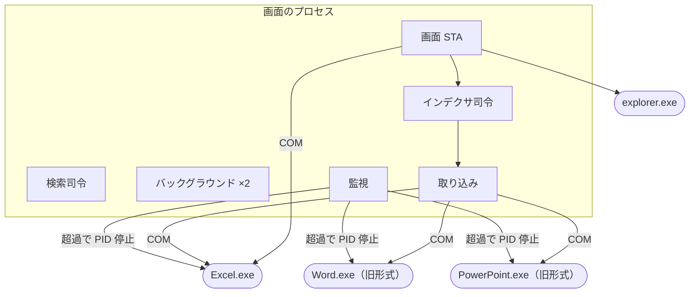
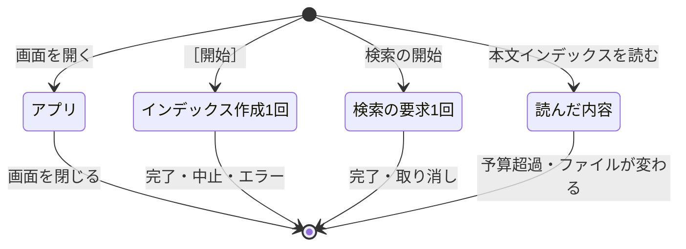
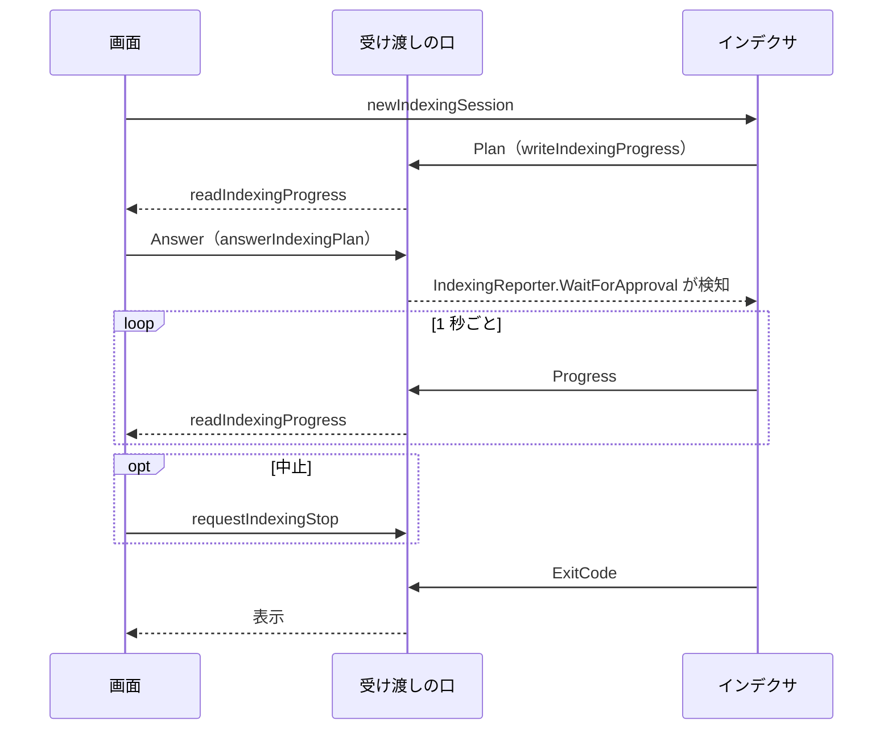

# プロセスとスレッド

扱うこと: tebunko がどのプロセス・スレッドで動き、それぞれをいつ作っていつ片づけるか（寿命・優先度・STA と MTA・画面とインデクサの受け渡し）。扱わないこと: インデックス作成の並列化そのもの（[取り込みの並列化](../indexing/parallel.md)）、クラスと関数の使い分け（[クラスと関数の使い分け](classes.md)）、閉じるときの順番・GC とメモリ（[閉じるときの順番と GC](closing.md)）。先に読むページ: [ソースの分け方](source.md)。検索・インデックス作成・画面の処理を足すときは、ここの決まりに合わせる。

| 知りたいこと | 節 |
|---|---|
| プロセスをどう分けているか | [プロセス](#プロセス) |
| どのスレッドが何をするか・優先度・STA と MTA | [スレッドの一覧](#スレッドの一覧) |
| いつ作っていつ片づけるか | [寿命](#寿命) |
| 画面とインデクサの受け渡し | [画面とインデクサの受け渡し](#画面とインデクサの受け渡し) |
| 閉じるときの順番・GC とメモリ | [閉じるときの順番と GC](closing.md) |

## プロセス

- **画面のプロセス 1 つで動く。** 検索・インデックス作成・画面の裏の読み込みは、どれも画面のプロセスの中のスレッドで行う。
- **別のプロセスになるのは Office（Excel・Word・PowerPoint）だけ。** COM で操作するアプリは、COM の仕組みで別のプロセスとして動く。
- **画面を閉じたら何も残さない。** インデックス作成中に閉じるときは、作成を中止してから閉じる（[閉じるときの順番](closing.md)）。作成を続けたまま画面だけを閉じることはできない。
- 画面は、インデックス作成 1 回ごとに `IndexingSession`（`newIndexingSession`）を作る。`IndexingSession` はインデクサの司令のスレッドを作り、そこで `indexer.ps1 -Channel <受け渡しの口>` を実行する。
- `indexer.ps1` は、画面を使わずにインデックスを作る入口としても使える（`-RetryFailed`）。`-Channel` を付けなければ自分で受け渡しの口を作り、ログをコンソールにも出す。中身は画面から使うものと同じ関数（`invokeIndexer`）で、コンソールのプロセスの中で同じスレッドの構成で動く。
- ツールが起動する外のプロセスは、エクスプローラー（`explorer.exe`）だけである。ワークスペースを変えても、画面は起動し直さない（その場で切り替える）。インデックス作成のために `powershell.exe` を起動することはない。

分けない理由は、閉じるときに後始末を確実にするためと、受け渡しをファイルで行わずに済ませるためである。スレッドにすると GC で画面が止まるおそれがあるが、実測では画面の止まりが増えなかった（[GC とメモリ](closing.md#gc-とメモリ)）。

## スレッドの一覧

| スレッド | 数 | 寿命 | アパートメント | 優先度 | 役目 |
|---|---|---|---|---|---|
| 画面 | 1 | アプリ | STA | Normal | 表示と操作の受け付けだけ。ファイルの読み込みなどの重い処理はしない。**ネットワークのパス（UNC・ネットワークドライブ）には触らない**（`testNetworkPath` で見分け、触る処理はネットワークを調べる列に出す）。届かない共有では `Test-Path` などの OS の呼び出しが十数秒〜二十秒戻らず、そのまま「応答なし」になるため |
| 検索の司令 | 1 | アプリ | MTA | Normal | 検索の要求を待ち、候補を集め、照合を照合のプールに配り、結果を画面へ渡す |
| 照合のプール | コア数 − 1（1〜4） | アプリ | MTA | Normal | 本文インデックスを読み、正規表現で照合する |
| バックグラウンド | 2 | アプリ | MTA | Normal | 画面から頼まれる短い仕事（`startJob`。プレビューの読み込み・状態の読み直し・プロセスの一覧など）。長い仕事の間もプレビューが待たないよう 2 つにする |
| ネットワークを調べる | 2 | アプリ | MTA | Normal | 元のフォルダ・元のファイルなど、ネットワークのパスに触る仕事（`startJob -queue "network"`）。届かない共有で OS の呼び出しが戻らなくても、バックグラウンド（プレビュー等）の列が塞がれないよう分ける。ネットワークのパスがある利用者だけが、初めて使うときに作る |
| インデクサの司令 | 1 | インデックス作成 1 回 | MTA | BelowNormal | クロール・確認・取り込みの振り分け・取り込み一覧・本文インデックスとシステムインデックスの書き出し |
| 取り込み（Excel） | 1 | インデックス作成 1 回 | STA | BelowNormal | Excel のファイル（`.xls*`）を 1 つずつ TSV に取り込む。Excel を 1 つ持つ |
| 取り込み（Word） | 1 | インデックス作成 1 回 | STA | BelowNormal | 旧形式の Word のファイル（`.doc`）を取り込む。Word を 1 つ持つ |
| 取り込み（PowerPoint） | 1 | インデックス作成 1 回 | STA | BelowNormal | 旧形式の PowerPoint のファイル（`.ppt`）を取り込む。PowerPoint を 1 つ持つ |
| 取り込み（読み取り） | コア数 − 1（1〜4。設定 `ingestThreads` で変えられる） | インデックス作成 1 回 | MTA | BelowNormal | 新形式の Word・PowerPoint のファイル（`.docx`・`.docm`・`.pptx`・`.pptm`）を、Office を使わずに読む |
| 監視 | Office の取り込みスレッド 1 つに 1 つ | インデックス作成 1 回 | MTA | Normal | 自分の取り込みスレッドの制限時間を見て、過ぎたらそのスレッドが起動した Office だけを PID で止める |
| システムインデックスのプール | 最大 4 | インデックス作成 1 回 | MTA | BelowNormal | フォルダごとのシステムインデックスを作る（`WorkerPool`） |

**優先度の決まり。** 利用者が結果を待つもの（画面・検索・バックグラウンド）は Normal にする。インデックス作成のものは BelowNormal にし、インデックス作成中も検索を先に動かす。監視は、固まった Office を止める役目のため Normal のままにする。

- 優先度は、プロセス全体（`PriorityClass`）ではなくスレッドごと（`Thread.Priority`）に下げる。プロセス全体を下げると画面も下がるため。画面のプロセスの `PriorityClass` は変えない。
- **優先度を下げるのは、利用者とプロセスを共有しないと確実に言えるものだけにする。** インデックス作成のスレッドは画面のプロセスの中にあり、利用者と共有しないため下げる。取り込みスレッドが起動した Office のプロセスは、`PriorityClass` を変えない（Normal のまま）。利用者がダブルクリックしたファイルが、インデックス作成が起動した画面の無い Excel・Word で開くことがあり、PowerPoint は 1 つのプロセスしか持てず利用者の PowerPoint と同じプロセスになるため、下げると利用者の操作が遅くなるおそれがある。Excel の `IgnoreRemoteRequests` で分けることもできるが、この設定は Excel のオプションとして残ることがあり、インデックス作成の Excel が途中で止まると利用者の Excel でファイルを開けなくなるおそれがあるため使わない。

**STA と MTA の使い分け。**

- STA（シングルスレッド アパートメント）では、そのスレッドで作った COM の部品を、そのスレッドだけで呼ぶ。Office の COM と WPF の画面はこれが前提になっている。
- MTA（マルチスレッド アパートメント）は、どのスレッドからでも呼べる。PowerShell のランスペースの既定である。
- Office の COM に触るスレッド（画面・Excel・Word・PowerPoint の取り込み）だけを STA にし、それ以外は MTA にする。STA のスレッドが長く待つと、そのスレッドの COM の部品への呼び出しが止まるため、必要なところに絞る。
- COM の部品はスレッドの間で渡さない。作ったスレッドで使い、同じスレッドで片づける。
- 画面のスレッドで COM を使うのは、利用者の Excel に「開いて」と頼む短い呼び出し（[元のファイルを開く](../gui/open-file.md)）だけにする。

## 寿命

スレッドやランスペースは、作っては捨てるのをやめ、次の 4 つの寿命のどれかに属させる。

| 寿命 | 始まり | 終わり | 属するもの |
|---|---|---|---|
| アプリ | 画面を開く | 画面を閉じる | 検索の司令・照合のプール・バックグラウンド・読んだ内容のキャッシュ |
| インデックス作成 1 回 | ［すべて更新］ | 完了・中止・エラー | インデクサの司令・取り込み・監視・システムインデックスのプール・Office |
| 検索の要求 1 回 | 検索の開始 | 結果の受け渡しの完了・取り消し | 要求（語・条件・取り消しの札 `Stop`）と結果の列だけ。スレッドは作らない |
| 読んだ内容 | 本文インデックスを読む | キャッシュの予算を超えて追い出される・ファイルが変わる | 本文インデックスのファイルの内容（[GC とメモリ](closing.md#gc-とメモリ)） |

- アプリの寿命のスレッドは、最初に使うときに作る。ランスペースには、はじめに一度だけ関数を読み込む。検索のたびに lib.ps1 を読み込み直さない。
  - 検索の司令（`SearchService`）は、スレッドを始めたときに lib.ps1 を 1 回だけ読み込み、照合のプール（`newPackWorkerPool`）を 1 回だけ作る。
  - バックグラウンド（`BackgroundQueue`）の各スレッドは、最初の仕事の前に lib.ps1 を 1 回だけ読み込む（`WorkerPool.Prelude`）。単一 .ps1 版（試験版）でも、この読み込みは `getPartLoad` がまとめて作る文字列をそのまま使うため、通常の zip 版と同じく 1 回だけ読み込む（[単一 PowerShell のビルド](single-script.md)「ビルドのロジック」）。
  - そのため、これらのスレッドは読み込んだときのワークスペース（`$workspace`）を持ち続ける。画面は仕事を頼むときにワークスペースの中の場所を渡す（検索の要求は `WorkDir` を持つ）。ワークスペースを変えてもスレッドは作り直さない（[ワークスペースの中の場所（Workspace）](data.md#ワークスペースの中の場所workspace)）。
- 照合のプールでは、ランスペースに加えて PowerShell のインスタンスも使い回す（`WorkerPool`）。
- 検索の要求（`newSearchRequest`。`[hashtable]::Synchronized`）は、`invokeSearchRequest` が実行する。要求の `Stop` が取り消しの札になる。新しい要求を出すと、前の要求の `Stop` を立てて取り消す。
- 検索 1 回が終わるたびに、検索の司令が読んだ内容のキャッシュを整理する（`trimTsvTextCache`。[GC とメモリ](closing.md#gc-とメモリ)）。

## 画面とインデクサの受け渡し

画面とインデクサは、同じプロセスのメモリ上の受け渡しの口（`newIndexerChannel`。`[hashtable]::Synchronized`）でやり取りする。ファイルでの受け渡しは行わない。画面は進み具合を 1 秒ごとに口から読む。

| 項目 | 書く側 | 読む側 | 内容 |
|---|---|---|---|
| RetryFailed・ConfirmTargets・Workers | 画面 | インデクサ | 前回失敗したファイルも取り込むか・取り込む前に確認するか・読み取りのスレッドの数（-1 は設定とコア数から決める。0 はすべてを司令のスレッドで取り込む（テスト）） |
| Progress | インデクサの司令（`writeIndexingProgress`） | 画面（`readIndexingProgress`） | 段階・処理済み・残り・失敗・詳細 |
| Stop | 画面（`requestIndexingStop`） | インデクサ | 中止の要求 |
| Plan・Answer・Answered | インデクサ → 画面（`answerIndexingPlan`） → インデクサ | 両方 | 取り込み予定と、利用者の返事。インデクサは `Answered`（`ManualResetEvent`）で待つ（`IndexingReporter.WaitForApproval`。60 分で取りやめる） |
| Error・ExitCode | インデクサ | 画面 | 続けられないエラーの内容と、終了コード（0 完了・1 エラー・2 中止）。`ExitCode` は最後に入れる |
| Notice・Postponed | インデクサ | 画面（`IndexingSession.GetNotice` / `GetPostponed`） | 終わりの案内（利用者の PowerPoint が起動していて後回しにしたファイルがあるときの一言。無ければ空）と、後回しにした件数（未取り込みのまま残した件数。無ければ 0） |
| OfficePids | 取り込みスレッド | 画面 | インデックス作成が起動した Office の PID とプロセス名（`ConcurrentDictionary`）。閉じるときに止まらなければ、これだけを止める |

ファイルに残すのは次のものだけである。

- `ingest_status.tsv`
- `ingesting.txt`（強制終了からの再開）
- `indexing_log.txt`（`writeIndexerLog` で書く。実行ごとに上書き）

インデクサのミューテックス（`newAppMutex "indexer"`。画面と `indexer.ps1` が同時に作らないため）は、インデクサの司令のスレッドで取得し、同じスレッドで解放する。ログはミューテックスを取ってから開く。［8 設定］タブは、ワークスペースを変える前に、画面を使わずに起動したインデックス作成が動いていないかをこのミューテックスで調べる（`testIndexerRunning`）。

設定ファイル（`setting.config`）の「読み直す → 変える → 書く」は、画面（UI のスレッド）とインデクサ（別のプロセスの司令のスレッド）が同時に行うことがあるため、設定ファイルごとの名前付きミューテックス（`Local\tebunko_settings_<鍵>`。`invokeSettingsLocked`）の中で行う。時間（5 秒）を過ぎても取れなければ例外にする。前の持ち主が手放さずに終わっていた（abandoned）ときは、取れたものとして続ける。重い読み込み（取り込み一覧など）はミューテックスの外で済ませ、持つ時間を短くする。

