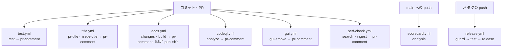
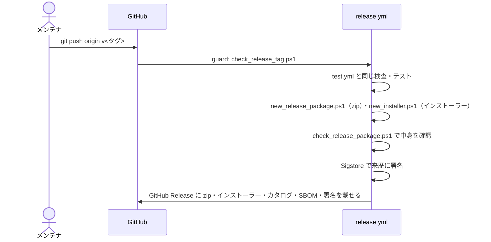

# CI

扱うこと: GitHub Actions のワークフロー一覧（test・title・docs・codeql・scorecard・gui・perf-check・release）と、それぞれの必須チェックの内容。扱わないこと: 性能の計測（[性能とリソースの計測のしかた](perf.md)）、速さの回帰テスト（[速さの回帰テストと上限の決め方](perf-check.md)）、コミット前のフック（[コミット前に動く検査](pre-commit.md)）。先に読むページ: [テストの実行](run.md)。



GitHub Actions のワークフローは次のとおり。使うアクションは、どのワークフローでもコミットのハッシュで固定する（版はハッシュの後ろのコメントに書き、Dependabot が更新する）。

| ワークフロー | ジョブ（チェック名） | 動く時 | 内容 | main の必須チェック |
|---|---|---|---|---|
| `test.yml` | `test`（ほか `pr-comment`） | PR、main への push、`release.yml` からの呼び出し | 個人情報・文字コードの検査、`Signed-off-by` の検査（PR のみ）、テスト（`run.ps1 -Ci`）、Codecov への送信、PSScriptAnalyzer | ○ |
| `title.yml` | `pr-title`・`issue-title`（ほか `pr-comment`） | PR・Issue の作成と編集（PR は push でも） | タイトルが Conventional Commits の形か | ○（`pr-title`） |
| `docs.yml` | `docs`（ほかに `changes`・`publish`・`pr-comment`） | PR、main で設計書が変わったとき | 設計書のサイトを作り、GitHub Pages に公開する | ○ |
| `codeql.yml` | `analyze`（ほか `pr-comment`） | PR、main への push、毎週 1 回 | ワークフローの静的解析 | ○ |
| `scorecard.yml` | `analysis` | main への push、ブランチ保護の変更、毎週 1 回 | OpenSSF Scorecard の採点 | – |
| `release.yml` | `guard`・`test`・`release` | `v` で始まるタグの push、手動（`workflow_dispatch`。タグを打たずに配布物を作る手順だけ試す） | テストのうえ、配布 zip とインストーラーを GitHub Release に載せる | – |
| `gui.yml` | `gui-smoke`（ほか `pr-comment`） | PR、main への push | 本物の画面を windows ランナーで開き、画面遷移（[画面のスモークテスト](gui-smoke.md)）を UI オートメーションで確かめる | –（必須にしない。しばらく安定して通ることを見てから、持ち主が決める） |
| `perf.yml` | `perf` | 手動（`workflow_dispatch`） | Office からの取り込み（.docx・.pptx）・本文インデックスの作成・検索の速さとリソースの推移を測る | – |
| `perf-check.yml` | `search`・`ingest`（ほか `pr-comment`） | PR にラベル `perf-check` を付けたとき（付けたあとの push でも）、main への push（速さに効くファイルが変わったとき）、手動 | 検索・本文インデックスの作成・取り込み（.docx・.pptx）の速さを上限と比べる（回帰テスト） | –（流した PR で落ちていればマージしない） |

`pr-comment` は 6 つのワークフロー（test・title・docs・codeql・gui・perf-check）それぞれが持つ、自分の結果を PR のコメントに書くジョブ（下の「結果を PR のコメントに書く（`pr-comment` ジョブ）」）。これらの結果を 1 つにまとめる集約ワークフローは無い。

**`test.yml`**

pull request と main への push のたびに windows ランナーで実行する。作業ブランチへの push だけでは動かない（PR のブランチで同じテストが 2 回走らないようにするため）。PR を出す前に CI で確かめたいときは、下書き（draft）の PR を出す。

- Windows PowerShell 5.1 はランナーに最初から入っている（`shell: powershell` を明示する。`pwsh`（PowerShell 7）では COM と文字コードの扱いが変わる）
- **どのワークフローも、`shell: powershell` の `run` は ASCII だけで書く。** Actions は `run` の内容を BOM の無い UTF-8 の一時スクリプトにして渡すが、Windows PowerShell 5.1 はこれを ANSI として読むため、日本語などの ASCII 以外の文字があると文字化けして構文エラーになる。メッセージなどで日本語が要るときは `tools/` の BOM 付き UTF-8 のスクリプトに移して呼び出す（`shell: pwsh` はこの制限を受けない）。`tests/meta/encoding.Tests.ps1` の「shell: powershell の run は ASCII だけ」が確かめる
- ランナーには Windows に最初から入っている Pester 3.4 もある。`tests/run.ps1` は `Import-Module Pester -RequiredVersion 5.9.0` で版を指定し、CI は 5.9.0 が無ければ入れる（版は `test.yml` の `PESTER_VERSION` と `tests/run.ps1` の 2 か所で同じにする）
- スクリプトの改行はランナーの `core.autocrlf` に左右されないよう、`.gitattributes` で `.ps1`・`.xaml`・`.bat` を CRLF に固定している
- ランナーに Office は入っていないため、タグ `Office` のテストは既定で外れる。COM を使うインデックス作成の確認は手元で行う（[結合テスト（手動）](index.md#結合テスト手動)）
- あわせて PSScriptAnalyzer の `Error` を 0 件に保つ（`TypeNotFound` は除く）。PSScriptAnalyzer の版は `test.yml` で固定する（新しい版でルールが増えて、コードを変えずに CI が落ちるのを防ぐ。Dependabot の対象外のため、上げるときは版を書き換えた PR で指摘が 0 件のままか確かめる）。安全性の検査（`tests/meta/safety.Tests.ps1`）はタグ `Meta` のため既定で実行される
- テストの前に `tools/check_commit.ps1` で、追跡している全ファイルと全コミットの作者を検査する（下の「公開してはいけない内容の検査」）。作者を全履歴で調べるため `fetch-depth: 0` で取得する
- PR では、PR のコミットに作者の `Signed-off-by` があるかを `tools/check_signoff.ps1 -Range HEAD^1..HEAD^2` で確かめる。pull_request では PR をマージした形のコミットを取り出すため、1 つ目の親が main、2 つ目の親が PR の先頭になる。その間だけを調べるので、main から取り込んだコミットと、決まりを作る前の履歴（`Signed-off-by` が無い）は調べない。マージコミットと bot（作者が `...[bot]@users.noreply.github.com`）のコミットも調べない
- 同じブランチに続けて push したときは、古い実行を取り消す（`concurrency`）
- テスト結果（`work/test/`）は成否にかかわらず成果物として保存する
- テストのあと、`work\test\coverage.xml` を [Codecov](https://codecov.io/gh/hsgwa/tebunko) に送る（`codecov/codecov-action`）。README のバッジ、PR へのコメント（ファイルごとの増減）、行ごとの表示は Codecov が出す
  - 送るのは相対パスと行ごとの実行回数だけで、ソースは送らない（Codecov はソースを GitHub から読む）
  - トークンはリポジトリの Secrets の `CODECOV_TOKEN` に置く。fork からの PR ではトークンが無くても送れる
  - 送れなくても CI は失敗にしない。Codecov の判定（`.github/codecov.yml`）も参考表示だけにする。下限の確認は `tests/coverage.baseline` が受け持つ
  - `.github/codecov.yml` には ASCII の文字だけを書き、コメントも書かない。Windows で動く Codecov の CLI がこのファイルを cp1252 として読み、日本語があると `UnicodeDecodeError` で止まるため。`tests/meta/encoding.Tests.ps1` が確かめる
  - タグの push（`release.yml` から呼ばれたとき）では送らない

**`title.yml`**

PR と Issue のタイトルを `tools/check_commit_message.ps1 -Title` で確かめる。squash merge では PR のタイトルが main のコミットのタイトルになるため、main の履歴の形はここで決まる。

- PR（ジョブ `pr-title`）… 形が違えば失敗にする。ブランチ保護の必須のチェックにしてあり、失敗するとマージできない。必須のチェックは head のコミットごとに要るため、タイトルの編集だけでなく push でも動かす
- `pr-title` は `tools/check_compat_golden.ps1` も呼び、前の版との互換の見本（`tests/testdata/compat/`。[前の版との互換](../index-data/format.md#前の版との互換)）を `!` 無しで変える・消す PR を落とす
- Issue（ジョブ `issue-title`）… 作成は止められないため、形が違えば `.github/title_comment.md` の直し方を 1 回だけコメントする（1 行目の目印が付いたコメントが既にあれば書かない）
- タイトルは誰でも書ける信頼できない入力のため、式で `run` に埋め込まず環境変数で渡す
- 起動の速い ubuntu のランナーで `pwsh`（PowerShell 7）を使う。そのため `tools/check_commit_message.ps1` は 5.1 と 7 の両方で動くように書く
- Dependabot の PR も同じ形にする（`.github/dependabot.yml` の `commit-message`。`ci(deps): bump ...` `build(deps): bump ...`）

**`gui.yml`（画面のスモークテスト）**

本物の画面（WPF）を windows ランナーで別のプロセスとして開き、UI オートメーションで、起動・タブ・検索・インデックスの追加から作成・ワークスペースの変更・閉じるまでを動かす（`tests/gui/*.Tests.ps1`、タグ `Gui`。何を動かすかは [画面のスモークテスト](gui-smoke.md)）。ジョブは `gui-smoke` 1 つで、`.\tests\run.ps1 -Tag Gui` を流す。

- **`test.yml` には入れない。** `test.yml` は `release.yml` から呼ばれ、release は test を待つため、画面のテストが不安定なときにリリースまで止まる。別のワークフローにすれば `test` と並んで動き、`test` の時間も延びない
- **必須チェックにしない。** 必須チェックを変えるのは持ち主で、しばらく安定して通ることを見てから諮る。必須にするときに、文書だけの PR で pending のまま残らないよう、`paths` の絞り込みは付けていない
- `tests\run.ps1 -Ci` は使わない。カバレッジの下限を確かめるが、画面は別のプロセスで動くので計測できず、`Gui` だけを流すと下限を割るため
- 1 回に 8〜9 分ほどかかる（場面ごとの秒数は各場面の出力に出る）。`timeout-minutes` は 20。同じブランチに続けて push したときは、古い実行を取り消す（`concurrency`）
- 落ちたときの材料（画面の画像・写した先の `gui_error_log.txt`・`indexing_log.txt`・窓の一覧）は、成否にかかわらず成果物 `gui-smoke-results`（`work/test/gui/<場面>/`）として保存する
- **落ちたときの再実行は 1 回まで。** 2 回続けて同じ段階で落ちたら、偶然ではなく直すものとして扱う（画面の文言を変えたときは、探している文言のテストを直す）
- **CI だけで流す場面がある。** S6（既定のワークスペース）は、利用者の本物のワークスペース（`%USERPROFILE%\Documents\tebunko_ws`）を使うため、`GITHUB_ACTIONS` が `true` のときだけ流す。手元では理由を出して飛ばす
- **手元で飛ばす段階がある。** S7 の［すべて終了］［バックグラウンドのみ終了］は、確認を出す作りが壊れていると本物の Office を止めるため、手元（`GITHUB_ACTIONS` が無いとき）で偽のプロセスのほかに Excel・Word・PowerPoint が動いていれば、その段階だけを飛ばして理由をログに出す
- ツールは `scripts/` を `$TestDrive` に写して起動し、設定ファイルもワークスペースも写した先に置く。作業ツリーの `setting.config`・`work\index`、`%LOCALAPPDATA%\tebunko`、（手元では）`Documents\tebunko_ws` が、流す前後で変わらないことも各場面で確かめる

**結果を PR のコメントに書く（`pr-comment` ジョブ）**

test・title・docs・codeql・gui・perf-check の 6 つのワークフローは、どれも自分の確認のジョブに続けて `pr-comment` ジョブを持つ。共有の複合アクション `.github/actions/pr-comment`（中身は `tools/pr_checks_comment.ps1` を呼ぶだけ）を使い、**そのワークフロー自身の結果**（成功・失敗・取り消し・スキップ）と実行へのリンクを PR のコメントに書く・書き換える。結果を 1 つのコメントにまとめる集約ワークフローは無い。個別のワークフローをやり直しても、そのワークフロー自身のコメントだけが書き換わる。

- **`pull_request_target` は使わない。** `pr-comment` ジョブは、ほかのジョブと同じ `pull_request` のワークフロー実行の中にある。PR のコードを動かすジョブ（`test`・`build` など）とは分け、複合アクションを呼ぶ前に、既定のブランチ（`github.event.repository.default_branch`）の内容で `tools/pr_checks_comment.ps1` と `.github/actions/pr-comment/` だけを改めて checkout する。ローカルの複合アクションは、呼ぶ時点で作業ツリーに置かれている内容で動くため、PR のブランチの内容のままにしておくと、PR で書き換えた道具・アクションが `pull-requests: write` の権限で動いてしまう。これを避けるための守りで、効く範囲は限られる（フォークの PR のトークンはそもそも読み取りだけで、同じリポジトリのブランチからの PR はワークフローの YAML 自体を書き換えられるため）。権限をジョブ単位に絞ることなどと重ねた多重の守りの 1 つ
- **この道具・複合アクションを変える PR では、その PR の CI で動くのは既定のブランチ（main）の版になる。** 新しく作った PR では main にまだ無いため `pr-comment` ジョブが「Can't find 'action.yml'」で失敗する（必須チェックではないのでマージは止まらない）。入力を足したときも、main に入るまでその PR の CI では効かない
- **`pull-requests: write` は `pr-comment` ジョブだけに付ける。** ワークフロー全体には広げず、ほかのジョブ・ステップは今までどおり読み取りだけにする
- **フォークの PR では書けないことがある。** `pull_request` イベントはフォークからの PR では読み取り専用のトークンになり、コメントの作成・書き換えが 403 になる。`tools/pr_checks_comment.ps1` はこれを例外にせず、警告を出すだけでジョブを失敗にしない。結果は常に（書けたかどうかに関わらず）Actions の Summary に書くため、フォークの PR でも結果は見える
- **PR の番号は `github.event.pull_request.number` からそのまま取る。** `pull_request` イベントの中で動くため、`workflow_run` のときのように head の SHA から開いている PR を探し直す必要が無い
- **書き換えるコメントは、作者が `github-actions[bot]` で、1 行目がそのワークフロー専用の目印（`<!-- pr-check:<id> -->`。`id` は `test`・`title`・`docs`・`codeql`・`gui`・`perf-check`）のものだけ。** 無ければ新しく書く。目印がワークフローごとに違うため、ほかのワークフローが書いたコメントは書き換えない
- **perf-check は `search`・`ingest` の 2 つのジョブの結果をまとめる。** カンマ区切りで両方の結果を渡し、悪いほうの結果（`failure` > `cancelled` > `skipped` > `success`）を 1 件のコメントにする。数字（検索・pack の作成・取り込みの速さ）はここに書き写さず、ジョブの Summary で見る
- **perf-check は、perf-check 以外のラベルを付けて起動した実行では書かない。** その実行は `search`・`ingest` がスキップになり、書くと前の結果（失敗など）が「スキップ」に書き換わるため（`concurrency` と同じ条件）
- **`pr-comment` ジョブの条件は `!cancelled()`。** 取り消された実行はコメントを書き換えない（古い実行が新しい結果を消さないため）。前段のジョブが失敗・スキップのときは書く
- **コメントには、PR の head のコミットを短い形で添える。** 遅れて終わった古い実行が新しい結果を上書きしたときに見分けるため
- **Dependabot の PR にはコメントしない。** PR の作者（`github.event.pull_request.user.login`）が `dependabot[bot]` の実行は対象から外す
- `release.yml` は `test.yml` を `workflow_call` で呼ぶ。呼ばれる側の `pr-comment` ジョブが `pull-requests: write` を求めるため、呼ぶ側の `test` ジョブにも同じ許可を付けてある（足りないと、ワークフローが不正として起動せず、タグを打っても release が動かない）。タグの push では `pr-comment` 自体はスキップされる
- 手元・CI 上からの確かめ方は `-DryRun`（`gh` を呼ばず、組み立てたコメントの本文だけを標準出力に出す）

**`codeql.yml`・`scorecard.yml`（サプライチェーンの安全性）**

CodeQL（`analyze`）は main の必須チェックで、指摘があるとマージできない。Scorecard は採点するだけで、マージは止めない。

- `codeql.yml` … GitHub Actions のワークフローを CodeQL で解析し、Security タブ（Code scanning）に載せる。信頼できない入力を `run` に埋め込む書き方などを見つける。PowerShell は CodeQL の対象外のため、スクリプトは上の PSScriptAnalyzer が受け持つ
- `scorecard.yml` … [OpenSSF Scorecard](https://scorecard.dev/viewer/?uri=github.com/hsgwa/tebunko) で採点し、結果を Code scanning と README のバッジに載せる
  - Scorecard はリポジトリを Linux で展開する。名前が UTF-8 で 255 バイト（日本語で 85 字）を超えるファイルがあると展開できず、ほとんどの項目が採点できなくなる。そのため `tools/check_commit.ps1` がこの長さを超える名前を止める

**`release.yml`（配布物の公開）**



`v` で始まるタグを push すると動く。最初の `guard` が `tools/check_release_tag.ps1` で、タグが `v<メジャー>.<マイナー>.<パッチ>` の形（大文字の `V`・全角の数字・0 始まり・`-rc1` などの接尾辞は不可）で、指すコミットが `origin/main` の履歴にあることを確かめる（満たさないタグからは、テストにも公開にも進まない）。続けて `test.yml` と同じ検査・テストを通したうえで、`tools/new_release_package.ps1` で配布 zip（`tebunko-<タグ>.zip`）を、`tools/new_installer.ps1` でインストーラー（`tebunko-setup-<タグ>.exe`）を作って GitHub Release に載せる。

- zip にはツール本体（`tebunko.bat`・`scripts/`）と `README.md`・`LICENSE`・`VERSION.txt`（版とコミットの記録）だけを入れる。README の相対リンクと画像は、その版の GitHub の URL に書き換える。カタログ（`tebunko.cat`）・ハッシュ一覧（`SHA256SUMS.txt`）・部品表（`sbom.cdx.json`。配布物を作るたびに zip の中身から作る）は zip と並べてリリースに載せ（[安全性の要約](../../safety/index.md) の [配布物の完全性（カタログ・ハッシュ一覧・来歴の署名）](../../safety/scans.md#配布物の完全性カタログハッシュ一覧来歴の署名)）、SECURITY は README とリリースの説明からリンクする。zip 自体の SHA256 はリリースの説明に書く（同 [複数エンジンでの検査: VirusTotal（外部へファイルを送信する）](../../safety/scans.md#複数エンジンでの検査-virustotal外部へファイルを送信する) の VirusTotal での照会用）
- 配布物を作った後、来歴に署名する前に、`tools/check_release_package.ps1` が zip の中身（ファイルの過不足・dot-source の先・構文・カタログ・ハッシュ一覧・部品表・`VERSION.txt`）を確かめる。通らなければ、署名も公開も行わない。公開する zip は変更の無い作業ツリーで作る（CI の checkout はそうなっている）
- インストーラーは Inno Setup 7 で作る（6.7.1 は、Program Files に入れたものを消すとアンインストーラーが残ったため 7.1.0 にした）。Inno Setup は版を固定して公式のリリースから取り、SHA256 を確かめてから、持ち運び版（レジストリに書かない）でランナーの一時フォルダに入れる（`tools/install_inno_setup.ps1`。日本語のメッセージが要るため、`shell: powershell` の `run` から呼ぶ tools の側に置く。上の「ASCII だけで書く」）。版を上げるときは `release.yml` の URL と SHA256 を一緒に直す（Dependabot の対象外）。インストーラーの SHA256 もリリースの説明に書く
- zip とインストーラーのビルドの来歴を Sigstore で署名して GitHub に登録し、署名の bundle（`tebunko-<タグ>.zip.sigstore.json`・`tebunko-setup-<タグ>.exe.sigstore.json`）もリリースに載せる（同 [配布物の完全性（カタログ・ハッシュ一覧・来歴の署名）](../../safety/scans.md#配布物の完全性カタログハッシュ一覧来歴の署名)）
- リリースノートは GitHub が PR から作り、`.github/release.yml` で PR のラベルごとに分ける
- 版の付け方とリリースの時機は AGENTS.md の「リリース」に従う。タグは main のコミットに付ける
- **タグを打たずに手動（`workflow_dispatch`）でも起動できる。** 配布物を作る・検査するところまでは同じに動かすが、`guard` のタグの形の確認と、来歴への署名・GitHub Release への公開は行わない（起動したブランチの名は版の形にならないため）。代わりに、作った zip・インストーラー・カタログ・ハッシュ一覧・部品表を artifact `release-dry-run-<実行の番号>`（保存期間 14 日）に置く。`new_release_package.ps1`・`new_installer.ps1` は `-Version`（ここではブランチ名）を `^[A-Za-z0-9._-]+$` で確かめるため、`/` を含むブランチ（`dependabot/...` など）からは起動できない

  ```
  gh workflow run release.yml --ref <試すブランチ（/ を含まないもの）>
  ```

```
git tag v0.1.0 origin/main
git push origin v0.1.0
```

**`docs.yml`（設計書のサイト）**

設計書（`docs/`）は [MkDocs](https://www.mkdocs.org/)（テーマは Material for MkDocs）で Web サイトにし、main で `docs/`・`tools/mkdocs/` が変わるたびに [GitHub Pages](https://hsgwa.github.io/tebunko/) に公開する。

- 設定は `tools/mkdocs/mkdocs.yml`。サイトはどれもリポジトリの直下で `mkdocs build --strict -f tools/mkdocs/mkdocs.yml` を実行して作る。リンク先のファイルや見出し（アンカー）が無いと失敗する。`docs/` の外の Markdown と、`docs/` から外へのリンクはここでは調べないため、`tests/meta/` の `links`（[テストの実行](run.md)）が調べる
- サイトを作るジョブ（チェックの名前は `docs`）は main の必須チェックにしている。必須のチェックはワークフローが動かないと待ったままになるため、PR では変えたファイルで絞らず、どの PR でもサイトを作る
- GitHub Pages は `gh-pages` ブランチの内容をそのまま公開する。main のサイトはその直下に置く
- `docs/`・`tools/mkdocs/` を変えた PR では（変えたかどうかは `changes` のジョブが PR のファイルの一覧で調べる）、サイトのプレビューを `gh-pages` の `pr-preview/pr-<PR の番号>/` に置き、URL を PR にコメントする（`rossjrw/pr-preview-action`）。push のたびに更新し、PR を閉じたら消す。fork からの PR ではプレビューを作らず、サイトを作れることだけを確かめる
- サイトを作るジョブは PR のコード（`tools/mkdocs/hooks.py`）を動かすため、読み取りの権限だけで動かす。`gh-pages` への書き込みと PR へのコメントは、作ったサイトを受け取るだけの別のジョブ（`publish`）で行う
- アンカーは GitHub と同じ形（日本語を残し、記号を除き、英字を小文字にする）で作る（`tools/mkdocs/mkdocs.yml` の `toc.slugify`）。`docs/` の中のリンクは GitHub で読めるように書けば、サイトでもそのまま飛べる
- GitHub で読むときとの違いは `tools/mkdocs/hooks.py` で埋める。先頭ページは `docs/index.md`（`tools/mkdocs/overrides/home.html` で組み立てる）。`docs/` の外（`../.github/SECURITY.md` など）へのリンクは GitHub 上のファイルへのリンクに書き換える
- 使うパッケージは `tools/mkdocs/requirements.txt` に版とハッシュで固定し、`pip install --require-hashes` で入れる。更新は Dependabot が PR を出す。サイトを作るときだけに使い、配布物には含めない
- サイトを見る人のブラウザーが第三者のサーバーへ通信しないようにする。フォントは Google Fonts を使わず OS のもので表示する（`theme.font: false`）。Mermaid は Material テーマが既定では unpkg から読み込むため、`extra_javascript` で版を固定して先に読み込ませ、`privacy` プラグインがビルドのときに取り込んでサイトに同梱する（取り込んだファイルは `work/cache/privacy/` に置く）。Mermaid の版は、Material テーマが読み込む版（`mermaid@11`）に合わせる
- 手元で見るときは次のとおり（生成物は `work/site/`）

```
pip install --require-hashes -r tools/mkdocs/requirements.txt
mkdocs serve -f tools/mkdocs/mkdocs.yml
```
