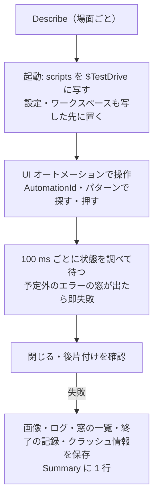

# 画面のスモークテスト

扱うこと: 本物の画面を UI オートメーションで操作して画面遷移を確かめるテスト（`tests/gui/`・タグ `Gui`）の仕組み・場面・対象外。扱わないこと: 画面の単体テスト・確認欄（[画面のテストと確認](gui-tests.md)）。先に読むページ: [画面のテストと確認](gui-tests.md)。

## 画面のスモークテスト

本物の画面（`scripts/tebunko/gui.ps1`）を別のプロセスとして開き、UI オートメーションで操作して、**画面遷移が壊れていないこと**を毎回機械で確かめる。XAML の読み込みの例外・読み込む順の誤り・イベントの配線の誤り・ダイアログの開閉と戻り方の誤り・閉じるときの後片付けの例外は、[画面の単体テスト](gui-tests.md#画面の単体テスト)（`$ui` を偽物にして WPF を動かさない）では見つからず、手で動かすまで分からなかった。画面を足すたびに手で確かめる代わりに、このテストが通ることを見る。

- 置き場所は `tests/gui/`、タグは `Gui`。共通の関数は `gui_helpers.ps1`、場面ごとのテストは `smoke`・`index`・`search`・`settings`・`leftover`・`leftover_real` の `*.Tests.ps1`
- 流し方は、CI が `gui.yml`（ジョブ `gui-smoke`。[`gui.yml`](ci.md#ci)）、手元が `.\tests\run.ps1 -Tag Gui`。既定の実行（`.\tests\run.ps1`）とコミット前のフックでは流さない。手元で流している間（約 4 分）は、マウス・キーボードに触らない
- 起動・検索・取り込みの秒数は出力に出すだけで、合否には使わない（性能は [`perf-check.yml`](ci.md#ci) の回帰テストが見る）

**仕組み**

| 決まり | 内容 |
|---|---|
| 隔離 | ツールは `scripts/` を `$TestDrive` に写して起動し、設定ファイル（`setting.config`）とワークスペースも写した先に置く（`workspaceFolder` を写した先の `work` にする。空にして既定のワークスペースを使う場面は、環境変数 `TEBUNKO_DEFAULT_WORKSPACE` で `$TestDrive` の中に差し替えて起動する）。起動の前に差し替えた既定の場所が利用者の既定のワークスペースでないことを確かめ、流す前後で、作業ツリーの `setting.config`・`work\index`、`%LOCALAPPDATA%\tebunko`、利用者の既定のワークスペース（`Documents\tebunko_ws`）、Office のプロセスの数が変わらないことも確かめる。多重起動の防止は配置フォルダごとなので、手元で開いている tebunko と重ならない |
| 探す | 部品は `AutomationId`（`x:Name`）で探す。名前の無い部品（確認ダイアログの選択肢・メッセージボックスのボタン）は表示の文字で探す。ダイアログ・確認・メッセージボックス・メニューは、UI オートメーションの木では本体の窓の子の窓として出る |
| 操作 | パターン（`InvokePattern`・`ValuePattern`・`SelectionItemPattern`・`TogglePattern`・`WindowPattern.Close`）で行い、マウス・キーボードの合成は使わない（SendInput・keybd_event は使わない）。キーは、修飾キーなしのものだけ `WM_KEYDOWN`・`WM_KEYUP` のメッセージで送れる（`pressGuiKey`）。Ctrl・Shift を押した形は、ハンドラが本物のキーボードの状態を読むため送れない（その振り分けは `tests/tebunko/ui/shell/nav.Tests.ps1` の単体テストで確かめる）。モーダルを開く操作は別のスレッドから呼ぶ。Win32 のダイアログ（OS のフォルダ選択）のボタンと欄はパターンを持たないため、窓のメッセージ（`BM_CLICK`・`WM_SETTEXT`）で操作する |
| 待つ | 100 ms ごとに状態を調べる（時間では待たない）。上限は起動 90 秒・取り込みの完了 120 秒・ほかは 30 秒。待つ間に、予定していないエラーの窓（`予期しないエラー`・`エラーが発生しました` など）が出たら、その文言で失敗にする |
| OS のフォルダ選択 | 差し替えずに、開いて閉じるまで本物で動かす（`selectFolder` のリフレクションで開く部分を確かめるため）。ボタンと欄は言語に依らない ID（［フォルダーの選択］は `1`、［キャンセル］は `2`、フォルダ名の欄は `1152`）で探す（ランナーは英語、手元は日本語） |
| 閉じたあとの判定 | どの閉じ方（`closeGui`・取り込みを止めて閉じる）も、閉じたあとの終了コードを 1 つの関数（`assertGuiExited`）で確かめる。0 でなければ、材料を集めてから失敗にする。待っている間に画面が終わったとき（`waitGui`）も、同じ材料を集める |
| 失敗したとき | 失敗した手順の名前を文言に入れ、画面の画像・写した先の `gui_error_log.txt`・`indexing_log.txt`・窓の一覧に加えて、`終了の記録.txt`（閉じる直前の様子・終わった時刻・呼び出し元に戻った印・閉じる順番の記録）・`クラッシュ情報.txt`（イベントログ。PID で当たったものと、時間と種類で拾ったものを分けて書く。無くても「該当なし」と書く）を `work\test\gui\<場面>\` に置く（CI は成果物 `gui-smoke-results` に上げる）。材料は部分ごとに別に保存し、1 つが失敗しても残りを書く。場面・手順・失敗の文言は、CI の Summary にも 1 行出す |

**場面**（1 場面 = 1 回の起動。1 つのプロセスを長く操作すると、途中で失敗したときに後ろが続けて落ち、原因も追いにくいため。場面ごとに別の `Describe` にして、前の場面の失敗が後ろに響かないようにする）

| 場面 | ファイル | 前提のデータ | 流れ |
|---|---|---|---|
| S1 起動・検索・閉じる | `smoke` | インデックス 1 つ | 起動 → 3 つのタブ → 検索・プレビュー → 「バージョン情報」 → 多重起動 → 閉じる |
| S2 インデックスの管理と作成 | `index` | インデックス無し。元のフォルダに .docx・.pptx と、壊れた .docx 1 つ | 起動（［インデックス管理］）→ ［検索］の［インデックスを作成する］→ 追加（キャンセル・注意・参照・OK）→ 編集 → 行のチェックの切り替え → 作成（確認でキャンセル → 開始 → 完了・失敗一覧）→ 削除（キャンセル・削除する）→ 閉じる |
| S3 作成中の操作 | `index` | .docx・.pptx を 100 組（300 ファイル。読み取りのスレッド `ingestThreads` を 1 にして、中止してもすぐには終わらないようにする） | 作成を開始 → 追加・編集・削除が押せない・［設定］の警告 → ［中止］（キャンセル・中止する）→ 閉じて起動し直す（中断中。#4 は保留のため、テストの側で［インデックス管理］を選び直す）→ 続きから再開 → 閉じる（［閉じない］・［止めて閉じる］）→ 終了コード 0 |
| S4 検索の遷移 | `search` | インデックス 1 つ（元のファイルが無い行） | 不正な正規表現 → ［すべて解除］［すべて選択］→ 検索 → 開閉・絞り込み → 見つからないファイル（キャンセル・フォルダを選ぶ → キャンセル）→ 閉じる |
| S5 ワークスペースの変更 | `settings` | インデックス 1 つ。空のフォルダ・空でないフォルダ・インデックスのあるフォルダ | ［変更…］（キャンセル・使えないフォルダ・空のフォルダ・空でないフォルダ・インデックスのあるフォルダ）→ 閉じる |
| S6 既定のワークスペース | `settings` | `workspaceFolder` を空にし、既定のワークスペースにほかのファイルを置く | 起動時の警告 → 作成の開始で警告 → ［既定に戻す］→ 閉じる |
| S7 起動時の確認 | `leftover`・`leftover_real` | `leftover`: 偽の行（環境変数で指す JSON）。`leftover_real`: 記録のある偽の Excel（PING.EXE を EXCEL.EXE の名前で写したもの）と、記録の無い偽の Excel。記録は画面のコピーの work の下 | 起動 → 確認（件数・詳細の開け閉め）→ ［今回は終了しない］→ 起動し直す → ［終了する］（記録を読む → 取り直す → 照らし合わせる → 止める → 記録が消える）→ 記録の無いものだけのときは確認が出ない。止めるのは、テストが起動して PID を控えた偽のプロセスだけ（本物の Office は相手にしない） |
| S9 ナビの切り替えと F5 | `nav` | 起動のあとに書く取り込み一覧 | ［検索］→ 取り込み一覧を書く → ［インデックス管理］へ移る（状態が読み直される）→ 取り込み一覧を書き換える → F5（読み直される）→ 閉じる |

- 取り込むファイルは `tests/testdata/office/` の .docx・.pptx（Office を使わずに直接読める）を写す。.xlsx は Excel が要るので使わない。失敗させるファイルは、ZIP としては開けるが `word/document.xml` の XML が壊れている .docx をテストの中で作る（ZIP でない旧形式・パスワード付きは、Word・PowerPoint に回し直されて Office が動くので使わない）
- S3 の取り込みは時間に頼る。取り込みが終わってしまったときは「間に合わなかった」という文言で失敗にする（ファイルの数を増やして直す）
- S6 は手元でも流す。既定のワークスペースは `TEBUNKO_DEFAULT_WORKSPACE` で `$TestDrive` の中に差し替わり、利用者の既定のワークスペースには触れない

**画面遷移の一覧**

「扱い」は、上の場面か、対象外（下の表）。

| # | 起点 | 操作 | 行き先 | 戻り方 | 扱い |
|---|---|---|---|---|---|
| 1 | 起動 | `gui.ps1` を起動 | 起動中の表示 → 本体 | – | S1 |
| 2 | 起動 | インデックスがある | ［検索］が選ばれる | – | S1 |
| 3 | 起動 | インデックスが無い | ［インデックス管理］が選ばれる | – | S2 |
| 4 | 起動 | 取り込みが中断している | ［インデックス管理］が選ばれる | – | S3（保留。下の「見つかった不具合」） |
| 5 | 起動 | 既定のワークスペースにほかのファイルがある | メッセージボックス（警告）→［設定］が選ばれる | ［OK］ | S6 |
| 6 | 起動 | 同じフォルダのツールをもう一度起動 | 2 つ目はすぐ終わり、1 つ目が残る | – | S1 |
| 7 | 本体 | 3 つのタブを選ぶ | 各タブ | – | S1 |
| 8 | 本体 | ［バージョン情報］ | ダイアログ（版） | ［閉じる］ | S1 |
| 9 | 本体 | 閉じる（作成中でない） | 終了（終了コード 0） | – | S1 |
| 10 | 本体 | 閉じる（作成中） | 確認「中止して閉じますか」 | ［閉じない］で戻る／［中止して閉じる］で止めてから終了 | S3 |
| 11 | ［インデックス管理］ | ［＋ フォルダを追加］ | インデックスの追加のダイアログ | ［キャンセル］／［OK］ | S2 |
| 12 | 追加・編集 | 入力が足りないまま［OK］ | ダイアログの中に注意（`ErrorText`） | 直して［OK］ | S2 |
| 13 | 追加・編集 | ［参照…］ | OS のフォルダ選択 | ［キャンセル］で変わらない／フォルダを選ぶと欄に入る | S2 |
| 14 | ［インデックス管理］ | 行をダブルクリック・右クリック→［編集…］ | インデックスの編集のダイアログ | ［キャンセル］／［OK］ | 対象外（UI オートメーションからは開けない。下の表） |
| 15 | ［インデックス管理］ | ［アクション ▾］→［削除…］ | 確認「インデックスを削除しますか」 | ［キャンセル］／［削除する］ | S2 |
| 16 | ［インデックス管理］ | 行のチェックを切り替える | チェックの状態が変わる（初めは外れている）。設定は書き換わらず、［すべて更新］の可否も変わらない | – | S2 |
| 17 | ［インデックス管理］ | ［すべて更新］ | クロール → 確認ダイアログ（件数・失敗分の取り込み直し） | ［キャンセル］で取りやめ／［すべて更新］で取り込み | S2 |
| 18 | ［インデックス管理］ | 取り込みが終わる | 完了の表示、失敗したファイルの一覧 | – | S2 |
| 19 | ［インデックス管理］ | 更新中に［中止］ | 確認「中止しますか」 | ［キャンセル］で続く／［中止する］で止まる | S3 |
| 20 | ［インデックス管理］ | 更新中の［＋ フォルダを追加］・［アクション ▾］の［エクスポート…］［インポート…］［削除…］ | 4 つが押せない。更新が終わると、また押せる | – | S3 |
| 21 | ［設定］ | 更新中に［変更…］ | メッセージボックス「更新中はワークスペースを変えられません」 | ［OK］ | S3 |
| 22 | ［インデックス管理］ | ［すべて更新］（既定のワークスペースが使えない） | メッセージボックス →［設定］ | ［OK］ | S6 |
| 23 | ［検索］ | ［検索］ | 結果の表・件数・行を選ぶとプレビュー | – | S1 |
| 24 | ［検索］ | 正規表現で不正な式を入れる | ［正規表現］の下に吹き出し（`RegexBalloon`）。入力欄の枠が赤くなり［検索］は押せない | 式を直す | S4 |
| 25 | ［検索］ | 検索対象のツリーで［すべて解除］／［すべて選択］ | 検索できない注意／元に戻る | – | S4 |
| 26 | ［検索］ | インデックスが無いときの［インデックスを作成する］ | ［インデックス管理］ | – | S2 |
| 27 | ［検索］ | 結果の［すべて開く］［すべて折りたたむ］・絞り込み | 表の見出しの開閉・絞り込んだ件数 | 絞り込みを消す | S4 |
| 28 | ［検索］ | 結果の右クリックのメニュー、プレビューのメニュー | 並びが決めたとおりに出る（コピーの内容は単体テスト） | – | `context_menu.Tests.ps1`（メニューキーで開いて項目の並びを確かめる。マウスの右クリックは合成できない） |
| 29 | ［検索］ | 元のファイルが無い行で［… で開く］ | 確認「… が見つかりません」 | ［キャンセル］／［フォルダを選ぶ］→ フォルダ選択 →［キャンセル］で確認に戻らず終わる | S4 |
| 30 | ［設定］ | ［変更…］ | OS のフォルダ選択 | ［キャンセル］で変わらない | S5 |
| 31 | ［設定］ | ［変更…］で空のフォルダ | 確認「ワークスペースを変える」 | ［キャンセル］／実行で中身が移り、画面が切り替わる | S5 |
| 32 | ［設定］ | ［変更…］で空でないフォルダ | 確認（中にフォルダを作る／そのまま使う） | ［キャンセル］／中にフォルダを作って切り替わる | S5 |
| 33 | ［設定］ | ［変更…］でインデックスのあるフォルダ | 確認（あるインデックスを使う／消してやり直す） | ［キャンセル］／［あるインデックスを使う］で切り替わる | S5 |
| 34 | ［設定］ | ［変更…］で使えないフォルダ（今のインデックスの中） | メッセージボックス（警告） | ［OK］ | S5 |
| 35 | ［設定］ | ［既定に戻す］ | 確認 → 既定のワークスペースに切り替わる | ［キャンセル］／実行 | S6 |
| 36 | 起動時 | 記録のある残り物（持ち主がもういない・窓が無い）が 1 件ある | 確認「前回のインデックス作成で起動した Office が 1 件、残ったまま動いています」。記録の無い Office は数えない | ［今回は終了しない］で止まらない。詳細を開くと PID が並ぶ | S7 |
| 37 | 起動時 | 起動し直す | また確認が出る | ［終了する］で記録のあるプロセスだけが終わり、記録のファイルが消え、ステータスに「Office を 1 件終了しました。」が出る | S7 |
| 38 | 起動時 | 記録の無い Office だけが動いている | 確認が出ない | – | S7 |

**このテストで見つかった不具合（#4。保留）**: 起動時のタブの決定（`gui.ps1`）は `$script:indexingState.Pending -gt 0` を見るが、この時点では `$script:indexingState` はまだ非同期の読み込み（`loadStartupData`。`ContentRendered` の後）前で常に `$null`。実質 `!(testIndexExists())` だけで決まり、1 件でも取り込み済みのファイルがあれば（`testIndexExists()` が true になる）、中断中でも ［検索］が選ばれる。`tests/gui/index.Tests.ps1`（S3）では、この不具合を踏まえてタブを明示的に選び直したうえで、続きの遷移（#10）を確かめている。直しは別の fix「fix: 取り込みが中断しているときは、起動したときにインデックス管理のタブを開く」（起票済み）で行う。

**画面のスモークテストの対象外**（理由と代わりの確かめ）

| 遷移 | 理由 | 代わり |
|---|---|---|
| 元のファイルを開く（通常・読み取り専用・新規）、フォルダを開く、ログを開く、結果をファイルに出力、失敗したファイルのフォルダを開く | 行き先が外のアプリ（Office・エクスプローラー・メモ帳）。ランナーに Office が無く、手元では利用者の窓と区別しにくい | `tests/tebunko/ui/open_source.Tests.ps1`（`Invoke-Item`・`Start-Process` を偽物にして確かめている）。[画面の確認](gui-tests.md#画面の確認)の手の確かめ |
| フォルダを選び直して元のファイルが見つかる | 見つかると Office で開く（外のアプリ） | 同上（`findMovedSource`・`resolveSourcePath` のテスト） |
| ドラッグ＆ドロップ、一覧のダブルクリック | UI オートメーションに合成のマウスの操作が無い（行き先は［＋ フォルダを追加］［編集…］［開く］と同じ） | 行き先はボタンから通す。手の確かめ |
| キーボードのショートカットのうち Ctrl 付きのもの（Ctrl+Tab・Ctrl+Shift+Tab・Ctrl+F・Ctrl+Shift+F）・Esc・Enter | Ctrl の状態は本物のキーボードからしか作れず、キーの合成はフォーカスに頼り壊れやすい | キーの判定と振り分けは単体テスト（`nav_view.Tests.ps1`・`nav.Tests.ps1`）。本物のキーは手の確かめ。F5 は S9 で確かめる |
| インデックス一覧の行の編集（ダブルクリック・右クリックのメニュー） | UI オートメーションでは右クリックのメニューも、マウスのダブルクリックも作れない（編集のダイアログの中身は、追加のダイアログと同じ部品） | `index_view.Tests.ps1`（名前・場所の判断）。リリース前の手の確かめ |
| 右クリックのメニューの項目を押すこと（コピーの内容） | UI オートメーションではメニューの項目を押せない（行き先は結果の行の選択・プレビューと同じ。メニューの並びは `context_menu.Tests.ps1`） | `tests/tebunko/ui/open_source.Tests.ps1`（コピーの内容の単体テスト）。リリース前の手の確かめ |
| 予期しない例外のメッセージボックス（`safe`・`reportStartupFailure`）、インデクサが続けられないエラー（終了コード 1）、閉じるときに 60 秒待って Office を止める | 異常を起こすには本体に仕掛けが要る | `indexer.Tests.ps1`・`indexing_session.Tests.ps1`。スモークテストでは、これらの窓が出たらその文言で失敗にする |
| 表示倍率ごとの見た目、アイコン | 見た目の確かめ | 手の確かめ |

