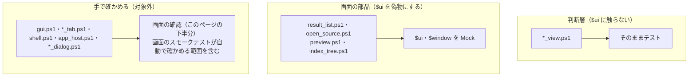

# 画面のテストと確認

扱うこと: 画面が使う関数・画面の型と判断層・画面の部品の単体テストが何を確かめるか、画面の確認（自動化できた範囲・手動で確かめる範囲）。扱わないこと: 画面以外の単体テスト（[単体テスト（インデックスと検索）](unit-index.md) など）、本物の画面を UI オートメーションで操作するスモークテストの仕組み・場面（[画面のスモークテスト](gui-smoke.md)）。先に読むページ: [テスト](index.md)。

判断層（`*_view.ps1`）はそのままテストする。`result_list.ps1`・`open_source.ps1`・`preview.ps1`・`index_tree.ps1` は `$ui`・`$window` を偽物にし、Excel・エクスプローラーの起動は `Mock` して実際には開かない。クリップボードは利用者の PC のものを書き換えるため、「コピーしない場合」（`preview.ps1` の `copyPreviewSelection`）だけを確かめる。型（`shared/ui/types.ps1`・`tebunko/ui/types.ps1`）はプロパティの変更通知と各メソッドを確かめる。

## 画面の単体テスト

画面が使う関数と画面の部品を Pester 5.9.0 で確かめる（実行方法・タグ・カバレッジは [テストの実行と CI](run.md)）。画面の部品（`ui/*.ps1`）のテストは、WPF のコントロール（`$ui.ResultGrid` など）を偽のオブジェクトに差し替え、読み込み時に登録されたイベントの処理を直接呼んで確かめる。画面を開かないため、CI でも動く。

**画面が使う `tebunko/lib.ps1` の関数**（[画面の実装構成](../gui/implementation.md#実装構成)）

| 対象 | テスト | 主な確認内容 |
|---|---|---|
| `searchPackIndex` | `tests/tebunko/search/pack_search.Tests.ps1` | 結果が TSV を 1 行ずつ照合したときと同じこと（改行の種類・照合のしかたごと）、文字どおり・正規表現・不正な正規表現、大文字・小文字、対象ファイル・図形とコメントの除外、上限での打ち切り、正規表現の照合の時間切れ（全文への照合は 1 行ずつに切り替える）、並列検索と読んだ内容の使い回し、中止・進捗の通知 |
| `getIndexPackFiles` / `readPackContext` | 同上 | 本文インデックスのファイルの列挙（フォルダの一部・直下だけ・無いフォルダ）、前後の行と行番号 |
| `testIndexExists` / `getIndexSummary` | `tests/tebunko/search/search_run.Tests.ps1` | 本文インデックスのファイルの有無・件数・最新の更新日時、存在しないフォルダ |
| `toSearchResultLines` / `writeSearchResult` | 同上 | [検索](../search/index.md) の結果ファイルの形式になること |
| `newSearchRegex` / `getRegexScanMode` / `newFileFilter` | `tests/tebunko/search/search_query.Tests.ps1` | 文字どおりの記号、不正な正規表現、大文字と小文字の区別。対象ファイルは `;` / `；` の区切り、`!` の除外、部分一致、`?`、ほかの記号は文字どおり、空なら条件なし |
| `getSourceLocation` / `resolveSourcePath` / `findMovedSource` | `tests/tebunko/search/source_map.Tests.ps1` | 元のファイルのインデックス名・場所・パスの特定、選んだフォルダからの探索（[元のファイルを開く](../gui/open-file.md)） |
| `splitTsvCells` | `tests/shared/core/text.Tests.ps1` | `"` で囲まれたセル内のタブ、空のセル、先頭のセルが空の行 |
| `getExistingAncestorFolder` | `tests/shared/core/folder.Tests.ps1` | フォルダ選択を開く場所（[フォルダ選択ダイアログ（［参照…］）](../gui/common.md#フォルダ選択ダイアログ参照)）。フォルダがあればそのまま、無ければその上の今もあるフォルダ、どこにも無い・空なら空 |
| `getOfficeProcesses` / `stopOfficeProcesses` | `tests/shared/office/office_process.Tests.ps1` | バックグラウンドの判定、終了の成功・失敗（`Get-Process` / `Stop-Process` をモックする） |
| `readSearchOption` / `writeSearchOption` ほか設定の読み書き | `tests/tebunko/core/settings.Tests.ps1` | ファイルが無ければオフ・空、保存した値の読み込み、指定した項目だけを変える |
| `newIndexName` | `tests/tebunko/index/index_name.Tests.ps1` | 使用済みの名前が無い・1 個だけの場合も正しく判定すること（PowerShell は集合を返すと中身を展開するため、`$null`・文字列で渡ることがある） |

**画面の型・判断層・部品**

| 対象 | テスト | 主な確認内容 |
|---|---|---|
| 画面の型（[実行時コンパイル（csc.exe）を使わない](../gui/implementation.md#実行時コンパイルcscexeを使わない)） | `tests/shared/ui/types.Tests.ps1` `tests/tebunko/ui/types.Tests.ps1` | `NotifyBase` の変更通知。`HitRow`（生成・`Prepare`・絞り込みの一致・セルの分割・`BuildPreview`・境界値）、`FileGroup`、`PreviewColumn`／`PreviewCell`／`PreviewTable`（範囲の選択とコピー、Excel に貼れる形への引用）、`IndexNode`（3 状態のチェック・フォルダの読み込み・境界値）、`FolderItem` |
| 判断層 | `tests/tebunko/ui/index_view.Tests.ps1` `indexing_view.Tests.ps1` `search\search_bar_view.Tests.ps1` `result_list_view.Tests.ps1` `open_source_view.Tests.ps1` `preview_view.Tests.ps1` `settings\settings_view.Tests.ps1` | 画面に出す文言と可否の判定（ワークスペースの表示・選んだフォルダの可否・変える前の確認と空でないフォルダの警告の文言、インデックス名の入力チェック、インデックス作成の確認の文言と終わりの見出し・説明（成功・失敗・後回しの組み合わせ）、ボタンの上の一言（残りの件数とインデックス作成中か）、検索条件の説明・注意・検索ボタンの状態、ファイルごとの見出しの表記と並べ替え、プレビューの行数とステータス） |
| 結果の表 | `tests/tebunko/ui/result_list.Tests.ps1` | ファイルごとの見出しの作成と開閉（[ファイルごとにまとめた表示](../gui/preview.md#ファイルごとにまとめた表示)）、行の作成、絞り込み、並べ替え、検索の終了時の表示、選択行の取得、イベント |
| 選択行のプレビュー | `tests/tebunko/ui/preview.Tests.ps1` | 表示・消去、高さに収まる行数、セルを選んでいないときのコピーの案内、イベント、読み込み（`startJob`）の結果の扱い（読んでいる間に別の行を選んだら古い結果を出さない・後から頼んだ読み込みがあれば先の分は捨てる・読めないときは選んだ行だけを出す） |
| 元のファイルを開く | `tests/tebunko/ui/open_source.Tests.ps1` | パスの特定・フォルダの選び直し、開き方の切り替え、既定のアプリで開く、フォルダを開く、ファイル出力、画面の操作 |
| 検索対象のツリー | `tests/tebunko/ui/index_tree.Tests.ps1` | ツリーの読み込み、検索範囲の説明、除外の保存、すべてのチェック、イベント |
| 画面定義（XAML） | `tests/meta/structure.Tests.ps1` | `scripts/**/*.xaml` が XML として読めること、各タブの画面に `gui.ps1` などが使う `x:Name` がすべてあること、shared と tebunko の型を順に読み込めること |

## 画面の確認

確認欄：◎ = テスト用のコピー（一時フォルダ）で画面を動かして確認済み、「自動」 = [画面のスモークテスト](gui-smoke.md)が毎回確かめる（S1〜S7 は場面）、空欄・「要手動」 = 未確認（手動で確認する）。

| 確認内容 | 関連 | 確認 |
|---|---|---|
| 起動時のタブが状態（未作成・中断中・失敗あり・通常）に応じて変わる | [起動時に開くタブ](../gui/index.md#起動時に開くタブ) | ◎（中断中）。未作成→S2、通常→S1 は自動。中断中で自動的に切り替わること（#4）は保留（上の「見つかった不具合」） |
| インデックス一覧・チェック・存在の判定、ドラッグ＆ドロップ・［参照…］、`"` 付きのパスの貼り付け | [インデックス一覧の管理](../gui/index-tab.md) | 一覧・判定は◎。追加・編集・削除・［参照…］は自動（S2） |
| インデックス一覧の［作成］チェックの切替が保存されること（Checked・Unchecked で配線） | [インデックス一覧の管理](../gui/index-tab.md) | 自動（S2） |
| フォルダ選択ダイアログ（Windows 標準のダイアログが開くこと、開始フォルダ、［フォルダーの選択］で元のフォルダに入ること、［キャンセル］で変わらないこと） | [フォルダ選択ダイアログ（［参照…］）](../gui/common.md#フォルダ選択ダイアログ参照) | ◎（UI オートメーションで［追加…］→［参照…］→フォルダ名の欄に入力→［フォルダーの選択］まで操作し、インデックス編集への反映を確認）。`OpenFileDialog` に切り替わる場合は要手動。自動（S2・S5。ランナーの英語の Windows でも） |
| 状態ごとの実行ボタンの表示、インデックス作成中の二重起動防止 | [一覧の列](../gui/index-tab.md#一覧の列) | ◎。作成中に追加・編集・削除が押せないことは自動（S3） |
| インデックス作成の進み具合（件数・失敗・残り時間・取り込み中のファイル・終了後の表示） | [インデックス作成の進み具合](../gui/indexing-run.md#更新の進み具合)、[中止・終了・ログ](../gui/indexing-run.md#中止終了ログ) | ◎（取り込み一覧を模擬） |
| インデックス作成の確認ダイアログ（インデックスごとの件数・更新不要・失敗分の再取り込み・［キャンセル］） | [インデックス作成の確認ダイアログ](../gui/indexing-run.md#インデックス更新の確認ダイアログ) | 取り込み予定・終了コード・取り込み一覧が前回のまま残ることは◎（`tests/tebunko/indexer/indexer.Tests.ps1` で、受け渡しの口の `ConfirmTargets` でインデクサを動かし、別のスレッドから返事を渡して確認）。ダイアログの見た目は要手動。開く・［キャンセル］・開始は自動（S2・S3） |
| インデックス作成中に画面を閉じる（止めてから閉じる確認・`インデックス作成を止めています…`・止まってから閉じる。60 秒で Office を止める） | [中止・終了・ログ](../gui/indexing-run.md#中止終了ログ)、[閉じる](../gui/state-flow.md#閉じる) | 要手動。確認・止めてから閉じる・終了コード 0 は自動（S3）。60 秒待って Office を止める段階は手 |
| 検索中の進捗表示・中止、大量ヒット時の打ち切り、検索中も画面を操作できること | [検索の実行](../gui/search-tab.md#検索の実行) | |
| `(株)` `1.5` `C++` の文字どおり検索と正規表現検索、不正な正規表現の注意 | [検索ワードの扱い](../gui/search-tab.md#検索ワードの扱い) | ◎。不正な正規表現の注意は自動（S4） |
| 一致箇所の強調、並べ替え、絞り込み | [結果の表](../gui/search-tab.md#結果の表)、[絞り込み](../gui/search-tab.md#絞り込み) | 要手動。並べ替えは軽いフィールド（場所→`Location`・行番号、該当行→`Line`）。絞り込みは生データで照合するため、セル番地（例 `B5`）とタブ表示記号 ` │ ` には当たらない |
| 「場所」列（`[シート]売上!B6` / `[シート]売上!A3 ほか 2`、Word・PowerPoint は場所ごとの表記）、選択行のプレビュー（前後の行・一致したセルの強調・先頭のセルが空の行・セル内改行のあるセルの折り返し）、列見出しのドラッグによる列幅の変更（下限 24px）、セルを選んでの値のコピー、［Excel で開く］［フォルダを開く］の表示 | [結果の表](../gui/search-tab.md#結果の表)、[検索対象のツリー](../gui/search-tree.md) | ◎（テスト用の TSV を画面に入れて描画を確認。列幅は見出しの `Thumb` に `DragDelta` を起こして確認。コピーは、画面のセル（`Border`）から `getPreviewCell` でセルを特定し、1 セル・範囲・行のコピー結果とクリップボードの内容を確認。合成したマウスイベントは配送されないため、クリック操作そのものは要手動） |
| 検索結果の遅延描画：スクロールしても一致箇所の強調・「場所」列が出る／大量ヒット（数千〜1万件）で固まらない（`HitRow.Prepare`＋`LoadingRow`） | [実行時コンパイル（csc.exe）を使わない](../gui/implementation.md#実行時コンパイルcscexeを使わない)、[結果の表](../gui/search-tab.md#結果の表) | クラスの動きは◎（上の「画面の単体テスト」）。スクロール時の描画・体感速度は要手動 |
| 検索対象ツリーの 3 状態チェック（親子伝播）・展開時の子読み込み | [検索対象のツリー](../gui/search-tree.md) | 3 状態・検索範囲と除外の組み立ては◎（上の「画面の単体テスト」）。クリック操作・展開は要手動。［すべて解除］［すべて選択］は自動（S4） |
| Excel の該当シート・セルが選択された状態で開くこと、Word・PowerPoint が開くこと、ファイルが無い場合（フォルダを選ぶ確認・フォルダ選択） | [元のファイルを開く](../gui/open-file.md) | 元のファイルのパスの特定・コピーしたインデックスからの特定・選んだフォルダからの探索と置き換え、Excel を「通常」で開いたときに該当シート・セル（`C3`）が選択されることは◎（`openInExcel` にテストデータのブックを渡して確認）。読み取り専用・新規、Word・PowerPoint、ファイルが無い場合は要手動。ファイルが無い場合の確認と［フォルダを選ぶ］は自動（S4） |
| コピーした行を Excel に貼ったときの列の位置、結果ファイルの形式 | [元のファイルを開く](../gui/open-file.md)、[結果をファイルに出力](../gui/search-tab.md#結果をファイルに出力) | コピーの形式のみ◎ |
| 起動時の残った Office の確認の文言・出すタイミング・対象の選び方 | [前回残った Office の確認](../gui/leftover-office.md) | 判断層の単体テスト（`leftover_view.Tests.ps1`）で確かめる。確認ダイアログを開いて［今回は終了しない］・［終了する］を押す流れは `tests/gui/leftover.Tests.ps1`（偽の行を差し込み、本物の Office には触れない）で確かめる |
| アイコンがタイトルバー・タスクバーに出ること（タスクバーのボタンは PowerShell と同じグループになるが、アイコンは tebunko） | [表示・アクセシビリティ](../gui/common.md#表示アクセシビリティ) | 要手動 |
| 表示倍率 100 %・150 % での見た目 | [表示・アクセシビリティ](../gui/common.md#表示アクセシビリティ) | |
| 多重起動したときに、2 つ目が終了して既存のウィンドウが前面に出ること | [ウィンドウ](../gui/index.md#ウィンドウ)、[画面を固まらせない待たせ方](../gui/responsiveness.md) | 最小化からの復帰は◎。別アプリが前面のときのフォーカス奪取は OS の制限で不確実（要手動）。2 つ目が終わり 1 つ目が残ることは自動（S1） |
| zip 展開直後（Mark-of-the-Web 付き）から `tebunko.bat` で起動でき、印が消えること（`Bypass` なし・`RemoteSigned`） | [配布と実行ポリシー（Mark-of-the-Web）](../gui/common.md#配布と実行ポリシーmark-of-the-web) | ◎（テスト用のコピー全ファイルに MOTW を付け、`RemoteSigned` でブロックされること→`tebunko.bat` 実行で `scripts` 配下の MOTW 0 件→`RemoteSigned` で画面が開く（ウィンドウ表題 `tebunko`）ことを確認） |
| `tebunko.bat` で起動したとき、PowerShell の窓が残らないこと（既定のターミナルが Windows Terminal でも） | [配布と実行ポリシー（Mark-of-the-Web）](../gui/common.md#配布と実行ポリシーmark-of-the-web) | ◎（エクスプローラーから起動し、Windows Terminal のタブが増えず、画面の親が `conhost.exe` であることを確認） |
| 実行時コンパイル（csc.exe）を出さないこと | [実行時コンパイル（csc.exe）を使わない](../gui/implementation.md#実行時コンパイルcscexeを使わない) | ◎（`Add-Type` は標準アセンブリの読み込みだけであること（`tests/meta/safety.Tests.ps1`）・起動〜検索で `csc.exe` 0 回／一時 DLL 0 個を実起動で確認） |
| `[` `]` を含むツールの配置フォルダからの起動 | [結合テスト（手動）](index.md#結合テスト手動) | |
