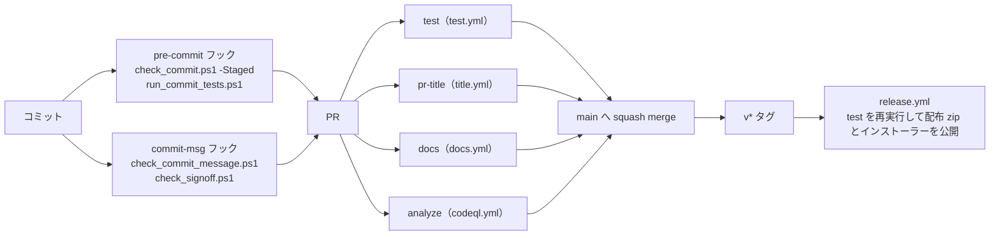

# テスト

このページは、tebunko の品質をどう確かめているかをまとめる。コードを変えたときに何が自動で確かめられ、何を手で確かめるかが分かる。

| 知りたいこと | 節 |
|---|---|
| 品質の関門（どこで何を止めるか）の一覧 | [品質の関門の一覧](#品質の関門の一覧) |
| 関数ごとに何をテストしているか | [単体テスト](#単体テスト) |
| Office の実機で確かめたこと | [結合テスト（手動）](#結合テスト手動) |
| テストの置き場所・タグ・実行のしかた・カバレッジ | [テストの実行と CI](ci.md)、[タグと実行](ci.md#タグと実行) |
| CI のワークフローとマージの必須チェック | [CI](ci.md#ci) |
| コミット時のフック | [コミット前の検査（pre-commit フック）](ci.md#コミット前の検査pre-commit-フック) |
| 個人情報・文字コードの検査 | [公開してはいけない内容の検査](ci.md#公開してはいけない内容の検査toolscheck_commitps1) |

## 品質の関門の一覧

変更は、手元のコミット → PR → main → リリースの順に、次の関門を通る。main へは PR 経由でしか入れられず（ブランチ保護）、必須チェックが通らないとマージできない。

| 関門 | 何を止めるか | 仕組み | 必須 |
|---|---|---|---|
| 単体テスト（Unit・Io・Meta） | 関数の動きの誤り、構成の決まりの違反 | `tests/run.ps1`（Pester 5.9.0）。[単体テスト](#単体テスト)・[テストの実行と CI](ci.md) | CI の `test` |
| カバレッジの下限 | テストされない処理が増えること | `tests/coverage.baseline`（90.0%）を下回ると `-Ci` が失敗する。[タグと実行](ci.md#タグと実行) | CI の `test` |
| 構成・安全性のメタテスト | 層の決まり・文字コード・危険な処理（`Invoke-Expression`・通信・実行時コンパイルなど）の混入 | `tests/meta/`。[テストの実行と CI](ci.md) | CI の `test` |
| 静的解析 | PSScriptAnalyzer の `Error` と、安全性にかかわる 14 ルールの指摘 | `test.yml`（版は 1.25.0 に固定）と `tests/meta/safety.Tests.ps1` | CI の `test` |
| 個人情報・文字コード | 利用者名入りのパス・メールアドレス・Office ファイルの作成者名、BOM・CRLF でないスクリプト | `tools/check_commit.ps1`。[公開してはいけない内容の検査](ci.md#公開してはいけない内容の検査toolscheck_commitps1) | フックと CI の `test` |
| DCO（`Signed-off-by`） | 作者の署名の無いコミット | `tools/check_signoff.ps1` | フックと CI の `test` |
| コミット・PR のタイトル | Conventional Commits の形でないもの | `tools/check_commit_message.ps1` | フックと CI の `pr-title` |
| 設計書のリンク | リンク先のファイル・見出しが無いこと | `mkdocs build --strict`（`docs/` の中）、メタテスト `links`（git で管理する全 `.md`） | CI の `docs`・`test` |
| ワークフローの静的解析 | 信頼できない入力を `run` に埋め込む書き方など | CodeQL | CI の `analyze` |
| サプライチェーンの採点 | ―（採点だけでマージは止めない） | OpenSSF Scorecard | ― |
| Office の実機での確認 | COM を使うインデックス作成の不具合 | 手動の結合テスト。[結合テスト（手動）](#結合テスト手動) | ― |

## 単体テスト

`tests/`（Pester 5.9.0）で各モジュールの関数とパス定義、全スクリプトの構文、実行時コンパイル（`Add-Type -TypeDefinition`）を使わないことを検証する。テストは `scripts/` と同じ構成に並べる（[テストの実行と CI](ci.md)）。検索・画面の部品のテストの内容は [テスト](index.md) の [画面の単体テスト](#画面の単体テスト) にある。

**共通基盤（`tests/shared/core/`）**

| 対象 | 主な確認内容 |
|---|---|
| `toSafeFileName` | 禁止文字の全角化、`/` → `／`、`"` → `”`、使用可能文字は不変 |
| `toLongPath` / `fromLongPath`・長いパス | `\\?\`・`\\?\UNC\` の付け外し、260 文字を超えるパスの読み書き |
| `copyFileShared` | ほかのアプリが書き込み用に開いているファイルもコピーでき、コピー中もほかのアプリの書き込みを妨げない |
| `readListFile` / `writeListFile` | `[` `]`・先頭の空白を含むパスの往復、ファイル無しは空配列、読めないファイルは例外、行が無ければ空のファイル |
| `writeTextLinesAtomic` | 新しいファイルを作り、一時ファイルを残さない |
| `formatFileTime` | 秒までの日時（`yyyy/MM/dd HH:mm:ss`） |
| `removeDirectoryRetry` | 中身ごと削除、フォルダが無ければ何もしない |
| `newAppMutex` | 同じ処理・同じ配置フォルダでは 2 つ目を取得できない、処理の種類・配置フォルダが違えば同時に取得できる |
| `replaceCellNewLine` | `"` 内の改行（LF・CR・CRLF）は U+2028 に置き換え、`"` 外の改行は保持 |
| `formatTsv` | 行末の空セル・末尾の空行の除去（途中の空行は保持）、セル内改行を含む行を 1 行にまとめる、使用範囲の左上に合わせた先頭の空行・空セルの補完、空白だけなら空 |
| `prettyTsv` | UTF-16 → UTF-8（BOM 付き）、`[` `]` を含む出力パス、使用範囲の左上の指定、空なら出力しない |
| `countTsvFields` | タブ区切りのセル数、先頭のセルが空の行、`"` で始まるセル内のタブ・改行は区切りとしない、途中の `"` は囲みとしない |
| `toColumnName` | 列名（`A` `Z` `AA` `ZZ` `AAA` `XFD`） |
| `normalizeFolderPath` | 前後の空白・引用符・末尾の `\` の除去、ドライブ直下は `D:\` のまま、UNC パス、`/` → `\`、`\\?\` ・ `\\?\UNC\` の除去、重なった `\` ・ `.` ・ `..` の解決、環境変数の展開、相対パスは `$rootDir` から、解釈できないパス（`*` を含む・`\\server` ・ `\` ひとつで始まる）は書かれたとおり |
| `getPathUnderFolder` | フォルダからの相対パス（フォルダ自身は空、末尾の `\` ・大文字と小文字の違い、ドライブ直下、UNC の共有直下）、フォルダの下でなければ `$null`（フォルダ名の途中では一致しない） |
| `getFolderPathAliases` / `testSameFolder` / `testFolderUnder` | ネットワークドライブ ⇔ UNC パス、`subst` のドライブ ⇔ 割り当て元のフォルダ、ドライブ直下・共有直下、割り当ての無いパスは自身だけ、同じフォルダの判定（割り当ては差し替えてテストする）、この PC の割り当てでも例外にならない、入れ子のフォルダの判定（自身も「中」・名前の先頭が同じだけのフォルダは別・別の書き方でも分かる） |
| `getFolderLeafName` | ドライブ直下・UNC・末尾の `\` |
| フォルダ選択を開く場所（`getExistingAncestorFolder`） | [テスト](index.md) の [画面の単体テスト](#画面の単体テスト) |

**設定ファイル（`tests/tebunko/core/settings`）**

| 対象 | 主な確認内容 |
|---|---|
| `readSettings` / `writeSettings` / `updateSettings` | ファイル無しは既定値でファイルを作らない、保存と読み込みの往復（1 件だけの一覧も配列のまま）、1 つのキーだけ変えてもほかのキーを保つ、記載の無いキー・空のファイルは既定値、JSON として読めなければ例外 |
| `getTargetFolders` / `writeTargetFolders` | 記載順、`enabled` が `false` はチェックなし・記載が無ければチェックあり、引用符・末尾の `\` の除去、空のパスは除く、重複（大文字・小文字・末尾の `\` の違い）は最初のものだけ、設定が無ければ空、保存と読み込みの往復（ほかの設定を保つ） |
| `readIndexSources` / `setIndexSourceFolder` | インデックス名に対する元のフォルダの記録と読み込み、同じ名前は 1 か所（上書き）、クロール対象フォルダにある名前ならその `path` を書き換える（`indexSources` には入れない）、名前・フォルダが空なら何もしない |
| `readSearchExcludes` / `writeSearchExcludes` | 無ければ空、保存したフォルダと直下だけの区別を読み戻す（末尾の `\` を除く、空のパスは除く）、ほかの設定を変えない、空で保存すると空 |

**インデックス名と TSV の名前（`tests/tebunko/index/index_name`）**

| 対象 | 主な確認内容 |
|---|---|
| `encodeIndexPlace` / `decodeIndexPlace` | 禁止文字・`_`・`%`・制御文字の `%XX` 化と往復、`衝突"` と `衝突”` が別の名前になる、使用可能文字（全角記号・空白・`&'#()`）は不変、符号化で作らない `%XX`（`100%` 等）は戻さない |
| `splitObjectPlace` / `describePlace` | 図形・コメントの場所の分解、画面と検索結果ファイルに出す場所・種別の文字 |
| `toIndexFileName` | 場所の符号化、255 文字の上限 |
| `newIndexName` / `assignIndexNames` | フォルダ名・ドライブ名・共有名、重複時の `(2)` `(3)`、設定の名前をそのまま使う（フォルダの場所が変わっても同じ名前）、名前が無ければ前回の取り込み一覧の名前・フォルダ名から作る、設定にある名前はほかのフォルダに使わない、名前にできない・長いフォルダ名 |
| `splitIndexRelPath` | 先頭のインデックス名と残り（深い階層、数字を含む名前）、`\` が無い場合 |
| `testIndexName` | 使える名前は空文字列、空・前後の空白・255 文字超・使えない文字・末尾の `.`・Windows の予約語（大文字小文字を区別しない）・ほかのインデックスと重複、それぞれの理由を返す |

**インデックスの管理（`tests/tebunko/index/index_store`）**

| 対象 | 主な確認内容 |
|---|---|
| `getIndexStats` | インデックス名ごとの件数（合計・済・未取り込み・失敗）と最終取り込み日時を集計する |
| `renameIndex` | `work\index\<旧名>` を改名して中身をそのまま残し、取り込み一覧のクロール対象フォルダの行と各行の相対パスの先頭を書き換える。ほかのインデックスの記録は変えない。フォルダがまだ無くても記録は書き換える。同じ名前のフォルダが既にあれば例外 |
| `removeIndex` | `work\index\<名前>` と取り込み一覧の記録を削除し、ほかのインデックスは残す。名前が空なら何もしない |
| `getSearchIndexes` | `work\index` 直下のフォルダをインデックス 1 件として返す。［1 インデックス管理］の一覧と同じ並びで、一覧に無いものは名前順で後ろ。元のフォルダも返す（一覧にも取り込み一覧にも無ければ、そのフォルダの `元のフォルダ.txt` から読む。分からなければ空）。フォルダが無ければ空 |
| `getIndexNameMap` | クロール対象フォルダの行だけを読み、見出し行の後の行・インデックス名の無い行は使わない。取り込み一覧が無ければ空 |
| `getIndexTsvCounts` / `testIndexComplete` | 集約ファイルはそのファイルの相対パスで数える（0 バイトは壊れているとする）、集約ファイルがあれば元のファイルごとのフォルダが無くても「済」のまま、フォルダごとの TSV の数（TSV の無いフォルダは 0 件、大文字・小文字を区別しない、インデックス直下の TSV は数えない）、TSV がそろっていれば「済」のまま、フォルダごと削除・TSV が足りない場合は取り込み直す、0 バイトの TSV があるフォルダは壊れているとして作り直す（ほかのファイルは巻き込まない・後の TSV で数え直さない）、TSV 数が空の行・数えられなかった場合は確認しない |
| `publishIndexFiles` | 作業フォルダの TSV をインデックスのフォルダへまとめて入れる、以前のインデックスを残さず入れ替える、TSV が 1 件も無ければ空のフォルダ、前回の出力用フォルダが残っていても入れ替えられる |

**集約ファイル（`tests/tebunko/index/pack_format`・`tests/tebunko/search/pack_search`）**

| 対象 | 主な確認内容 |
|---|---|
| `convertPlaceToPackMeta` / `convertPackMetaToPlace` | 場所の名前（シート・ページ・スライド・非表示・ノート・図形・コメント・それ以外の部分）とメタ情報の往復、組み立て直して同じにならない名前はそのまま持つ |
| `getPackFileName` / `readPackFileName` / `planPackParts` / `splitPackBooksByExtension` / `encodePackValue` / `decodePackValue` / `convertToPackBody` | 集約ファイルの名前、拡張子ごとの分け方、値の `%XX` の往復、中身の改行を LF にそろえ U+001C〜U+001F を除く |
| `convertToPackText` / `readPackPlaces` | 文字列にしてから読み戻すと、元のファイル・場所・中身の範囲が同じになる、版の無い・違う集約ファイルは例外 |
| `convertIndexFolderToPack` / `updateIndexFolderPack` / `findIndexFoldersWithBooks` / `publishIndexFolders` | フォルダごと・拡張子ごとに作る、元のファイルが無くなった拡張子の集約ファイルは消す、UTF-16LE（BOM 付き）で一時ファイルを残さない、置かれた TSV を入れて TSV を消し変わらない元のファイルは写す、TSV の残ったフォルダを見つけて集約ファイルとシステムインデックスに入れる |
| `searchPackIndex` / `getIndexPackFiles` / `readPackContext` | 結果が TSV を 1 行ずつ照合したときと同じ（改行の種類・照合のしかた・検索語ごと）、大文字・小文字・図形とコメントの除外・対象ファイル、上限・中止・並列・キャッシュ（書き直したら読み直す）、全文への照合の時間切れは 1 行ずつに切り替える、列挙（フォルダの一部・直下だけ・無いフォルダ）、プレビューの前後の行 |

**インデックス作成（`tests/tebunko/indexer/`）**

| 対象 | 主な確認内容 |
|---|---|
| `readStatusFile` / `writeStatusFile` / `addStatusRow` | クロール対象フォルダと各列の往復（`[` `]`・先頭の空白を含むパス）、1 行目・見出し行の書式、追記した行の優先（大文字・小文字を区別しない）、エラーのタブ・改行をスペースに、列数の合わない行の無視、書き直し時の置き換え、ファイル無しは空、まとめて書き出した行と `toStatusLine`（1 件ずつの追記）の整形が同じ（速さのため別々に書いているため）、ほかから共有せずに開かれているときの読み込み |
| `readStatusLines` / `renameStatusIndexName` / `removeStatusIndexName` | 名前の変更（クロール対象フォルダの行と各行の相対パス）、インデックスの記録の削除 |
| `readIngestingFiles` / `writeIngestingFiles` / `removeIngestingFile` | 取り込み中の複数のファイルの回数と相対パスの往復、取り込み中が無ければ記録を消す、壊れた行は読み飛ばす |
| `describeIngestError` | 取り込みの例外から失敗の原因を作る（パスが長すぎる場合を含む） |
| `getIndexingState` | 状態ごとの件数、失敗したファイルの行の並び、指定した時刻以降に取り込んだ件数 |
| `newIndexerChannel` / `writeIndexingProgress` / `readIndexingProgress` | 画面が決めた条件を入れスレッドをまたいで使える形にする、段階・件数・内容の往復（タブ・改行はスペース）、受け渡しの口が無ければ何もしない |
| `requestIndexingStop` / `answerIndexingPlan` | 中止を求めると確認を待っていても待つのをやめる、取り込む返事は中止にしない、取りやめの返事（`$null`）は中止にする |
| `testIndexerRunning` | インデックス作成の鍵をほかが持っていれば `$true`、調べた後は鍵を持たない |
| `writeIndexerLog` | ログを開いていればログに書く、コンソールに出すときは色を付ける、ログに書けなくても止めない |
| `getExtractVersion` / `getIngestDecision` | 形式ごとの抽出版、取り込むかどうかと理由（新規・更新あり・前回未完了・インデックスなし・前回失敗・前の抽出版） |
| `getIngestLane` / `getOfficeLane` | Excel はすべて Excel のレーン、旧形式の Word・PowerPoint は Office のレーン、新形式は読み取りのレーン。読み取りのレーンから回し直すときは、PowerPoint のファイルは PowerPoint、それ以外は Word のレーン |
| `createTargetList` / `findOfficeFiles` / `waitForIndexingApproval` | 新規・更新あり・前回未完了・インデックスなし・前の抽出版は取り込み対象、更新の無い取り込み済み・前回失敗は対象外、元のファイルが無くなったらインデックスと行を消す（集約ファイルから外すよう `Removed` で返す）、アクセスできないフォルダがあったときは行とインデックスを残す、画面の返事を受け渡しの口で待つ（返事は別のスレッドから渡す。中止・前に残った返事・制限時間を含む） |
| `publishTsv` / `removeStaleTmpDirs` / `removeDroppedFolders` | 作業フォルダの TSV をインデックスへ移す（`[` `]`・260 文字超のパス）、終了したプロセスの作業フォルダだけを削除する、クロール対象から削除したフォルダのインデックスだけを削除する |
| `indexer.ps1`（起動口） | 設定とインデックスを `$TestDrive` に差し替え、`indexer.ps1 -Channel` で通しで動かす（受け渡しの口の `Workers` を 0 にし、取り込みは司令のスレッドで行う。Excel は使わず、`.docx`・`.pptx` を取り込む）。代表的な場面だけを確かめる（関数の単位で確かめられることは各モジュールのテストで確かめる）。続けられないエラーと終了コード、ほかのインデックス作成が実行中なら触らない、基本の流れ（取り込み・集約ファイル・システムインデックス）、2 回目は更新の無いファイルを取り込まない、フォルダが見つからないときは前回の結果を残す、強制終了したファイルを最後に回す・続けて強制終了したら失敗にする、画面の確認での取りやめと失敗分の取り込み直し、中止（終了コード 2。元のファイルごとのフォルダを残さず、対応済みにしない）、制限時間、取り込み中に元のファイル・フォルダが無くなった場合、前回残った TSV を次の作成の始めに集約ファイルへ入れる、既定のワークスペースが空でなければ何も書かない |
| `indexer.ps1`（取り込みのスレッド） | 取り込みのスレッドで取り込んでも、取り込み一覧・集約ファイルがスレッドを使わないときと同じになる、取り込みのスレッドが始められなければ続けられないエラーで 1 を返す |
| `getIngestWorkerCount` | 読み取りのスレッドの数。指定があればその数、無ければ設定（`ingestThreads`）、設定が 0 ならコア数から決める、ファイルの数より多くしない |
| `getIngestLaneCapacity` | Office のレーンは取り込み中と次の 1 件、読み取りのレーンはスレッドの数の 2 倍まで渡す |
| `runIngestWorker` / `invokeIngestTask`（レーン） | 列の順に取り込み、結果を 1 件に 1 つ返して、列が閉じられたら終わる、読み取りのスレッドは Office を起動し直さない。「Office が要る」の例外なら、失敗にせず回し直し（`Reroute`）として返し、Office も終了しない |
| `IndexingSession`（`indexing_session`） | インデクサを別のスレッド（MTA・優先度を下げる）で動かし終了コードを返す、中止を求めると受け渡しの口の `Stop` を立てて返事を待つのをやめさせる、終了コードを入れずに止まったら 1 と止まった理由、インデクサが入れたエラーの内容、`Close` は動いていれば中止を求めて待つ（何度呼んでもよい）、`KillOffice` は記録した PID のうちプロセス名が同じものだけを止める |

**スレッドとプール（`tests/shared/core/worker_pool`・`tests/tebunko/search/search_service`）**

| 対象 | 主な確認内容 |
|---|---|
| `getWorkerCount` / `newWorkerState` | 画面のために 1 コアを残し 1〜上限に収める、指定した関数と値だけを各スレッドに読み込む |
| `WorkerPool` | 仕事の出力と引数の受け渡し、指定した優先度、PowerShell のインスタンスの使い回し、同時に複数の仕事、仕事の例外を投げても次の仕事を続けられる、止めた仕事は使い回さない、閉じた後は受け付けない（`Close` は何度呼んでもよい）、`Prelude` は各スレッドで 1 回だけ実行する |
| `BackgroundQueue` | 終わった仕事の出力を onDone に渡す、失敗は errorText で渡す、終わっていない仕事の数、閉じると終わっていない仕事を止める |
| `newSearchRequest` / `invokeSearchRequest` | ヒットを列に入れて件数と終わったことを伝える、照合のプールを渡しても同じ結果、始める前に取り消されていたら検索しない、検索できなかった理由を `Error` に入れる（例外は投げない） |
| `SearchService` | 要求を順に実行し同じスレッドを使い続ける、次の要求を渡すと前の要求を取り消す、閉じるとスレッドを止める、司令のスレッドが止まっていたら理由を返し次の要求で作り直す |
| `trimTsvTextCache` | 上限の 9 割以下なら追い出さずに世代だけ進める、超えていたら今の世代で使わなかったものを古い世代から追い出す、今の世代で使ったものは残す、入れたとき・使ったときの世代を残す |

**元のファイルの特定（`tests/tebunko/search/source_map`）**

| 対象 | 主な確認内容 |
|---|---|
| `getIndexNameMap` / `resolveSourcePath` | インデックス名から元のフォルダを引いた元のファイルのパス、ドライブ直下、元のフォルダが分からない結果は `$null`、**設定（`targetFolders` / `indexSources`）を `元のフォルダ.txt`・取り込み一覧より優先**、既定のインデックスは取り込み一覧を `元のフォルダ.txt` より優先 |
| `writeSourceFolderFile` / `readSourceFolderFile` / `getSourceLocation` | 各インデックスのフォルダへの書き出しと読み込み（説明の行は無視）、別の場所にコピーしたインデックス、インデックス名のフォルダを検索対象にした場合（そのフォルダの記録）、分からない場合は Known = `$false`・Folder は空でインデックス名を返す、キャッシュ |
| `joinSourcePath` | ドライブ直下・相対フォルダが空の場合・共有フォルダ・空の名前 |
| `findMovedSource` | 元のフォルダ・ファイルのあるフォルダ・途中のフォルダを選んだ場合も同じ `Root` を返す、相対フォルダが無い場合、見つからない場合 |

**開発用の道具（`tests/tools/`）**

| 対象 | 主な確認内容 |
|---|---|
| `check_commit_message.ps1` | 形が合うタイトルを通し、違うものを止める、git が自動で作るメッセージは調べない、コメント行と空行を飛ばして最初の行を調べる、CRLF のファイル、空のメッセージは通す |
| `check_signoff.ps1` | 作者の `Signed-off-by` があれば通す、無い・作者と違うメールアドレスなら止める、コメント行と `git commit -v` の差分の中は数えない、マージコミット・bot は調べない |
| `check_markdown_links.ps1` | あるファイル・フォルダ・見出しへのリンクを通し、切れたリンクを止める、コードの中のリンクは調べない、1 行に複数あるリンクをそれぞれ調べる |
| `measure_perf.ps1` | 統計値（最小・中央値・平均・最大）と最小二乗の傾きの計算、点の間引き、グラフの行の書き方。小さなインデックスで最後まで動かし、フォルダ・ブック・TSV・pack の数、語ごとのヒット件数と検索時間の統計値、検索の流れ（`SearchMode`）、`result.json` の形式の版と実行の情報、`metrics.csv` の列と行、`summary.md` の表とグラフ（パスを含まないこと）を確かめる。pack しか無いインデックスでは、作成を測らずに検索だけを測る |

**Office ファイルの読み取り（`tests/shared/office/office_reader`）**

Word・PowerPoint・Excel は使わず、最小限の `.docx` `.pptx` `.xlsx`（ZIP）をテスト内で作成する。

| 対象 | 主な確認内容 |
|---|---|
| `isZipFile` / `isCompoundFile` | ZIP / 複合ドキュメント形式（旧形式・パスワード付き）/ 空ファイル・テキスト |
| `resolveZipPath` | リレーションシップの相対パス・`/` 始まりのパス |
| `readDocxUnits` | 段落・表の行（タブ区切り、セル内の複数段落、末尾の空セル、入れ子の表）、変更履歴の削除・フィールドコードを読まない、保存時のページ区切り・手動の改ページ（直後の保存時のページ区切りの有無）・セクション区切り・段落前で改ページ、ヘッダー/フッターの重複除去、脚注、テキストボックスは本文から分けてそのページの図形にする、SmartArt・グラフの文字は図形にする、コメントと返信は付けた所のページに入れる |
| `readPptxUnits` | 表示順（`sldIdLst`）、非表示スライド、グループ内の図形・表、スライド番号・日付のプレースホルダーを読まない、ノートとスライドの対応、SmartArt・グラフの文字はスライドの図形にする、旧形式・新形式のコメントと返信 |
| `readXlsxObjectUnits` / `getCellPosition` | 表示シートの図形・コメントだけをシートごとの場所にする、図形は左上のセル番地の順、グループ化した図形は 1 つ、互換用の代替表示は読まない、スレッド形式のコメント（返信を含む）、ふりがなは読まない、Excel のブックでない ZIP は何も返さない |
| `readObjectText` / `readChartText` | 参照先が無ければ空、グラフはタイトル・系列名・項目名（多段を含む）を読み、数値は読まない |
| `readDocxUnits` / `readPptxUnits`（壊れた ZIP） | 本文・プレゼンテーション情報が無ければ、分かるメッセージで例外にする |
| `writeUnits` | 場所ごとの TSV 出力、空の場所は出力しない、`[` `]` を含むパス |

**COM を使う処理（`tests/tebunko/indexer/extract_office`・`tests/shared/office/office_app`）**

Excel・Word・PowerPoint の COM を呼ぶ処理は、Office を使わずに流れを検証する。COM の入口は `getApp`（アプリの取得）と `New-Object -ComObject` だけなので、ここを Pester の `Mock` で差し替え、本物と同じ呼び方ができる偽のオブジェクト（呼ばれたメソッドと引数を記録し、保存では本物と同じ形式のファイルを書く）を返す。実機での動作は [結合テスト（手動）](#結合テスト手動) の手動の結合テストで確かめる。

| テスト | 主な確認内容 |
|---|---|
| `tests/tebunko/indexer/extract_office.Tests.ps1` | 表示しているシートだけを書き出す、作業フォルダのコピーを読み取り専用・ダミーのパスワードで開いて保存せずに閉じる、使用範囲の左上を A1 からの位置に戻す、使用範囲が膨らんだシートは一時シートにコピーして書き出して消す（構成が保護されていれば元のシートのまま）、新形式のブックの図形・コメントを別の場所の TSV にする（読めなくてもセルの値は取り込む）、新形式の Word は Word を使わずに読む、旧形式の Word・PowerPoint を新形式に保存してから読む、壊れた `.pptx` を PowerPoint に渡さない、読み取りのスレッドでは中身が旧形式の `.docx` を Office を使わずに「Office が要る」の例外にし（`getApp` を呼ばない）、壊れた `.pptx` は回し直さずに失敗にする、失敗しても文書を閉じて作業ファイルを消す |
| `tests/shared/office/office_app.Tests.ps1` | 起動時の設定（非表示・警告なし・イベントなし・リンクを更新しない・マクロ無効。PowerPoint は `Visible` を変えない）、起動済みのアプリを使い回す、自分で起動したアプリだけを制限時間の強制終了の対象にする、Quit して終わらなければ強制終了する（Excel は 1 秒、Word・PowerPoint は 5 秒待つ）、利用者のアプリ・利用者が文書を開いたアプリは終了させない、制限時間の監視、起動した Office の優先度は変えない |

**画面の部品（`tests/tebunko/ui/`・`tests/shared/ui/`）**

判断層（`*_view.ps1`）はそのままテストする。`result_list.ps1`・`open_source.ps1`・`preview.ps1`・`index_tree.ps1` は `$ui`・`$window` を偽物にし、Excel・エクスプローラーの起動は `Mock` して実際には開かない。クリップボードは利用者の PC のものを書き換えるため、「コピーしない場合」（`preview.ps1` の `copyPreviewSelection`）だけを確かめる。型（`shared/ui/types.ps1`・`tebunko/ui/types.ps1`）はプロパティの変更通知と各メソッドを確かめる。内容は [テスト](index.md) の [画面の単体テスト](#画面の単体テスト)。

**テストデータの個人情報の除去（`tests/testdata/scrub_personal`）**

タグ `Io` で、テストデータから個人情報を取り除く `tests/testdata/scrub_personal.ps1` を検証する（OOXML・ODF・`.xlsb` の中のバイナリ・旧形式・Shift_JIS のテキスト、壊れた ZIP、隠し属性・読み取り専用属性）。

**安全性の検査（`tests/meta/safety.Tests.ps1`）**

タグ `Meta` で、[安全性の要約](../../safety/index.md) の主張を機械的に検証する。導入審査で「危険な処理・ライブラリを使っていないこと」を示すための検査であり、将来の変更でこの前提が崩れた場合に失敗する。スクリプトを読むだけで動作するため、Office もテストデータも要らない（36 件）。

| 対象 | 主な確認内容 |
|---|---|
| 禁止する処理 | 動的なコード実行（`Invoke-Expression` 等）・難読化（Base64）・ネットワーク通信・P/Invoke・実行時コンパイル・レジストリ・権限やサービスの変更・`Set-ExecutionPolicy` と `Bypass`・資格情報・リモート実行が 0 件 |
| 許す処理の限定 | `Add-Type` は `-AssemblyName` だけ、`Start-Process` は `explorer.exe` だけ、`Stop-Process` は `shared/office/office_process.ps1` の 1 か所だけ |
| Office の開き方 | マクロ無効（`AutomationSecurity = 3`）・`EnableEvents = $false`・外部リンクを更新しない・インデクサでは不可視・Excel / Word / PowerPoint いずれも読み取り専用で開く |
| 原本の保護 | 原本のパスを書き込み・削除の API に渡さない、`SaveAs` の保存先は作業フォルダのパスだけ、原本を読むのは `copyFileShared`（`FileAccess::Read`）だけ |
| 書き込み先 | `$workspace`（`Workspace` の `IndexDir`・`PublishDir`）・`${tmpDir}`・`${settingsFile}` の定義が `work` 配下・`%TEMP%` 配下・`setting.config` だけ、ドライブ直下やシステムフォルダを直接指す書き込み先が無い、異常終了で残った作業フォルダを次回起動時に回収する（`removeStaleTmpDirs`） |
| 静的解析（PSScriptAnalyzer） | 安全性にかかわるルール（`tests/meta/PSScriptAnalyzer.security.psd1` の 14 件）・`Error` 重大度・制限言語モード（`PSUseConstrainedLanguageMode`）の指摘が 0 件、設定ファイルから当該ルールが削られていないこと |
| 審査用の資料 | `docs/safety/index.md`・`.github/SECURITY.md`・`tools/new_release_files.ps1`・`sbom.cdx.json` がそろっており、SBOM が第三者の部品（`purl` を持つ部品）を含まないこと |

PSScriptAnalyzer は Windows PowerShell 5.1 に標準では入っていないため、未導入の環境では静的解析の 3 件を自動的に飛ばす（`It -Skip`）。導入は `Install-Module PSScriptAnalyzer -Scope CurrentUser`。CI では必ず入れて実行する。安全性にかかわるルールの選定と、全ルールで出る指摘の内訳は [安全性の要約](../../safety/index.md) の [静的解析: PSScriptAnalyzer（Microsoft）](../../safety/scans.md#静的解析-psscriptanalyzermicrosoft) に記載している。

`TypeNotFound`（継承元の型が別ファイルにあるための指摘）は、1 ファイルだけでは解決できないため除く。読み込む順で解決できることは `tests/meta/structure.Tests.ps1` で確かめる。

**インストーラーの検査（`tests/meta/installer.Tests.ps1`）**

タグ `Meta` で、インストーラー（`installer/`）が [安全性の要約](../../safety/index.md) の [インストーラー版](../../safety/disclosure.md#インストーラー版) のとおりであることを確かめる。インストーラーそのもののビルド（Inno Setup）は `release.yml` だけで行い、ここではスクリプトを読んで確かめる。

| 対象 | 主な確認内容 |
|---|---|
| 起動口 `tebunko.exe`（`tebunko.cs`） | Windows 標準の `csc.exe` で警告なしにビルドできる、起動するのは Windows の PowerShell 5.1 だけで `-ExecutionPolicy RemoteSigned`（`Bypass` を使わない）、P/Invoke とレジストリを使わない、ミューテックスの名前がインストーラーの `AppMutex` と同じ |
| インストーラー（`tebunko.iss`） | 既定は管理者権限なし、`[Registry]` を使わず PATH・関連付けも変えない、入れるのは `tebunko.exe`・`LICENSE`・`scripts\` だけ、更新では前の版の `scripts\` を消してから入れる、インストール後に起動するのは `tebunko.exe` だけ |
| 文字コード | 2 つとも BOM 付き UTF-8・CRLF（Inno Setup は BOM の無いスクリプトを ANSI として読む） |

## 結合テスト（手動）

Excel・Word・PowerPoint の COM を使うインデックス作成と、画面のプロセス停止は、実機の Office を要するため自動テストの対象外。以下のテストデータで手動の結合テストを行い、動作を確認済み。

| テストデータ | 確認内容 | 関連 |
|---|---|---|
| `[確定]` を含むブック名、`[1]` を含むツール配置フォルダ | インデックス作成・検索できる | インデックス作成・検索 |
| 表示 / 非表示 / 完全に非表示 / 空 のシート | 表示かつ内容のあるシートのみ TSV になる | インデックス作成 |
| セル内改行・`"`・`:` を含むセル、離れた位置のセル | 1 行にまとまる。検索結果で行が途切れない | インデックス作成・検索 |
| `セル内容.xlsx`（D5 から始まる表・空行・300 列の行・セル内改行を含む 5 シート）を `TC10` で検索し、結果を Excel に貼り付け | 71 行 × 300 列の各セルが、元のシートの「行番号・列」のセルの表示値と一致する（位置のずれ 0 件。表示形式の和暦の順序と、CR だけの改行が LF になる点のみ値が異なる） | インデックス作成・検索 |
| Word の行（`"` で始まるセル、途中に `"` を含むセル、表の行）を含む検索結果を Excel に貼り付け | 各セルが元のまま貼り付けられ、後続の行がずれない | 検索 |
| サブフォルダ（空白を含む）内の `.xls` | 相対フォルダ付きで検索結果に出る | 検索 |
| パスワード付きブック | ダイアログを出さずに失敗として記録される | インデックス作成 |
| `~$` で始まるロックファイル | 取り込み対象にならない | インデックス作成 |
| 2 回目の実行 / 元ファイルの更新 | 取り込み済みはスキップ、更新したファイルのみ再取り込み | インデックス作成 |
| インデックス作成後の Excel プロセス | 残らない | インデックス作成 |
| 複数ページ・表・テキストボックス・ヘッダー/フッター・脚注・変更履歴（削除）を含む `.docx`（`[確定]` を含むファイル名） | ページごとに分かれ、表は行ごと、削除した文字は出ない | インデックス作成・検索 |
| 旧形式 `.doc`、中身が `.doc` の `.docx` | Word で変換して同じ内容を読める | インデックス作成 |
| 並べ替えたスライド・非表示スライド・表・グループ・ノートを含む `.pptx`、旧形式 `.ppt` | 表示順のスライド番号、非表示・ノートが分かれる | インデックス作成・検索 |
| パスワード付きの `.docx` / `.doc` / `.pptx` | ダイアログを出さずに失敗として記録される | インデックス作成 |
| テンプレート `.dotx`、`~$` で始まる `.docx` | 取り込み対象にならない | インデックス作成 |
| インデックス作成後の Word・PowerPoint プロセス | 残らない（利用者が使用中の Word には触れない） | インデックス作成 |

テストデータの作り方と、各ファイルで確かめる内容は [tests/testdata/README.md](../../../tests/testdata/README.md) にある。

## 画面の単体テスト

画面が使う関数と画面の部品を Pester 5.9.0 で確かめる（実行方法・タグ・カバレッジは [テスト](index.md)）。画面の部品（`ui/*.ps1`）のテストは、WPF のコントロール（`$ui.ResultGrid` など）を偽のオブジェクトに差し替え、読み込み時に登録されたイベントの処理を直接呼んで確かめる。画面を開かないため、CI でも動く。

**画面が使う `tebunko/lib.ps1` の関数**（[実装構成](../gui/implementation.md#実装構成)）

| 対象 | テスト | 主な確認内容 |
|---|---|---|
| `searchPackIndex` | `tests/tebunko/search/pack_search.Tests.ps1` | 結果が TSV を 1 行ずつ照合したときと同じこと（改行の種類・照合のしかたごと）、文字どおり・正規表現・不正な正規表現、大文字・小文字、対象ファイル・図形とコメントの除外、上限での打ち切り、正規表現の照合の時間切れ（全文への照合は 1 行ずつに切り替える）、並列検索と読んだ内容の使い回し、中止・進捗の通知 |
| `getIndexPackFiles` / `readPackContext` | 同上 | 集約ファイルの列挙（フォルダの一部・直下だけ・無いフォルダ）、前後の行と行番号 |
| `testIndexExists` / `getIndexSummary` | `tests/tebunko/search/search_run.Tests.ps1` | 集約ファイルの有無・件数・最新の更新日時、存在しないフォルダ |
| `toSearchResultLines` / `writeSearchResult` | 同上 | [検索](../search/index.md) の結果ファイルの形式になること |
| `newSearchRegex` / `getRegexScanMode` / `newFileFilter` | `tests/tebunko/search/search_query.Tests.ps1` | 文字どおりの記号、不正な正規表現、大文字と小文字の区別。対象ファイルは `;` / `；` の区切り、`!` の除外、部分一致、`?`、ほかの記号は文字どおり、空なら条件なし |
| `getSourceLocation` / `resolveSourcePath` / `findMovedSource` | `tests/tebunko/search/source_map.Tests.ps1` | 元のファイルのインデックス名・場所・パスの特定、選んだフォルダからの探索（[元のフォルダの特定（インデックスを別の PC・場所で使う場合）](../gui/search-tab.md#元のフォルダの特定インデックスを別の-pc場所で使う場合)・[元のファイルが見つからないとき（元のフォルダを設定する）](../gui/search-tab.md#元のファイルが見つからないとき元のフォルダを設定する)） |
| `splitTsvCells` | `tests/shared/core/text.Tests.ps1` | `"` で囲まれたセル内のタブ、空のセル、先頭のセルが空の行 |
| `getExistingAncestorFolder` | `tests/shared/core/folder.Tests.ps1` | フォルダ選択を開く場所（[フォルダ選択ダイアログ（［参照…］）](../gui/index-tab.md#フォルダ選択ダイアログ参照)）。フォルダがあればそのまま、無ければその上の今もあるフォルダ、どこにも無い・空なら空 |
| `getOfficeProcesses` / `stopOfficeProcesses` | `tests/shared/office/office_process.Tests.ps1` | バックグラウンドの判定、終了の成功・失敗（`Get-Process` / `Stop-Process` をモックする） |
| `readSearchOption` / `writeSearchOption` ほか設定の読み書き | `tests/tebunko/core/settings.Tests.ps1` | ファイルが無ければオフ・空、保存した値の読み込み、指定した項目だけを変える |
| `newIndexName` | `tests/tebunko/index/index_name.Tests.ps1` | 使用済みの名前が無い・1 個だけの場合も正しく判定すること（PowerShell は集合を返すと中身を展開するため、`$null`・文字列で渡ることがある） |

**画面の型・判断層・部品**

| 対象 | テスト | 主な確認内容 |
|---|---|---|
| 画面の型（[実行時コンパイル（csc.exe）を使わない](../gui/implementation.md#実行時コンパイルcscexeを使わない)） | `tests/shared/ui/types.Tests.ps1` `tests/tebunko/ui/types.Tests.ps1` | `NotifyBase` の変更通知。`HitRow`（生成・`Prepare`・絞り込みの一致・セルの分割・`BuildPreview`・境界値）、`FileGroup`、`PreviewColumn`／`PreviewCell`／`PreviewTable`（範囲の選択とコピー、Excel に貼れる形への引用）、`IndexNode`（3 状態のチェック・フォルダの読み込み・境界値）、`FolderItem` |
| 判断層 | `tests/tebunko/ui/index_view.Tests.ps1` `indexing_view.Tests.ps1` `search_view.Tests.ps1` `preview_view.Tests.ps1` `settings_view.Tests.ps1` | 画面に出す文言と可否の判定（ワークスペースの表示・選んだフォルダの可否・変える前の確認と空でないフォルダの警告の文言、インデックス名の入力チェック、インデックス作成の確認の文言、検索条件の説明・注意・検索ボタンの状態、ファイルごとの見出しの表記と並べ替え、プレビューの行数とステータス） |
| 結果の表 | `tests/tebunko/ui/result_list.Tests.ps1` | ファイルごとの見出しの作成と開閉（[ファイルごとにまとめた表示](../gui/search-tab.md#ファイルごとにまとめた表示)）、行の作成、絞り込み、並べ替え、検索の終了時の表示、選択行の取得、イベント |
| 選択行のプレビュー | `tests/tebunko/ui/preview.Tests.ps1` | 表示・消去、高さに収まる行数、セルを選んでいないときのコピーの案内、イベント、読み込み（`startJob`）の結果の扱い（読んでいる間に別の行を選んだら古い結果を出さない・後から頼んだ読み込みがあれば先の分は捨てる・読めないときは選んだ行だけを出す） |
| 元のファイルを開く | `tests/tebunko/ui/open_source.Tests.ps1` | パスの特定・フォルダの選び直し、開き方の切り替え、既定のアプリで開く、フォルダを開く、ファイル出力、画面の操作 |
| 検索対象のツリー | `tests/tebunko/ui/index_tree.Tests.ps1` | ツリーの読み込み、検索範囲の説明、除外の保存、すべてのチェック、イベント |
| 画面定義（XAML） | `tests/meta/structure.Tests.ps1` | `scripts/**/*.xaml` が XML として読めること、各タブの画面に `gui.ps1` などが使う `x:Name` がすべてあること、shared と tebunko の型を順に読み込めること |

## 画面の確認

確認欄：◎ = テスト用のコピー（一時フォルダ）で画面を動かして確認済み、空欄・「要手動」 = 未確認（手動で確認する）。

| 確認内容 | 関連 | 確認 |
|---|---|---|
| 起動時のタブが状態（未作成・中断中・失敗あり・通常）に応じて変わる | [起動時に開くタブ](../gui/index.md#起動時に開くタブ) | ◎（中断中） |
| インデックス一覧・チェック・存在の判定、ドラッグ＆ドロップ・［参照…］、`"` 付きのパスの貼り付け | [［1 インデックス管理］タブ](../gui/index-tab.md) | 一覧・判定は◎ |
| インデックス一覧の［作成］チェックの切替が保存されること（Click で配線） | [［1 インデックス管理］タブ](../gui/index-tab.md) | 要手動 |
| フォルダ選択ダイアログ（Windows 標準のダイアログが開くこと、開始フォルダ、［フォルダーの選択］で元のフォルダに入ること、［キャンセル］で変わらないこと） | [フォルダ選択ダイアログ（［参照…］）](../gui/index-tab.md#フォルダ選択ダイアログ参照) | ◎（UI オートメーションで［追加…］→［参照…］→フォルダ名の欄に入力→［フォルダーの選択］まで操作し、インデックス編集への反映を確認）。`OpenFileDialog` に切り替わる場合は要手動 |
| 状態ごとの実行ボタンの表示、インデックス作成中の二重起動防止 | [一覧の列](../gui/index-tab.md#一覧の列) | ◎ |
| インデックス作成の進み具合（件数・失敗・残り時間・取り込み中のファイル・終了後の表示） | [インデックス作成の進み具合](../gui/index-tab.md#インデックス作成の進み具合)、[中止・終了・ログ](../gui/index-tab.md#中止終了ログ) | ◎（取り込み一覧を模擬） |
| インデックス作成の確認ダイアログ（インデックスごとの件数・更新不要・失敗分の再取り込み・［キャンセル］） | [インデックス作成の確認ダイアログ](../gui/index-tab.md#インデックス作成の確認ダイアログ) | 取り込み予定・終了コード・取り込み一覧が前回のまま残ることは◎（`tests/tebunko/indexer/indexer.Tests.ps1` で、受け渡しの口の `ConfirmTargets` でインデクサを動かし、別のスレッドから返事を渡して確認）。ダイアログの見た目は要手動 |
| インデックス作成中に画面を閉じる（止めてから閉じる確認・`インデックス作成を止めています…`・止まってから閉じる。60 秒で Office を止める） | [中止・終了・ログ](../gui/index-tab.md#中止終了ログ)、[閉じる](../gui/state-flow.md#閉じる) | 要手動 |
| 検索中の進捗表示・中止、大量ヒット時の打ち切り、検索中も画面を操作できること | [検索の実行](../gui/search-tab.md#検索の実行) | |
| `(株)` `1.5` `C++` の文字どおり検索と正規表現検索、不正な正規表現の注意 | [検索ワードの扱い](../gui/search-tab.md#検索ワードの扱い) | ◎ |
| 一致箇所の強調、並べ替え、絞り込み | [結果の表](../gui/search-tab.md#結果の表)、[絞り込み](../gui/search-tab.md#絞り込み) | 要手動。並べ替えは軽いフィールド（該当行→`Line`、セルは並べ替えない）。絞り込みは生データで照合するため、セル番地（例 `B5`）とタブ表示記号 ` │ ` には当たらない |
| 「セル」列（`B6` / `A3 ほか 2`、Word は空欄）、選択行のプレビュー（前後の行・一致したセルの強調・先頭のセルが空の行・セル内改行のあるセルの折り返し）、列見出しのドラッグによる列幅の変更（下限 24px）、セルを選んでの値のコピー、［Excel で開く］［フォルダを開く］の表示 | [結果の表](../gui/search-tab.md#結果の表)、[検索対象のツリー（No.13）](../gui/search-tab.md#検索対象のツリーno13) | ◎（テスト用の TSV を画面に入れて描画を確認。列幅は見出しの `Thumb` に `DragDelta` を起こして確認。コピーは、画面のセル（`Border`）から `getPreviewCell` でセルを特定し、1 セル・範囲・行のコピー結果とクリップボードの内容を確認。合成したマウスイベントは配送されないため、クリック操作そのものは要手動） |
| 検索結果の遅延描画：スクロールしても一致箇所の強調・「セル」列が出る／大量ヒット（数千〜1万件）で固まらない（`HitRow.Prepare`＋`LoadingRow`） | [実行時コンパイル（csc.exe）を使わない](../gui/implementation.md#実行時コンパイルcscexeを使わない)、[結果の表](../gui/search-tab.md#結果の表) | クラスの動きは◎（[画面の単体テスト](#画面の単体テスト)）。スクロール時の描画・体感速度は要手動 |
| 検索対象ツリーの 3 状態チェック（親子伝播）・展開時の子読み込み | [検索対象のツリー（No.13）](../gui/search-tab.md#検索対象のツリーno13) | 3 状態・検索範囲と除外の組み立ては◎（[画面の単体テスト](#画面の単体テスト)）。クリック操作・展開は要手動 |
| Excel の該当シート・セルが選択された状態で開くこと、Word・PowerPoint が開くこと、ファイルが無い場合（フォルダを選ぶ確認・フォルダ選択） | [元のファイルを開く](../gui/search-tab.md#元のファイルを開く) | 元のファイルのパスの特定・コピーしたインデックスからの特定・選んだフォルダからの探索と置き換え、Excel を「通常」で開いたときに該当シート・セル（`C3`）が選択されることは◎（`openInExcel` にテストデータのブックを渡して確認）。読み取り専用・新規、Word・PowerPoint、ファイルが無い場合は要手動 |
| コピーした行を Excel に貼ったときの列の位置、結果ファイルの形式 | [元のファイルを開く](../gui/search-tab.md#元のファイルを開く)、[結果をファイルに出力](../gui/search-tab.md#結果をファイルに出力) | コピーの形式のみ◎ |
| Office プロセスの一覧・各終了ボタン・確認ダイアログ・インデックス作成中の警告 | [［9 プロセス停止］タブ](../gui/process-tab.md) | 一覧・ボタンの有効／無効のみ◎ |
| アイコンがタイトルバー・タスクバーに出ること（タスクバーのボタンは PowerShell と同じグループになるが、アイコンは tebunko） | [表示・アクセシビリティ](../gui/common.md#表示アクセシビリティ) | 要手動 |
| 表示倍率 100 %・150 % での見た目 | [表示・アクセシビリティ](../gui/common.md#表示アクセシビリティ) | |
| 多重起動したときに、2 つ目が終了して既存のウィンドウが前面に出ること | [ウィンドウ](../gui/index.md#ウィンドウ)、[待たせ方の方針（画面を固まらせない）](../gui/implementation.md#待たせ方の方針画面を固まらせない) | 最小化からの復帰は◎。別アプリが前面のときのフォーカス奪取は OS の制限で不確実（要手動） |
| zip 展開直後（Mark-of-the-Web 付き）から `tebunko.bat` で起動でき、印が消えること（`Bypass` なし・`RemoteSigned`） | [配布と実行ポリシー（Mark-of-the-Web）](../gui/common.md#配布と実行ポリシーmark-of-the-web) | ◎（テスト用のコピー全ファイルに MOTW を付け、`RemoteSigned` でブロックされること→`tebunko.bat` 実行で `scripts` 配下の MOTW 0 件→`RemoteSigned` で画面が開く（ウィンドウ表題 `tebunko`）ことを確認） |
| `tebunko.bat` で起動したとき、PowerShell の窓が残らないこと（既定のターミナルが Windows Terminal でも） | [配布と実行ポリシー（Mark-of-the-Web）](../gui/common.md#配布と実行ポリシーmark-of-the-web) | ◎（エクスプローラーから起動し、Windows Terminal のタブが増えず、画面の親が `conhost.exe` であることを確認） |
| 実行時コンパイル（csc.exe）を出さないこと | [実行時コンパイル（csc.exe）を使わない](../gui/implementation.md#実行時コンパイルcscexeを使わない) | ◎（`Add-Type` は標準アセンブリの読み込みだけであること（`tests/meta/safety.Tests.ps1`）・起動〜検索で `csc.exe` 0 回／一時 DLL 0 個を実起動で確認） |
| `[` `]` を含むツールの配置フォルダからの起動 | [結合テスト（手動）](#結合テスト手動) | |
