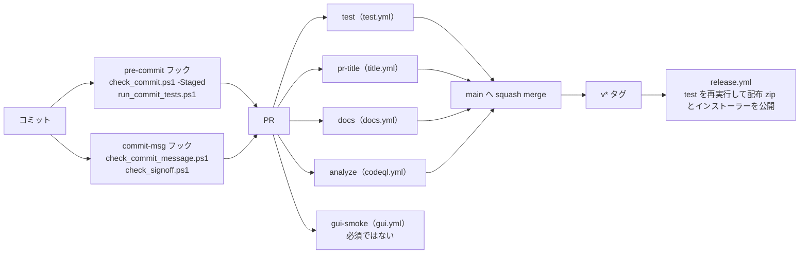

# テスト

扱うこと: 品質の関門の一覧、Office の実機での結合テスト（手動）。扱わないこと: 関数ごとの単体テストの内容（[インデックスと検索](unit-index.md)・[インデックス作成](unit-indexer.md)・[Office](unit-office.md)・[検査と道具](unit-checks.md)・[画面](gui-tests.md)）、テストの実行・CI（[テストの実行と CI](run.md)・[CI](ci.md)）。先に読むページ: [設計の概要](../index.md)。

このページは、tebunko の品質をどう確かめているかをまとめる。コードを変えたときに何が自動で確かめられ、何を手で確かめるかが分かる。

| 知りたいこと | 節 |
|---|---|
| 品質の関門（どこで何を止めるか）の一覧 | [品質の関門の一覧](#品質の関門の一覧) |
| 関数ごとに何をテストしているか | [インデックスと検索](unit-index.md)・[インデックス作成](unit-indexer.md)・[Office](unit-office.md)・[検査と道具](unit-checks.md)・[画面](gui-tests.md) |
| Office の実機で確かめたこと | [結合テスト（手動）](#結合テスト手動) |
| テストの置き場所・タグ・実行のしかた・カバレッジ | [テストの実行と CI](run.md) |
| CI のワークフローとマージの必須チェック | [CI](ci.md) |
| コミット時のフック | [コミット前に動く検査](pre-commit.md) |
| 個人情報・文字コードの検査 | [コミット前に動く検査](pre-commit.md) |

## 品質の関門の一覧

変更は、手元のコミット → PR → main → リリースの順に、次の関門を通る。main へは PR 経由でしか入れられず（ブランチ保護）、必須チェックが通らないとマージできない。

```mermaid
flowchart LR
    C["コミット"] --> H1["pre-commit フック<br>check_commit.ps1 -Staged<br>run_commit_tests.ps1"]
    C --> H2["commit-msg フック<br>check_commit_message.ps1<br>check_signoff.ps1"]
    H1 & H2 --> PR["PR"]
    PR --> R1["test（test.yml）"]
    PR --> R2["pr-title（title.yml）"]
    PR --> R3["docs（docs.yml）"]
    PR --> R4["analyze（codeql.yml）"]
    PR --> R5["gui-smoke（gui.yml）<br>必須ではない"]
    R1 & R2 & R3 & R4 --> M["main へ squash merge"]
    M --> T["v* タグ"] --> REL["release.yml<br>test を再実行して配布 zip とインストーラーを公開"]
```

| 関門 | 何を止めるか | 仕組み | 必須 |
|---|---|---|---|
| 単体テスト（Unit・Io・Meta） | 関数の動きの誤り、構成の決まりの違反 | `tests/run.ps1`（Pester 5.9.0）。[単体テスト](unit-index.md)・[テストの実行と CI](run.md) | CI の `test` |
| カバレッジの下限 | テストされない処理が増えること | `tests/coverage.baseline`（90.0%）を下回ると `-Ci` が失敗する。[テストの実行と CI](run.md) | CI の `test` |
| 構成・安全性のメタテスト | 層の決まり（判断層・状態層が画面に触らないこと、画面以外の読み込み口が `ui/` を読み込まないこと）・文字コード・危険な処理（`Invoke-Expression`・通信・実行時コンパイルなど）の混入 | `tests/meta/`。[テストの実行と CI](ci.md) | CI の `test` |
| 画面のスモークテスト | 画面の起動・タブ・検索・インデックスの作成・ワークスペースの変更・プロセス停止・閉じるの流れが壊れること（XAML の読み込み・イベントの配線・ダイアログの開閉・後片付けの例外） | `gui.yml`（`gui-smoke`。`tests/gui/`・タグ `Gui`）。手元は `.\tests\run.ps1 -Tag Gui`。[画面のスモークテスト](gui-smoke.md) | –（必須にしない） |
| 静的解析 | PSScriptAnalyzer の `Error` と、安全性にかかわる 14 ルールの指摘 | `test.yml`（版は 1.25.0 に固定）と `tests/meta/safety.Tests.ps1` | CI の `test` |
| 検索とインデックス作成の速さ | 検索・本文インデックスの作成・取り込み（.docx・.pptx）が、ランナーで測った数字から決めた上限より遅くなること | `perf-check.yml`（`search`・`ingest`）。PR にラベル `perf-check` を付けたときと main への push で流す。[`perf-check.yml`](ci.md) | ―（流した PR で落ちていればマージしない） |
| 個人情報・文字コード | 利用者名入りのパス・メールアドレス・Office ファイルの作成者名、BOM・CRLF でないスクリプト | `tools/check_commit.ps1`。[公開してはいけない内容の検査](pre-commit.md) | フックと CI の `test` |
| DCO（`Signed-off-by`） | 作者の署名の無いコミット | `tools/check_signoff.ps1` | フックと CI の `test` |
| リリースのタグ | 形が `v<メジャー>.<マイナー>.<パッチ>` でないタグ、指すコミットが main の履歴に無いタグ | `tools/check_release_tag.ps1` | `release.yml` の `guard`（公開前） |
| コミット・PR のタイトル | Conventional Commits の形でないもの | `tools/check_commit_message.ps1` | フックと CI の `pr-title` |
| 設計書のリンク | リンク先のファイル・見出しが無いこと | `mkdocs build --strict`（`docs/` の中）、メタテスト `links`（git で管理する全 `.md`） | CI の `docs`・`test` |
| ワークフローの静的解析 | 信頼できない入力を `run` に埋め込む書き方など | CodeQL | CI の `analyze` |
| サプライチェーンの採点 | ―（採点だけでマージは止めない） | OpenSSF Scorecard | ― |
| Office の実機での確認 | COM を使うインデックス作成の不具合 | 手動の結合テスト。[結合テスト（手動）](#結合テスト手動) | ― |

## 結合テスト（手動）

Excel・Word・PowerPoint の COM を使うインデックス作成と、画面のプロセス停止は、実機の Office を要するため自動テストの対象外。以下のテストデータで手動の結合テストを行い、動作を確認済み。

| テストデータ | 確認内容 | 関連 |
|---|---|---|
| `[確定]` を含むブック名、`[1]` を含むツール配置フォルダ | インデックス作成・検索できる | インデックス作成・検索 |
| 表示 / 非表示 / 完全に非表示 / 空 のシート | 表示かつ内容のあるシートのみ TSV になる | インデックス作成 |
| セル内改行・`"`・`:` を含むセル、離れた位置のセル | 1 行にまとまる。検索結果で行が途切れない | インデックス作成・検索 |
| `セル内容.xlsx`（D5 から始まる表・空行・300 列の行・セル内改行を含む 5 シート）を `TC10` で検索し、結果を Excel に貼り付け | 71 行 × 300 列の各セルが、元のシートの「行番号・列」のセルの表示値と一致する（位置のずれ 0 件。表示形式の和暦の順序と、CR だけの改行が LF になる点のみ値が異なる） | インデックス作成・検索 |
| Word の行（`"` で始まるセル、途中に `"` を含むセル、表の行）を含む検索結果を Excel に貼り付け | 各セルが元のまま貼り付けられ、後続の行がずれない | 検索 |
| サブフォルダ（空白を含む）内の `.xls` | 相対フォルダ付きで検索結果に出る | 検索 |
| パスワード付きブック | ダイアログを出さずに失敗として記録される | インデックス作成 |
| `~$` で始まるロックファイル | 取り込み対象にならない | インデックス作成 |
| 2 回目の実行 / 元ファイルの更新 | 取り込み済みはスキップ、更新したファイルのみ再取り込み | インデックス作成 |
| インデックス作成後の Excel プロセス | 残らない | インデックス作成 |
| 複数ページ・表・テキストボックス・ヘッダー/フッター・脚注・変更履歴（削除）を含む `.docx`（`[確定]` を含むファイル名） | ページごとに分かれ、表は行ごと、削除した文字は出ない | インデックス作成・検索 |
| 旧形式 `.doc`、中身が `.doc` の `.docx` | Word で変換して同じ内容を読める | インデックス作成 |
| 並べ替えたスライド・非表示スライド・表・グループ・ノートを含む `.pptx`、旧形式 `.ppt` | 表示順のスライド番号、非表示・ノートが分かれる | インデックス作成・検索 |
| パスワード付きの `.docx` / `.doc` / `.pptx` | ダイアログを出さずに失敗として記録される | インデックス作成 |
| テンプレート `.dotx`、`~$` で始まる `.docx` | 取り込み対象にならない | インデックス作成 |
| インデックス作成後の Word・PowerPoint プロセス | 残らない（利用者が使用中の Word には触れない） | インデックス作成 |

テストデータの作り方と、各ファイルで確かめる内容は [tests/testdata/README.md](../../../tests/testdata/README.md) にある。
