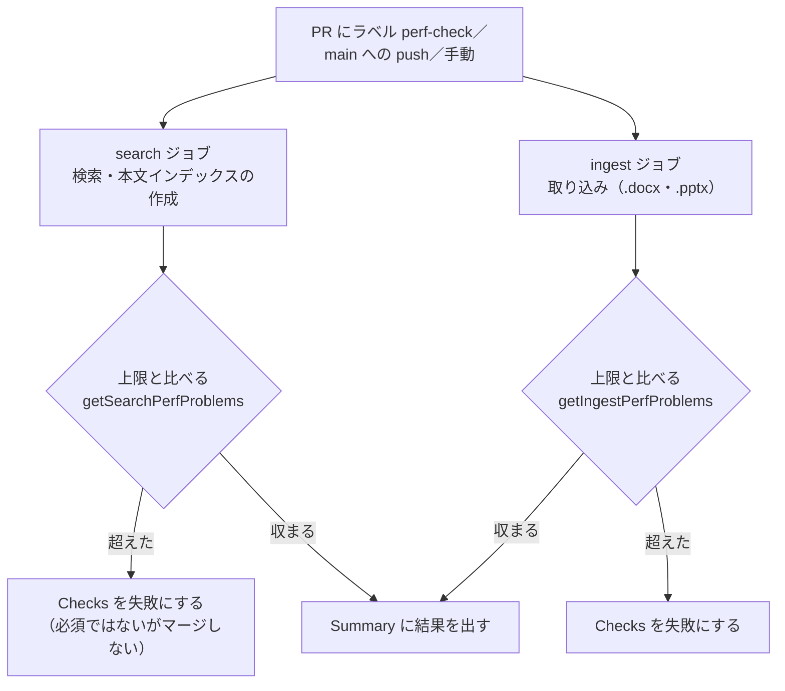

# 速さの回帰テストと上限の決め方

扱うこと: perf-check.yml による速さの回帰テスト、回帰テストの中身、上限の決め方、誤って落ちたときの扱い、Office を使う形式の比べ方。扱わないこと: 手動の性能計測そのもの（[性能とリソースの計測のしかた](perf.md)）。先に読むページ: [CI](ci.md)。

## perf-check.yml（速さの回帰テスト）

検索・本文インデックスの作成・取り込みの速さが落ちたことを、PR の段階で見つける。`measure_perf.ps1` で測り、上限と比べて合否を出す（`perf.yml` は数字を見るだけで、合否は出さない）。必須のチェックにはしないが、流した PR で `search`・`ingest` が落ちていればマージしない。

| 何を | ランナー（`perf-check.yml`） | Windows 機の手元 |
|---|---|---|
| 検索（4 語） | 固定の上限と比べる（`search`） | `.\tests\run.ps1 -Tag Slow -ExcludeTag Manual -Path tests\tools\perf_search.Tests.ps1` |
| 本文インデックスの作成（段階 `pack の作成`） | 固定の上限と比べる（`search`） | 同上 |
| 取り込み（.docx・.pptx。読み取りのスレッド） | 固定の上限と比べる（`ingest`） | `.\tests\run.ps1 -Tag Slow -ExcludeTag Manual -Path tests\tools\perf_ingest.Tests.ps1` |
| 取り込み（.xlsx・.doc・.ppt。Excel・Word・PowerPoint） | 測らない（ランナーに Office が無い） | main と PR のブランチを同じ日に続けて測り、比で判断する（下の「Office を使う形式の比べ方」） |

- 動く時
  - PR にラベル `perf-check` を付けたとき。付けたあとの push・reopen でも流し直す。ラベルが無い PR では、ジョブが「スキップ」になり、失敗にはならない
  - main への push のうち、速さに効くファイル（`scripts/**`・`tools/measure_perf.ps1`・`tools/perf/**`・`tests/tools/perf_*.Tests.ps1`・`tests/testdata/office/**`・`.github/workflows/perf-check.yml`）が変わったとき。ラベルを付け忘れた回帰も、マージの後には見つかる
  - 手動（`workflow_dispatch`）。main への push と手動は、ラベルを見ずに流す
- ラベル `perf-check` は、リポジトリに作ってある。付けるのはメンテナ。リリースノートの分類（`.github/release.yml`）には入れない（ほかの分類のラベルと一緒に付くので、その分類に入る）
- ジョブは `search`（検索と本文インデックスの作成）と `ingest`（取り込み）の 2 つを、別のランナーで並べて流す。取り込みの後に同じジョブで検索すると遅く出る回があるため、分ける。どちらも `windows-latest`（4 コア）、`timeout-minutes: 30`。ランナーでかかる時間は `search` が 3〜4 分、`ingest` が 4〜5 分
- 各ジョブの `if` は、`github.event_name != 'pull_request'`（main への push・手動）、または `labeled` でラベル名が `perf-check`（付けたとき）、または `labeled` 以外（`synchronize`・`reopened`）で PR に `perf-check` が付いているとき。ほかのラベルを付けたときは流し直さない
- 流れている実行の取り消し（`concurrency`）は、同じ PR に push を足したときと、`perf-check` を付け直したときだけ。グループは `perf-check-<PR の番号（無ければ ref）>` で、`perf-check` 以外のラベルを付けて起動した実行（ジョブはスキップになる）は、末尾に `run_id` を付けた別のグループに入れる。自分の PR に必ず付ける分類のラベル（`enhancement` など）を付けても、流れている `search`・`ingest` は取り消されない
- 結果は PR の Checks の `search`・`ingest` の合否と、ジョブの Summary（`summary.md` の表）、artifact（`perf-check-search-<実行の番号>-<試行の番号>`・`perf-check-ingest-...`。保存期間は 90 日）で見る。PR にコメントは書かない
- フォークからの PR でも `pull_request` のまま動かす（`pull_request_target` は使わない）。読み取りだけのトークンで動き、秘密の値は使わない（tebunko-perfdata は公開）。フォークの作者はラベルを付けられないので、流すかどうかはメンテナの側が決める。初めての貢献者の PR は、GitHub の設定どおり実行の承認が要る
- アクションはハッシュで固定する。`PERFDATA_SHA`（tebunko-perfdata のコミット）は `perf.yml` と同じ値にする（`PESTER_VERSION` と同じく、2 か所を手で同じにする）。`run` の中は ASCII だけで書く

## 回帰テストの中身

| テスト | データ | 測り方 | 比べる値 |
|---|---|---|---|
| `tests/tools/perf_search.Tests.ps1`（検索と本文インデックスの作成） | tebunko-perfdata の `new_index.ps1 -Scale 0.1`（種は既定の 1。ブック 5,361・TSV 16,078 → 本文インデックスのファイル 521・118MB）。語は同じリポジトリの `words.tsv` | `measure_perf.ps1 -Index ... -Words ... -Count 20`（`perf.yml` の既定と同じ手順・同じ条件） | 語ごとの検索の中央値（`Search[].TotalMs.Median`）・本文インデックスの作成の秒（`Index.Pack.Seconds`。1 回の値） |
| `tests/tools/perf_ingest.Tests.ps1`（取り込み） | `new_ingest_data.ps1 -Docx 50 -Pptx 50`（テストデータの複製。計 100 ファイル） | `measure_perf.ps1 -Office ... -Threads 2 -Repeat 3`（1 回ごとに新しいプロセス・空のワークスペース） | 1 ファイルあたりの ms の中央値（`Ingest.PerFileMs.Median`）・全体の秒の中央値（`Ingest.Seconds.Median`） |

比べる処理は `tools/perf/perf_common.ps1` の `getSearchPerfProblems`・`getIngestPerfProblems` で、合わないものの一覧を返す（空なら合格）。失敗のメッセージには、対象の名前・値・上限の数字だけを書く。上限との境目・欠けた語・件数などは、各テストファイルの `Unit` で確かめる。

- 「速く終わっても、何もしていない」誤りを通さないため、時間のほかに次も確かめる
  - 検索: `searches.csv` の 20 回すべてで、件数が `words.tsv` の「件数」と合うこと（数ならその件数、`10000+` なら 1 万件で打ち切り）、照合した本文インデックスのファイルの数（`Packs`）が本文インデックスの作成の数（521）と同じで 0 より大きいこと。件数は scale 0.1・種 1 のときの値。検索の流れ（`Run.SearchMode`）が `service` であること（`newSearchService` が無いと、`measure_search.ps1` は黙って `runspace` で測るため）
  - 取り込み: `Total`・`Done` が 100、`Failed` が 0。最後の回のワークスペースに本文インデックスがあり、合計の大きさが 0 より大きいこと（取り込み一覧の状態だけが `済` になり、中身を書かずに終わる誤りを通さないため。この形に頼ることは、下の「計測の口」の表にある）
- 結果（`summary.md`・`result.json` など。数字だけでパスは入らない）は `work\test\perf-search\`・`work\test\perf-ingest\`（git 管理外）に残る。`summary.md` の見出しに、tebunko-perfdata のコミットが入る（取れなければ「不明」）
- tebunko-perfdata の場所は、環境変数 `TEBUNKO_PERFDATA`。無ければリポジトリと並んだ `tebunko-perfdata`（git worktree のときは、本体のチェックアウトと並んだもの）。どちらにも無いときは、`git clone` の取り方を示して失敗にする。手元の clone は、`PERFDATA_SHA` と `new_index.ps1`・`words.tsv` が同じであること（違うとデータが変わり、ランナーの数字と比べられない）
- `-All` は `Slow` も流すので、tebunko-perfdata が要る

## 上限

上限は、ランナー（`windows-latest`）で、`perf-check.yml` と同じ構成（同じジョブ）で 5 回測った比べる値の最大に余裕を掛け、切り上げて決める。各テストファイルの先頭の表（`searchLimitsMs`・`packLimitSeconds`・`perFileLimitMs`・`secondsLimit`）に置く。

| 対象 | 比べる値 | 5 回の実測（最小〜最大） | 余裕 | 上限 |
|---|---|---|---|---|
| 検索 0 件 | 中央値 | 298〜337 ms | 1.5 倍（50 ms 単位） | 550 ms |
| 検索 まれ | 中央値 | 353〜500 ms | 1.5 倍（50 ms 単位） | 750 ms |
| 検索 大量 | 中央値 | 1,290〜1,634 ms | 1.5 倍（50 ms 単位） | 2,500 ms |
| 検索 正規表現 | 中央値 | 1,458〜1,517 ms | 1.5 倍（50 ms 単位） | 2,300 ms |
| 本文インデックスの作成（段階 `pack の作成`） | 1 回の秒 | 39.8〜51.6 秒 | 2 倍（5 秒単位） | 105 秒 |
| 取り込み 1 ファイルあたり | 中央値 | 723〜793 ms | 1.5 倍（50 ms 単位） | 1,200 ms |
| 取り込み 全体 | 中央値 | 73.2〜80.5 秒 | 1.5 倍（10 秒単位） | 130 秒 |

- 余裕: 検索の同じ条件の 2 回の差は 7% ほど、取り込みの 3 回の差は 2% ほど。ランナーの機械の違いを見込んで 1.5 倍を取りつつ、流れが崩れたときに出る数倍の遅れは確実に止める。本文インデックスの作成は 1 回の値で、5 割ほどぶれることがあるため 2 倍にする
- `perf.yml` の数字は、構成が違う（取り込みの後に同じジョブで検索すると遅く出た回がある）ので、上限の元にしない。インクリメンタルサーチの目標（7,000 件規模で 0.1 秒前後）も上限にしない。今の main はこのデータで 0.3 秒ほどなので、上限にすると今の main で落ちる
- 変え方: 速くした PR では、同じ決め方で下げてよい。上げるのは、ランナーが遅くなったなど、速さを落としていない理由があるときだけにする。理由と数字を PR 本文に書き、メンテナの了承を得る
- 上限はランナー（4 コア）に合わせたもの。手元の PC で超えたときは、同じ PC で main を測って比べ、回帰かどうかを見る

## 誤って落ちたとき

- ジョブを 1 回だけ再実行する。続けて落ちたら、`perf-check.yml` を main で `workflow_dispatch` で流して比べる
- main も同じくらい遅ければ、ランナーの問題として扱う。上限を上げるかは、メンテナが決める
- main が通って PR だけが落ちれば、回帰として直す

## Office を使う形式の比べ方（手元の Windows。Excel・Word・PowerPoint が入った機械で）

- 対象は .xlsx（Excel）・.doc（Word）・.ppt（PowerPoint）の取り込み。ランナーに Office が無く、Office の版・機械・Defender で大きく揺れるので、固定の上限は置かない
- データは、.xlsx 100・.docx 200・.pptx 200・.doc 20・.ppt 20（`new_ingest_data.ps1 -Xlsx 100 -Docx 200 -Pptx 200 -Doc 20 -Ppt 20 -Books <new_books.ps1 で作ったブックのフォルダ>`）。測るのは `-Threads 2 -Repeat 3`
- 同じ PC・同じ日に、main → PR のブランチ → main の順に、`measure_perf.ps1 -Office <データ> -Work <作業フォルダ> -Tool <測る版のフォルダ>` で測る
- 判断: PR のブランチの 1 ファイルあたりの中央値（`Ingest.PerFileMs.Median`）が、前後の main の 2 回のうち大きいほうの 1.2 倍以下で、失敗（`Ingest.Failed`）が 0 件なら合格とする。数字は PR 本文に書く
  - 同じ日・同じ PC で、ほかの作業が動いていないときの 2 回の差は 2% ほどだが、ほかの作業（ほかのテスト・ビルド）と重なると 2 割ほどぶれることがある（同じコードの main を続けて測って 1.02 倍と 1.17 倍、同じコードの PR のブランチと main で 1.24 倍の回があった）。1.2 倍の境目で落ちたときは、ほかの作業が無い時間に測り直してから判断する。測っている間は、ほかのテストや Office の作業を動かさない
- 流す時: `perf-check` を付けた PR のうち、取り込みとインデックスの書き出し（`scripts/shared/office/`・`scripts/tebunko/indexer/`・`scripts/tebunko/index/`・`scripts/tebunko/core/`）に触るもの

