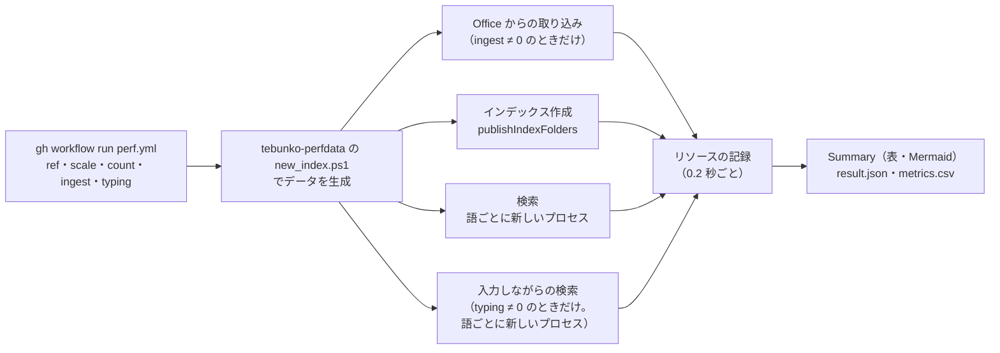

# 性能とリソースの計測のしかた

扱うこと: perf.yml による手動計測（取り込み・インデックス作成・検索・入力しながらの検索の速さとリソース）、手元の Windows での取り込み・入力しながらの検索の計測、取り込みの計測が頼る「計測の口」。扱わないこと: 速さの回帰テスト（[速さの回帰テストと上限の決め方](perf-check.md)）。先に読むページ: [CI](ci.md)。

## perf.yml（性能とリソースの計測）



手動で起動し、決まった量のデータで、Office からの取り込み、インデックス作成、検索の速さ、およびその間のリソース（メモリ・CPU・スレッド・ハンドル・GC）を測る。大きな変更の前後で数字を比べるときなどに使う。必須のチェックではない。

```
gh workflow run perf.yml -f ref=<測る ref> -f scale=0.1 -f ingest=200
```

- 入力: `ref`（測る ref。作業中のブランチも測れる）、`scale`（データの量。`0.04` はブック約 2,100・TSV 約 6,400（入力しながらの検索の 7,000 件規模）、`1` でブック 5.4 万・TSV 16 万・約 1GB）、`count`（語ごとに続けて検索する回数。既定 20）、`ingest`（取り込みを測る .docx・.pptx のそれぞれの数。`0` `200` `1000`。既定 `0` は取り込みを測らない。検索だけを測る起動が長くならないようにする）、`typing`（入力しながらの検索を測る、語ごとの入力の繰り返し回数。`0` `10` `20`。既定 `0` は測らない）、`typing_min_length`（入力しながらの検索で最初に送る語の長さ。`3`（既定。画面と同じで合否を決める）・`1`（短い語の取り消しを多く含む厳しめの参考値））
- 起動と終了の速さ … 入力 `startup`（`0` `5`。既定 `0` は測らない）が `0` でないときだけ、上の計測の代わりに別のジョブで、zip 版と単一 .ps1 版を同じランナーで交互に測って中央値を比べる（`tools/perf/measure_startup.ps1`。測り方と合格の線は [単一ファイルのリリース](../structure/single-script.md)「速さの測り方」）
- 計測スクリプト（`tools/measure_perf.ps1` と `tools/perf/`）はワークフローの ref から、計測対象のコードは入力の ref からチェックアウトする。計測スクリプトが呼ぶ関数（`publishIndexFolders`・`getIndexPackFiles`・`searchPackIndex`）が無い ref（本文インデックスの形式より前の版）では、エラーメッセージを出して止まる
- データは [tebunko-perfdata](https://github.com/hsgwa/tebunko-perfdata) の `new_index.ps1` で毎回生成する（取り込みの一時置き場と同じ形の TSV）。使う版は `perf.yml` の `PERFDATA_SHA` でコミットに固定する。検索する語は同じリポジトリの `words.tsv`（0 件・まれ（3 件）・大量・正規表現）
- 測るもの（それぞれ別のプロセスで動かし、リソースが混ざらないようにする）
  - Office からの取り込み … `ingest` が `0` でないときだけ。`tools/perf/new_ingest_data.ps1` でテストデータ（`tests/testdata/office`）の複製を作り（.docx・.pptx を `ingest` 個ずつ。50 ファイルごとにフォルダを分ける）、`measure_perf.ps1 -Office` で測る。ランナーには Office が無いので、Office を使わずに読むファイル（.docx・.pptx。読み取りのスレッド）だけを測り、Excel・Word・PowerPoint を使う取り込み（.xlsx・.doc・.ppt）は手元の Windows で測る（下の「取り込みの計測」）
  - インデックス作成 … インデクサと同じ `publishIndexFolders`（本文インデックスを書く・TSV を消す・システムインデックスを作る）。Office からの取り込みは、下の取り込みの計測で別に測る。画面ではインデックス作成のスレッドの優先度を下げている（BelowNormal）が、計測ではほかに動くものが無いので、優先度は下げずに測る
  - 検索 … 語ごとに新しいプロセスを起動し、同じプロセスで `count` 回続けて検索する（上限 1 万件）。画面と同じく、検索の司令のスレッド（`newSearchService`）を 1 つ作り、要求（`newSearchRequest`）を順に送る。`lib.ps1` の読み込みと照合のスレッドの用意は司令のスレッドが始めに 1 回だけ行うので、1 回目の時間に含まれる。検索のキャッシュも画面と同じくプロセスで 1 つを持ち続ける。語ごとに、検索時間の最小・中央値・平均・最大と、その内訳（列挙・照合）を出す。1 回目は画面を開き直した直後の検索に当たり、たいてい最大の値になる。高速検索は、ランナーに Windows Search が無いので使わない
    - 司令のスレッドが無い版（#102 より前）は、その版の画面と同じく、検索のたびに新しい Runspace で `lib.ps1` を読み込んで測る（内訳に読み込みの時間も出す）。どちらで測ったかは結果の `SearchMode`（`service` / `runspace`）に出るので、#102 の前後を同じワークフローで比べられる
  - 入力しながらの検索 … `typing` が `0` でないときだけ。語ごとに新しいプロセス（`tools/perf/measure_typing.ps1`）を起動し、語を `typing_min_length` 文字目から 1 文字ずつ伸ばした語（画面のインクリメンタルサーチと同じ）を、150 ms おきに検索の司令のスレッド（`newSearchService`）へ送る（新しい要求は前の要求を取り消す）。これを 1 回の入力として `typing` 回繰り返す。測るのは、最後の要求を渡した時点（渡す時間を含む）から、前の要求がすべて終わるまで・最初のヒットまで・検索が終わるまでの時間。1 回目は画面を開き直した直後の入力に当たるため、統計（最小・中央値・平均・最大）は 2 回目以降から作る。時刻は Windows のタイマーの細かさの分、大きく出る側に最大で約 16 ms の誤差がある。画面はヒットを 100 ms ごとに取り込むため、画面に出るまでは最大で約 100 ms 長くなる。高速検索は、ランナーに Windows Search が無いので使わない。検索の司令のスレッドが無い版（#102 より前）は測らない（結果の `Typing.Mode` が `none` になる。失敗にはしない）
  - リソース … 別のスレッドで 0.2 秒ごと（および段階の切り替わり）に、プロセスのワーキングセット・プライベート・マネージドヒープ、CPU 時間、スレッド・ハンドルの数、GC の回数と、PC 全体の CPU・空きメモリを記録する。検索では、検索 1 回ごとのメモリも記録し、10 回あたりの増え方（最小二乗の傾き）を出す（検索を続けたときにメモリが増え続けないかを見るため）
- OS のファイルキャッシュは空にしない。本文インデックスは作成の直後なので OS のキャッシュに載っており、PC を起動した直後の検索（ディスクから読む）とは違う
- 結果は、ジョブの Summary（表と Mermaid のグラフ）と、artifact `perf-<実行の番号>`（保存期間は 90 日）に出力する。パスやファイル名は出力しない
  - `summary.md` … Summary と同じ内容（「Office からの取り込み」「入力しながらの検索」の節を含む）
  - `result.json` … すべての数字。形式の版（`Schema`）と実行の情報（実行の番号・ref・コミット・scale・日時・ランナーの CPU）を含む
  - `metrics.csv` … 1 行 1 指標の縦長の形（`run_id, date, ref, sha, scale, metric, word, stat, value, unit`）。実行をまたいで数字を貯め、Grafana などで見るときに使う（貯める仕組みはまだ無い）
  - `searches.csv`（検索 1 回ごと）・`typing.csv`（入力しながらの検索、1 回の入力ごと）・`resource-ingest.csv`・`resource-index.csv`・`resource-search.csv`・`resource-typing.csv`（リソースの記録）
- ランナー（4 コア）は手元の PC と条件が違う。Defender のリアルタイム保護の状態は、結果の「環境」に出力する。比べるときは、同じワークフローで測った数字どうしで比べる。同じ条件でも、本文インデックスの作成の時間は 5 割ほどぶれることがある
- 手元でも同じ計測スクリプトで測れる（`.\tools\measure_perf.ps1 -Index <TSV のフォルダ> -Work <作業フォルダ> -Words <words.tsv> -Typing <入力の回数>`）。渡した TSV は本文インデックスに変換され、元の TSV は削除される

## 入力しながらの検索の計測（手元の Windows。高速検索を使う 16 万件規模）

`-Scale 1`（16 万件規模）の「最初のヒットまで 0.5 秒以内」の条件は、高速検索（Windows Search）を使わないと確かめられないため、Windows Search のある手元の PC で測る（ランナーには無いので `perf.yml` では測れない）。

```
.\perfdata\tools\new_index.ps1 -Dest $env:USERPROFILE\perf\s1\content_index -Scale 1
.\tools\measure_perf.ps1 -Index $env:USERPROFILE\perf\s1\content_index -Work $env:USERPROFILE\perf\s1 -Words perfdata\words.tsv -Count 1
# ここで Windows Search がシステムインデックスを反映するのを待つ
.\tools\measure_perf.ps1 -Index $env:USERPROFILE\perf\s1\content_index -Work $env:USERPROFILE\perf\s1 -Words perfdata\words.tsv -Count 5 -Typing 10 -TypingFast
```

1. `<Work>`（例 `$env:USERPROFILE\perf\s1`。既定で Windows Search の索引の対象になる、利用者のフォルダの下にする）でデータを作る。`C:\perf` のような索引の対象外の場所では、高速検索が使えず測れない。`new_index.ps1 -Dest <Work>\content_index -Scale 1` でデータを作る
2. `measure_perf.ps1 -Index <Work>\content_index -Work <Work> -Words <words.tsv> -Count 1` を 1 回流し、pack とシステムインデックスを作る（検索は 1 回だけにして時間を縮める）。`-TypingFast` では `-Index` を `<Work>\content_index`（ワークスペースの本文インデックスのフォルダ、`Workspace.IndexDir` と同じ）にする必要がある
3. Windows Search がシステムインデックスを反映するのを待ち、`measure_perf.ps1 -Index <Work>\content_index -Work <Work> -Words <words.tsv> -Count 5 -Typing 10 -TypingFast` を流す（pack だけのインデックスなので、作成は測らない）
4. `summary.md` の「照合した pack」が、まれの語で全体の数より十分に少なければ、反映が済んでいる。全体の数と同じなら、反映を待って流し直す

## 取り込みの計測（手元の Windows。Excel・Word・PowerPoint が入った機械で）

```
.\tools\perf\new_ingest_data.ps1 -Dest C:\perf\office -Docx 50 -Pptx 50
.\tools\measure_perf.ps1 -Office C:\perf\office -Work C:\perf\work -Repeat 1
```

- データ（`new_ingest_data.ps1`）… .docx・.pptx（`-Docx`・`-Pptx`。既定 200）、.doc・.ppt（`-Doc`・`-Ppt`。既定 0）はテストデータの複製、.xlsx（`-Xlsx`。既定 0）は tebunko-perfdata の `new_books.ps1` で作ったブック（`-Books`）の先頭の数冊。50 ファイルごとにフォルダを分ける（フォルダごとの本文インデックスの書き出しも一緒に測るため）。同じ引数からは同じ構成・同じ中身になる。Excel は .xlsx、Word は .doc、PowerPoint は .ppt を読むので、使う Office はデータにある種類で決まる
- 測り方（`tools/perf/measure_ingest.ps1`）… `-Repeat` 回（既定 3）、1 回ごとに新しいプロセス・空のワークスペースで流す（Office の起動を含む、初めての取り込みの時間）。測る tebunko の `scripts` を作業フォルダに写して `setting.config` を書くので、利用者の設定・既定のワークスペース・リポジトリの `setting.config` には触らない。取り込みは起動口 `indexer.ps1 -Channel` で動かし、記録のスレッドが受け渡しの口の `Progress.Phase` を読んで、段階（クロール・確認・取り込み・仕上げ）ごとの時間とリソースを出す。1 ファイルあたりの ms は、取り込みの段階の秒 ÷ ファイル数
- 成功・失敗は、ワークスペースの `ingest_status.tsv` を計測の側で読んで数える（同じ相対パスは最後の行の状態）。成功 + 失敗がファイル数と合わなければ、終了コードが 0 でなければ、取り込みの段階が読めなかったとき・知らない段階の名前が来たときは、計測を失敗にする。失敗したファイルがあれば `summary.md` に書く
- リソースの表が測るのは、計測の PowerShell のプロセスだけ。EXCEL・WINWORD・POWERPNT のプロセスは含まない（「PC の CPU」には含む）
- Office を使う取り込み（.xlsx・.doc・.ppt）の時間に固定の上限を付けた合否のテストは無い。Office の時間は機械・Defender・Office の版で大きく揺れるので、比べるのは同じ機械・同じ日・同じ引数で続けて測った数字どうしにする（Office の版は結果の実行の情報に出す）。比べ方は下の「Office を使う形式の比べ方」。Office を使わずに読む .docx・.pptx は、`perf-check.yml` が固定の上限と比べる

## 計測の口（取り込みの計測が頼るもの）

取り込みのコードを書き直すときは、この口を変えない。変えるときは、先に計測（`measure_ingest.ps1`）を直し、変える前の版を測り直してから比べる。

| 口 | 中身 |
|---|---|
| 起動口 | `scripts\tebunko\indexer.ps1 -Channel <口>`。終了コード 0 = 完了 |
| 読み込み口 | `scripts\tebunko\lib.ps1`（`resolveTebunkoLib` が頼っている）の `newIndexerChannel`（引数 `retryFailed`・`confirmTargets`・`workers`） |
| 受け渡しの口 | `Progress.Phase` と、その値 `クロール`・`確認`・`取り込み`・`仕上げ` |
| 設定 | `setting.config` がツールのフォルダにあること。キー `targetFolders`（`@{ name; path; enabled }` の配列）・`workspaceFolder`・`ingestThreads` |
| 取り込み一覧 | ワークスペース直下の `ingest_status.tsv`。見出しの `相対パス`・`状態`。状態の値 `済`・`失敗` |
| 取り込んだ結果 | 最後の回のワークスペース（`<作業フォルダ>\ingest\ws`。`measure_ingest.ps1` は次の回の始めまで消さない）の下に、本文インデックスのファイル `content_index.*.tsv`（[インデックスのファイルの形](../index-data/format.md#配置命名規則)の形。サブフォルダの下にもできる）があること。取り込みの回帰テスト（`perf_ingest.Tests.ps1`）が、数と合計の大きさを数える |

