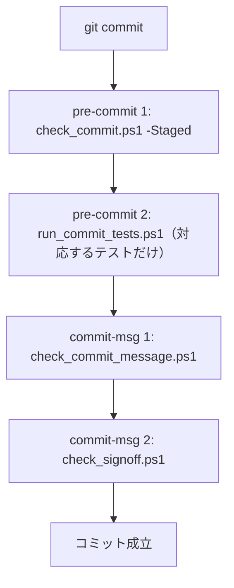

# コミット前に動く検査

扱うこと: pre-commit・commit-msg フックの内容、変更したファイルから流すテストの選び方、公開してはいけない内容の検査（個人情報・文字コード）。先に読むページ: [CI](ci.md)。



## コミット前の検査（pre-commit フック）

clone したら 1 回だけ次を実行する。`core.hooksPath` を `tools/hooks` にし、コミットのたびに `tools/hooks/pre-commit` と `tools/hooks/commit-msg` が動く（git worktree で作ったツリーでも、そのツリーのフックが動く）。

```
.\tools\install_hooks.ps1              有効にする
.\tools\install_hooks.ps1 -Uninstall   やめる
```

| フック | 順 | 内容 | 所要時間の目安 |
|---|---|---|---|
| `pre-commit` | 1 | `tools/check_commit.ps1 -Staged`：ステージした内容と、これから作るコミットの作者を検査する | 数秒 |
| `pre-commit` | 2 | `tools/run_commit_tests.ps1`：ステージした変更に対応するテストだけを、既定のタグ（`Unit`・`Io`・`Meta`）で流す。失敗したテストだけを表示する。選び方は下の表。全テストと静的解析は CI で行う | 変更による（文書だけなら 20 秒ほど、全部流すと 1 分半ほど） |
| `commit-msg` | 1 | `tools/check_commit_message.ps1 -Path <メッセージのファイル>`：1 行目が Conventional Commits の形（`feat: ...` など。AGENTS.md「GitHub の運用」）か。`#` で始まる行と空行は飛ばし、git が自動で作るメッセージ（`Merge ...` `Revert "..."` `fixup! ...` など）は調べない | – |
| `commit-msg` | 2 | `tools/check_signoff.ps1 -Path <メッセージのファイル>`：作者（`git var GIT_AUTHOR_IDENT`）のメールアドレスの `Signed-off-by:` 行があるか（`git commit -s` で付く。大文字・小文字は区別しない）。`#` で始まる行と、`git commit -v` の切り取り線より後ろ（差分）は数えない。マージコミット（1 行目が `Merge `）と bot の作者は調べない | – |

`run_commit_tests.ps1` は、ステージした変更（名前の変更は、消したファイルと足したファイルに分ける）から流すテストを選ぶ。`-List -Files <パス>` で、選んだテストを流さずに出せる。

| 変更したファイル | 流すテスト |
|---|---|
| `scripts/<パス>.ps1` | `tests/<パス>.Tests.ps1` と `meta/structure`・`meta/layers`（`scripts/tebunko/indexer.ps1` は `tests/tebunko/indexer/indexer.Tests.ps1`） |
| `scripts/` の `.xaml` | `meta/structure` |
| `tests/` の `*.Tests.ps1` | そのテスト |
| `tools/<名前>.ps1` | `tests/tools/<名前>.Tests.ps1`（無ければ流さない）。`check_markdown_links.ps1` は `meta/links` も |
| `tests/testdata/scrub_personal.ps1` | `tests/testdata/scrub_personal.Tests.ps1` |
| `.md`・`docs/` の中 | `meta/links` |
| `tests/gui/` の中（画面のスモークテスト） | 流さない（CI の `gui.yml` と、手元の `-Tag Gui` で流す） |
| 対応するテストが無い・消した `scripts/` の `.ps1`、`tests/` のほかのファイル（`run.ps1`・`helpers/`・`testdata/` など） | 速いテスト（`Unit`・`Meta`）を全部 |
| それ以外（`.github/`・画像・設定など） | 流さない |

文字コードは `check_commit.ps1 -Staged` が確かめるため、`meta/encoding` はフックでは流さない。

引っかかったら内容を直す。`git commit --no-verify` で飛ばしても、CI で同じ検査が走る（コミットメッセージは、squash merge で main のコミットになる PR のタイトルを CI が確かめる）。フックは git for Windows の sh が読むため LF で保存する（`.gitattributes` で固定）。

## 公開してはいけない内容の検査（`tools/check_commit.ps1`）

リポジトリは公開しているため、履歴に一度でも入れたら公開されたのと同じになる（AGENTS.md「個人情報を書かない」）。これを機械的に止める。手元では `-Staged` でステージした内容を、CI では追跡している全ファイルと全コミットを調べる。

| 対象 | 見つけたら失敗にするもの | 例示用として通すもの |
|---|---|---|
| 絶対パス | `C:\Users\<名前>`（`/` 区切り・`\\` のエスケープも） | `test`（`test_` のように長さを揃えたものも）・`a`・`Public`・`Default`・`%USERNAME%` `<利用者名>` のような置き換え用の表記 |
| メールアドレス | すべて | `example.com` などの例示用のドメイン、GitHub の noreply |
| Office ファイル | 作成者・最終更新者（`docProps/core.xml`・ODF の `meta.xml`・PDF の `/Author`）、コメント・変更履歴の作成者に付くアカウント ID（`userId`） | `test`、空、`0` だけの ID |
| 手元で実行したとき | Windows のユーザー名そのもの（CI では調べない） | — |
| `.ps1`・`.xaml` | BOM 付き UTF-8 でない、改行が CRLF でない | — |
| ファイル名・フォルダ名 | UTF-8 で 255 バイトを超えるもの（上の Scorecard の制約） | — |
| コミットの作者・コミッター | GitHub の noreply 以外のメールアドレス | `noreply@github.com`（GitHub 上でマージしたときのコミッター） |

Office ファイル（ZIP）は展開して中の XML・バイナリを 1 つずつ調べる。旧形式（`.doc` `.xls` `.ppt`）・PDF などはバイト列を UTF-8 と UTF-16LE の両方で読んで調べる。中身は作業ツリーではなく git に記録される内容を読む（改行だけは、git が LF にして記録するため作業ツリーのファイルで調べる）。例示用として通す名前・ドメインを増やすときは `tools/check_commit.ps1` の先頭で行う。
