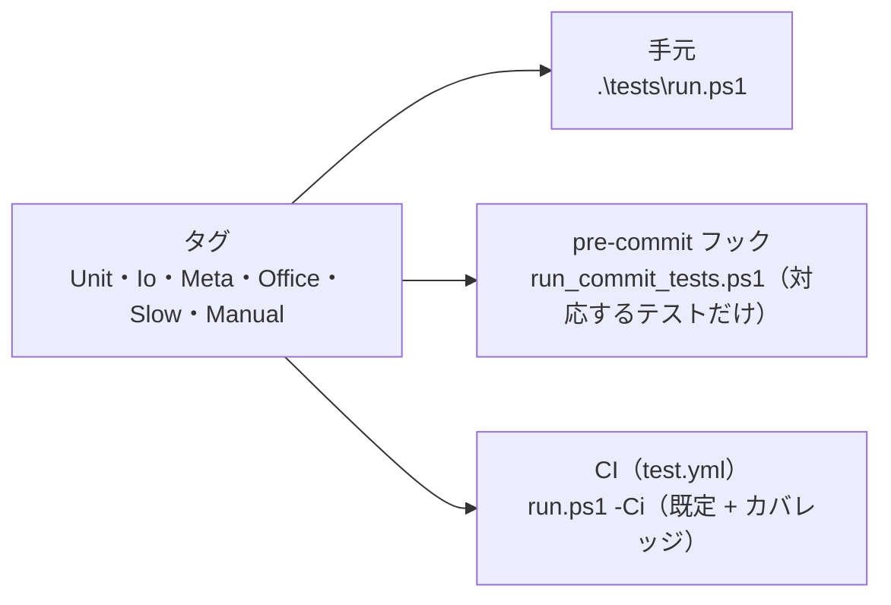

# テストの実行

扱うこと: テストの置き場所、タグ（`Unit`・`Io`・`Meta`・`Office`・`Slow`・`Manual`）と実行のしかた、カバレッジの下限。扱わないこと: CI のワークフローそのもの（[CI](ci.md)）。先に読むページ: [テスト](index.md)。



テストは `scripts/` と同じ構成に並べる。どのモジュールのテストがどこにあるか、たどらなくても分かるようにするため。

| フォルダ | 内容 |
|---|---|
| `tests/helpers/` | 共通の準備（`load.ps1`。`$here`・`${scriptsDir}`・`${testDataDir}` を決めて `tebunko/lib.ps1` を読み込む）とテスト用の TSV 作成（`tsv.ps1`） |
| `tests/shared/core/` | `fs`・`text`・`folder`・`worker_pool`・`data_dir` |
| `tests/shared/office/` | `office_process`・`office_reader`・`office_app` |
| `tests/shared/ui/` | 画面の型（`types`） |
| `tests/tebunko/core/` | `settings`（`setting.config`）・`workspace` |
| `tests/tebunko/index/` | `index_name`・`index_store`・`pack_format`・`system_index` |
| `tests/tebunko/indexer/` | `indexer_state`・`indexer_decide`・`indexer_plan`・`extract_office`・`index_migrate`・`indexing_session`、起動口の通しのテスト（`indexer`） |
| `tests/tebunko/search/` | `search_query`・`search_run`・`pack_search`・`search_service`・`source_map`・高速検索（`search_gram`・`fast_search`・`windows_search`） |
| `tests/tebunko/ui/` | 画面の判断層（`index_view`・`indexing_view`・`search\*_view`・`preview_view`・`settings_view`）と、`$ui` を偽物にした画面の部品（`result_list`・`open_source`・`preview`・`index_tree`）・型（`types`） |
| `tests/gui/` | 画面のスモークテスト（`gui_helpers`＝共通の関数、`smoke`・`index`・`search`・`settings`・`process`＝場面。タグ `Gui`。[画面のスモークテスト](gui-smoke.md)） |
| `tests/tools/` | 開発用の道具（`check_commit_message`・`check_signoff`・`check_release_tag`・`check_markdown_links`・`measure_perf`・`run_commit_tests`） |
| `tests/meta/` | 構成を守るテスト（`structure`・`encoding`・`layers`・`links`・`runner`・`classes`）と安全性の検査（`safety`・`installer`） |
| `tests/testdata/` | 手動の結合テスト用のデータ（[結合テスト（手動）](index.md#結合テスト手動)）と、その生成（`make_testdata.ps1`）・個人情報の除去（`scrub_personal`） |

入力と期待値だけが違うテストは、`-TestCases` の 1 つの `It` にまとめる（例: `tests/tebunko/ui/types.Tests.ps1` の `HitRow.Contains`）。表は `It` の中にそのまま書き、計算で作らない。キーには `input`・`args`・`_`・`Matches` など PowerShell の自動変数の名前を使わない。各行に `name` を持たせ、`It "<name>"` で失敗した行が分かるようにする。表の中で変数（`$stateDone` など）を使うときは、`BeforeDiscovery` で用意する（表はテストを探す段階で作られ、`BeforeAll` より先に評価されるため）。

Pester 5 はテストを「探す段階」と「流す段階」に分けて動かす。探す段階では `Describe` の中身がそのまま実行され、`BeforeAll` の中身は流す段階まで実行されない。そのため次のように書く。

- ファイルの先頭の読み込み（`. "$PSScriptRoot\..\helpers\load.ps1"`・`Add-Type`）と、テスト用の関数・偽物のオブジェクトは、いちばん外の `BeforeAll { }` に書く。
- `Describe` の準備（`$TestDrive` へのファイル作成・変数・`Mock`）は、その `Describe` の `BeforeAll` / `BeforeEach` に書く。探す段階では `$TestDrive` が空のため、`Describe` の中に直接書くとドライブ直下を指してしまう。
- `Mock` はそれを書いたブロック（`It`・`Describe`）の中だけで効く。呼ばれたかは `Should -Invoke` で確かめる。

`tests/meta/` は、直し忘れると気づきにくい決まりごとを機械的に確かめる。

| テスト | 確かめること |
|---|---|
| `structure` | `$rootDir` などのパス定義、全 `.ps1` の構文、`ui/` のスクリプトで `$PSScriptRoot` を使わない、`gui.ps1` が指すインデクサのファイルがある、XAML が XML として読める・`gui.ps1` が使う `x:Name` がある、型を読み込む順で継承が解決できる |
| `encoding` | 全 `.ps1`・`.xaml` が BOM 付き UTF-8 で、改行が CRLF。`.github/codecov.yml` が ASCII の文字だけ |
| `layers` | `shared/` にツールの名前が出てこない、ツール同士が互いを読み込まない、起動口からたどれない `.ps1` が無い、判断層（`text.ps1`・`index_name.ps1`・`search_query.ps1`・`indexer_decide.ps1`・`*_view.ps1`）に画面への依存が無い |
| `links` | git で管理している全 `.md` の相対リンク（画像・参照リンクの定義・HTML の `href`/`src` を含む）の先のファイルがあり（大文字・小文字も区別する）、`.md` のアンカーの見出しがある（`tools/check_markdown_links.ps1`。外部の URL は調べない） |
| `runner` | `tests/run.ps1` が、実行したテストが 0 件なら失敗にすること、`powershell.exe -File` で渡したカンマ区切りのタグを分けて受け取ること、`Gui` を既定では流さず `-Tag Gui` と `-All` では流すこと |
| `safety` | 危険な処理を使っていない、Office をマクロ無効・読み取り専用で開く、原本を書き換えない、書き込み先が `work` 配下だけ（`%TEMP%` は前の版が残した作業フォルダの片付けと起動失敗の記録だけ）、PSScriptAnalyzer の指摘が 0 件、審査用の資料がそろっている（[単体テスト（検査と道具）](unit-checks.md)、[安全性の要約](../../safety/index.md)） |

## タグと実行

`Describe` にタグを付け、実行するものを選べるようにする。

| タグ | 内容 | 外部ソフト | 既定で実行 |
|---|---|---|---|
| `Unit` | ファイルに触らないもの（判断層、画面の部品を偽物にしたもの） | 不要 | する |
| `Io` | ファイルの読み書き（`$TestDrive` の中で完結する） | 不要 | する |
| `Meta` | 構成を守るテスト・安全性の検査 | 不要（PSScriptAnalyzer があれば静的解析も行う） | する |
| `Office` | Excel・Word・PowerPoint の COM を実際に動かすもの（`indexer.Tests.ps1` の「利用者のPowerPointが起動している場合」。ほかは `Mock` で確かめる） | 必要 | しない（`-All` で実行） |
| `Gui` | 本物の画面（`scripts/tebunko/gui.ps1`）を別のプロセスで開いて UI オートメーションで操作するもの（`tests/gui/`。[画面のスモークテスト](gui-smoke.md)） | 不要（Windows の画面が要る。ランナーの Windows で動く） | しない（`-Tag Gui`・`-All` で実行。CI は `gui.yml`） |
| `Slow` | 時間のかかるもの（検索・本文インデックスの作成・取り込みの速さの回帰テスト。`tests/tools/perf_*.Tests.ps1`。[`perf-check.yml`](perf-check.md)） | 検索の側は tebunko-perfdata（データを作るスクリプトのリポジトリ）が要る | しない（`-All` または `-Tag Slow` で実行） |
| `Manual` | 手で確かめるもの（今は該当するテストが無い） | – | しない（`-All` でも実行しない） |

実行は `tests/run.ps1` から行う。

```
.\tests\run.ps1              既定（Unit・Io・Meta。Office・Slow・Gui・Manual は外す）
.\tests\run.ps1 -Tag Unit    速い確認だけ
.\tests\run.ps1 -All         Office・Slow・Gui も含める（Office と、tebunko-perfdata が必要。Gui は画面を開くので、操作しないで待つ）
.\tests\run.ps1 -Tag Slow    Slow だけ（手元で 3〜4 分ずつ。下の「`perf-check.yml`」）
.\tests\run.ps1 -Tag Gui     画面のスモークテストだけ（約 4 分。流している間はマウス・キーボードに触らない）
.\tests\run.ps1 -Tag Gui -Path .\tests\gui\search.Tests.ps1   1 つの場面だけ
.\tests\run.ps1 -Ci          結果の XML（work\test\results.xml）とカバレッジ（work\test\coverage.xml）を出し、カバレッジの下限を確かめる
.\tests\run.ps1 -Path .\tests\shared\core   指定したフォルダ・ファイルのテストだけ
.\tests\run.ps1 -Quiet       失敗したテストだけを表示する
```

いずれも失敗したテストの数を終了コードにする（フックと CI が見る）。1 件も実行しなかったときも失敗にする（終了コード 1）。タグの打ち間違いで、何も確かめないまま通るのを防ぐため。

Pester 5 は除外（`ExcludeTag`）をタグ（`Tag`）より優先するため、`-Tag` に明示したタグは既定の除外から取り除く（`-Tag Slow`・`-Tag Gui` が 0 件にならない）。`-ExcludeTag` を渡すと既定の除外が丸ごと置き換わる（`-Tag Slow -ExcludeTag Manual` は今までどおり動く）。

`-Tag`・`-ExcludeTag` はカンマ区切りの文字列でも受け取る。`powershell.exe -File` で呼ぶと `-Tag Unit,Meta` は配列にならず 1 つの文字列で渡るため（pre-commit フックがこの呼び方）。

**カバレッジ**

- 対象は `scripts/` の `.ps1` のうち、画面層の `gui.ps1`・`gui_main.ps1`・`shell.ps1`・`app_host.ps1`・`splash.ps1`・`*_tab.ps1`・`*_dialog.ps1` を除いたもの。`ui/` の下でも、判断や状態をテストしているファイル（`result_list.ps1`・`preview.ps1`・`*_view.ps1`・`ui/shell/nav.ps1` など）は対象に残す（`tests/helpers/coverage_targets.ps1` の `getCoverageTargets`。`tests/run.ps1` が使う）。除いたものは自動テストの対象外で、手で確かめる。画面層のファイルを足したら、この条件から外れているか（分母に入っていないか）を確かめる。
- 値は Pester のコマンド単位（実行されたコマンドの数 ÷ 全コマンドの数。小数点以下 1 桁）。
- **下限は `tests/coverage.baseline`（90.0）。** `-Ci` はこれを下回ると失敗し、CI の必須チェック `test` が通らない。下回ったらテストを足して戻し、下限は下げない。実測が上がっても下限は上げない（変えるのはメンテナだけ）。
- 全体の目標値は決めない。判断層は 95% 以上を保ち、数字を上げるためだけのテスト（結果を確かめないもの）は書かない（AGENTS.md「テストカバレッジの方針」）。
- カバレッジはブレークポイントを使わない計測（Pester の Profiler。`CodeCoverage.UseBreakpoints = $false`）で取る。ブレークポイントを使う計測より速い。
- `-Ci` はカバレッジを Cobertura 形式の XML（`work\test\coverage.xml`）にも書き出す。Pester が書き出す XML には利用者名を含む絶対パスが入るため使わず、`tests/run.ps1` が結果（コマンド単位）から行単位に組み立てる。1 行に実行されたコマンドが 1 つでもあれば、その行は通ったものとする。そのため、行単位の値（Codecov の表示）はコマンド単位の値と少し違う。ファイル名はリポジトリからの相対パスで書き、利用者名を含む絶対パスは入れない。

