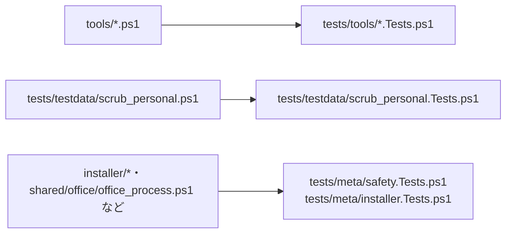

# 単体テスト（検査と道具）

扱うこと: 開発用の道具（`tests/tools/`）・テストデータの個人情報の除去・安全性の検査・インストーラーの検査の単体テストが何を確かめるか。扱わないこと: インデックス・検索・Office のテスト（[単体テスト（インデックスと検索）](unit-index.md)・[単体テスト（Office）](unit-office.md)）。先に読むページ: [テスト](index.md)。

**開発用の道具（`tests/tools/`）**

| 対象 | 主な確認内容 |
|---|---|
| `check_commit_message.ps1` | 形が合うタイトルを通し、違うものを止める、git が自動で作るメッセージは調べない、コメント行と空行を飛ばして最初の行を調べる、CRLF のファイル、空のメッセージは通す |
| `check_signoff.ps1` | 作者の `Signed-off-by` があれば通す、無い・作者と違うメールアドレスなら止める、コメント行と `git commit -v` の差分の中は数えない、マージコミット・bot は調べない |
| `check_release_tag.ps1` | 形が合うタグを通し、形が違うもの（`v1.0`・`V1.0.0`・`v01.0.0`・全角の数字・接尾辞・末尾の改行など）を止める。指すコミットが main にあれば通し、無いときと、参照を解決できないときは、別の理由の文言で止める |
| `check_markdown_links.ps1` | あるファイル・フォルダ・見出しへのリンクを通し、切れたリンクを止める、コードの中のリンクは調べない、1 行に複数あるリンクをそれぞれ調べる |
| `measure_perf.ps1` | 統計値（最小・中央値・平均・最大）と最小二乗の傾きの計算、点の間引き、グラフの行の書き方。小さなインデックスで最後まで動かし、フォルダ・ブック・TSV・本文インデックスのファイルの数、語ごとのヒット件数と検索時間の統計値、検索の流れ（`SearchMode`）、`result.json` の形式の版と実行の情報、`metrics.csv` の列と行、`summary.md` の表とグラフ（パスを含まないこと）を確かめる。本文インデックスしか無いインデックスでは、作成を測らずに検索だけを測る。`-Office` の取り込みは、`new_ingest_data.ps1`（種類ごとの数・50 ファイルごとのフォルダ分け・同じ引数から同じ構成になること）、取り込み一覧の数え方（同じ相対パスは最後の行・成功 + 失敗がファイル数と合わなければ失敗）、段階が読めないときと知らない段階のときの失敗、記録のスレッドが受け渡しの口の段階を読むこと、小さな .docx・.pptx のデータで最後まで動かして `result.json` の `Ingest`・`metrics.csv` の `ingest_` の行・`summary.md` の「Office からの取り込み」の表（パスを含まないこと）を確かめる。`-Office` だけのときは `Index`・`Search` を、`-Index` だけのときは `Ingest` を、キーを残して `null` にする（`Schema` は 1 のまま）。リポジトリの `setting.config` を作らない・変えないことも確かめる。Office を使う取り込み（.xlsx・.doc・.ppt）は CI では測れないので、手元の Windows で測る（[CI](ci.md)）。`-Typing`（入力しながらの検索）は、送る語の並びを作る `getTypingSteps`（最初に送る長さ・語より短いとき・サロゲートペアの途中で切れる長さを飛ばすこと・正規表現として不正な文字列と空の文字列に一致する文字列を飛ばすこと）と、1 回ごとの記録から語ごとの値を作る `newTypingWordResult`（統計に 1 回目が入らないこと・ヒットの無い語は `FirstHitMs` が null になること・高速検索を使った回数と取り消された要求の合計）を `Unit` で確かめる。小さなインデックスで `-Typing 2` を流し、`result.json` の `Typing`（`Mode`・`MinLength`・語ごとの値）、`typing.csv`・`metrics.csv` の `typing_` の行、`summary.md` の「入力しながらの検索」の節を確かめる。`-Typing` を渡さないときは `Typing` のキーを残して `null` にする。`-Typing 1`・`-TypingFast` で `-Index` が `<Work>\content_index` でないときは、始める前に失敗にする（[性能とリソースの計測のしかた](perf.md)） |
| `perf_search.Tests.ps1`（`Slow`・`Unit`） | 検索の語ごとの中央値と本文インデックスの作成の秒を上限と比べる（`Slow`。tebunko-perfdata が要る）。比べる関数（`getSearchPerfProblems`）は、上限との境目（ちょうどなら通す）、語が欠けたとき、1 回ごとの件数（2 回目以降だけ違う場合を含む）・`10000+` の打ち切り・照合した本文インデックスのファイルの数、`SearchMode` が `runspace`、本文インデックスが無い・作成が遅いときを `Unit` で確かめる |
| `perf_ingest.Tests.ps1`（`Slow`・`Unit`） | 取り込み（.docx・.pptx）の 1 ファイルあたりと全体の中央値を上限と比べ、全部取り込まれ、本文インデックスができていることを確かめる（`Slow`）。比べる関数（`getIngestPerfProblems`）は、上限との境目、`Total`・`Done`・`Failed`、`Ingest` が無いとき、本文インデックスが無い・合計の大きさが 0 のときを `Unit` で確かめる |

**テストデータの個人情報の除去（`tests/testdata/scrub_personal`）**

タグ `Io` で、テストデータから個人情報を取り除く `tests/testdata/scrub_personal.ps1` を検証する（OOXML・ODF・`.xlsb` の中のバイナリ・旧形式・Shift_JIS のテキスト、壊れた ZIP、隠し属性・読み取り専用属性）。

**安全性の検査（`tests/meta/safety.Tests.ps1`）**

タグ `Meta` で、[安全性の要約](../../safety/index.md) の主張を機械的に検証する。導入審査で「危険な処理・ライブラリを使っていないこと」を示すための検査であり、将来の変更でこの前提が崩れた場合に失敗する。スクリプトを読むだけで動作するため、Office もテストデータも要らない（36 件）。

| 対象 | 主な確認内容 |
|---|---|
| 禁止する処理 | 動的なコード実行（`Invoke-Expression` 等）・難読化（Base64）・ネットワーク通信・P/Invoke・実行時コンパイル・レジストリ・権限やサービスの変更・`Set-ExecutionPolicy` と `Bypass`・資格情報・リモート実行が 0 件 |
| 許す処理の限定 | `Add-Type` は `-AssemblyName` だけ、`Start-Process` は `explorer.exe` だけ、`Stop-Process` は `shared/office/office_process.ps1` の 1 か所だけ |
| Office の開き方 | マクロ無効（`AutomationSecurity = 3`）・`EnableEvents = $false`・外部リンクを更新しない・インデクサでは不可視・Excel / Word / PowerPoint いずれも読み取り専用で開く |
| 原本の保護 | 原本のパスを書き込み・削除の API に渡さない、`SaveAs` の保存先は作業フォルダのパスだけ、原本を読むのは `copyFileShared`（`FileAccess::Read`）だけ |
| 書き込み先 | `$workspace`（`Workspace` の `IndexDir`・`TmpRoot`・`PublishDir`）・`${settingsFile}`・`${dataDir}` の定義が `work` 配下・`setting.config`・`%LOCALAPPDATA%\tebunko\<鍵>` だけ、起動に失敗したときの記録の置き場所が固定の `%LOCALAPPDATA%\tebunko`・`%TEMP%` 配下だけ、ドライブ直下やシステムフォルダを直接指す書き込み先が無い、異常終了で残った作業フォルダを次回起動時に回収する（`removeStaleTmpDirs`） |
| `%TEMP%` を指す書き方 | 直接指すのは、取り込みの作業フォルダの前の版の置き場所（`${legacyTmpParent}`。片付けの対象としてだけ使う。`paths.ps1`）と、起動失敗を記録する `writeStartupErrorFile`（`gui.ps1`）の 2 か所だけで、取り込みの作業フォルダ自体はワークスペースの `tmp\` の下（`${tmpDir}`）を使う |
| 静的解析（PSScriptAnalyzer） | 安全性にかかわるルール（`tests/meta/PSScriptAnalyzer.security.psd1` の 14 件）・`Error` 重大度・制限言語モード（`PSUseConstrainedLanguageMode`）の指摘が 0 件、設定ファイルから当該ルールが削られていないこと |
| 審査用の資料 | `docs/safety/index.md`・`.github/SECURITY.md`・`tools/new_release_files.ps1`・`sbom.cdx.json`（雛形）がそろっており、雛形が本体の説明・ライセンス・前提ソフトウェアを持ち部品を持たないこと（`safety.Tests.ps1`）。作った部品表が第三者の部品（`purl` を持つ部品）を含まず、zip の中身と一致すること（`new_sbom.Tests.ps1`・`new_release_package.Tests.ps1`） |

PSScriptAnalyzer は Windows PowerShell 5.1 に標準では入っていないため、未導入の環境では静的解析の 3 件を自動的に飛ばす（`It -Skip`）。導入は `Install-Module PSScriptAnalyzer -Scope CurrentUser`。CI では必ず入れて実行する。安全性にかかわるルールの選定と、全ルールで出る指摘の内訳は [安全性の要約](../../safety/index.md) の [静的解析: PSScriptAnalyzer（Microsoft）](../../safety/scans.md#静的解析-psscriptanalyzermicrosoft) に記載している。

`TypeNotFound`（継承元の型が別ファイルにあるための指摘）は、1 ファイルだけでは解決できないため除く。読み込む順で解決できることは `tests/meta/structure.Tests.ps1` で確かめる。

**インストーラーの検査（`tests/meta/installer.Tests.ps1`）**

タグ `Meta` で、インストーラー（`installer/`）が [安全性の要約](../../safety/index.md) の [インストーラー版](../../safety/disclosure.md#インストーラー版) のとおりであることを確かめる。インストーラーそのもののビルド（Inno Setup）は `release.yml` だけで行い、ここではスクリプトを読んで確かめる。

| 対象 | 主な確認内容 |
|---|---|
| 起動口 `tebunko.exe`（`tebunko.cs`） | Windows 標準の `csc.exe` で警告なしにビルドできる、起動するのは Windows の PowerShell 5.1 だけで `-ExecutionPolicy RemoteSigned`（`Bypass` を使わない）、P/Invoke とレジストリを使わない、ミューテックスの名前がインストーラーの `AppMutex` と同じ |
| インストーラー（`tebunko.iss`） | 既定は管理者権限なし、`[Registry]` を使わず PATH・関連付けも変えない、入れるのは `tebunko.exe`・`LICENSE`・`scripts\` だけ、更新では前の版の `scripts\` を消してから入れる、インストール後に起動するのは `tebunko.exe` だけ |
| 文字コード | 2 つとも BOM 付き UTF-8・CRLF（Inno Setup は BOM の無いスクリプトを ANSI として読む） |
