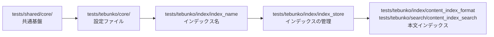

# 単体テスト（インデックスと検索）

扱うこと: 共通基盤・設定ファイル・インデックス名と TSV の名前・インデックスの管理・本文インデックスの単体テストが何を確かめるか。扱わないこと: インデックス作成そのもののテスト（[単体テスト（インデックス作成）](unit-indexer.md)）、Office のテスト（[単体テスト（Office）](unit-office.md)）、画面のテスト（[画面のテストと確認](gui-tests.md)）。先に読むページ: [テスト](index.md)。

**共通基盤（`tests/shared/core/`）**

| 対象 | 主な確認内容 |
|---|---|
| `toSafeFileName` | 禁止文字の全角化、`/` → `／`、`"` → `”`、使用可能文字は不変 |
| `toLongPath` / `fromLongPath`・長いパス | `\\?\`・`\\?\UNC\` の付け外し、260 文字を超えるパスの読み書き |
| `copyFileShared` | ほかのアプリが書き込み用に開いているファイルもコピーでき、コピー中もほかのアプリの書き込みを妨げない |
| `readListFile` / `writeListFile` | `[` `]`・先頭の空白を含むパスの往復、ファイル無しは空配列、読めないファイルは例外、行が無ければ空のファイル |
| `writeTextLinesAtomic` | 新しいファイルを作り、一時ファイルを残さない。既定は BOM 付き UTF-8、文字コードの引数で BOM なし UTF-8 にできる |
| `formatFileTime` | 秒までの日時（`yyyy/MM/dd HH:mm:ss`） |
| `removeDirectoryRetry` | 中身ごと削除、フォルダが無ければ何もしない |
| `invokeWithNamedMutex` | 出力を返し手放す、例外でも手放す、同じスレッドの入れ子は通す、別のスレッドが持ったままなら時間切れの例外、持ったまま終わったスレッドの後は abandoned として続ける |
| `newAppMutex` | 同じ処理・同じ配置フォルダでは 2 つ目を取得できない、処理の種類・配置フォルダが違えば同時に取得できる |
| `replaceCellNewLine` | `"` 内の改行（LF・CR・CRLF）は U+2028 に置き換え、`"` 外の改行は保持 |
| `formatTsv` | 行末の空セル・末尾の空行の除去（途中の空行は保持）、セル内改行を含む行を 1 行にまとめる、使用範囲の左上に合わせた先頭の空行・空セルの補完、空白だけなら空 |
| `prettyTsv` | UTF-16 → UTF-8（BOM 付き）、`[` `]` を含む出力パス、使用範囲の左上の指定、空なら出力しない |
| `countTsvFields` | タブ区切りのセル数、先頭のセルが空の行、`"` で始まるセル内のタブ・改行は区切りとしない、途中の `"` は囲みとしない |
| `toColumnName` | 列名（`A` `Z` `AA` `ZZ` `AAA` `XFD`） |
| `normalizeFolderPath` | 前後の空白・引用符・末尾の `\` の除去、ドライブ直下は `D:\` のまま、UNC パス、`/` → `\`、`\\?\` ・ `\\?\UNC\` の除去、重なった `\` ・ `.` ・ `..` の解決、環境変数の展開、相対パスは `$rootDir` から、解釈できないパス（`*` を含む・`\\server` ・ `\` ひとつで始まる）は書かれたとおり |
| `getPathUnderFolder` | フォルダからの相対パス（フォルダ自身は空、末尾の `\` ・大文字と小文字の違い、ドライブ直下、UNC の共有直下）、フォルダの下でなければ `$null`（フォルダ名の途中では一致しない） |
| `getFolderPathAliases` / `testSameFolder` / `testFolderUnder` | ネットワークドライブ ⇔ UNC パス、`subst` のドライブ ⇔ 割り当て元のフォルダ、ドライブ直下・共有直下、割り当ての無いパスは自身だけ、同じフォルダの判定（割り当ては差し替えてテストする）、この PC の割り当てでも例外にならない、入れ子のフォルダの判定（自身も「中」・名前の先頭が同じだけのフォルダは別・別の書き方でも分かる） |
| `getFolderLeafName` | ドライブ直下・UNC・末尾の `\` |
| フォルダ選択を開く場所（`getExistingAncestorFolder`） | [画面のテストと確認](gui-tests.md) |

**設定ファイル（`tests/tebunko/core/settings`）**

| 対象 | 主な確認内容 |
|---|---|
| `readSettings` / `writeSettings` / `updateSettings` | ファイル無しは既定値でファイルを作らない、保存と読み込みの往復（1 件だけの一覧も配列のまま）、1 つのキーだけ変えてもほかのキーを保つ、記載の無いキー・空のファイルは既定値、JSON として読めなければ例外 |
| `getTargetFolders` / `writeTargetFolders` | 記載順、`enabled` が `false` はチェックなし・記載が無ければチェックあり、引用符・末尾の `\` の除去、空のパスは除く、重複（大文字・小文字・末尾の `\` の違い）は最初のものだけ、設定が無ければ空、保存と読み込みの往復（ほかの設定を保つ） |
| `readIndexSources` / `setIndexSourceFolder` | インデックス名に対する元のフォルダの記録（`source_folder.txt`）と読み込み、同じ名前は 1 か所（上書き）、クロール対象フォルダにある名前ならその `path` を書き換える（`indexSources` には入れない）、名前・フォルダが空なら何もしない |
| `readSearchExcludes` / `writeSearchExcludes` | 無ければ空、保存したフォルダと直下だけの区別を読み戻す（末尾の `\` を除く、空のパスは除く）、ほかの設定を変えない、空で保存すると空 |

**インデックス名と TSV の名前（`tests/tebunko/index/index_name`）**

| 対象 | 主な確認内容 |
|---|---|
| `encodeIndexPlace` / `decodeIndexPlace` | 禁止文字・`_`・`%`・制御文字の `%XX` 化と往復、`衝突"` と `衝突”` が別の名前になる、使用可能文字（全角記号・空白・`&'#()`）は不変、符号化で作らない `%XX`（`100%` 等）は戻さない |
| `splitObjectPlace` / `describePlace` / `describeHitPlace` | 図形・コメント・ヘッダー・フッターの場所の分解、場所ごとの表記（見出しの要約・検索結果ファイル）と種別の文字、行ごとの表記（表の「場所」列。セル番地・ほかの数・行番号） |
| `toIndexFileName` / `convertIndexFileNameToPlace` | 決まった種類の場所は英語の固定名（ページ・スライド・見出し等）との往復、図形・コメント・ヘッダー・フッターの `[shape]` `[comment]` `[header_footer]`、決まった種類でない場所（Excel の任意のシート名）は符号化との往復、固定名と符号化がぶつからないこと、255 文字の上限 |
| `placeKindFileNames` | 図形・コメント・ヘッダー・フッターの種類と `objectPlacePattern` がそろっていること |
| `newIndexName` / `assignIndexNames` | フォルダ名・ドライブ名・共有名、重複時の `(2)` `(3)`、設定の名前をそのまま使う（フォルダの場所が変わっても同じ名前）、名前が無ければ前回の取り込み一覧の名前・フォルダ名から作る、設定にある名前はほかのフォルダに使わない、名前にできない・長いフォルダ名 |
| `splitIndexRelPath` | 先頭のインデックス名と残り（深い階層、数字を含む名前）、`\` が無い場合 |
| `testIndexName` | 使える名前は空文字列、空・前後の空白・255 文字超・使えない文字・末尾の `.`・Windows の予約語（大文字小文字を区別しない）・ほかのインデックスと重複、それぞれの理由を返す |

**インデックスの管理（`tests/tebunko/index/index_store`）**

| 対象 | 主な確認内容 |
|---|---|
| `getIndexStats` | インデックス名ごとの件数（合計・済・未取り込み・失敗）と最終取り込み日時を集計する |
| `renameIndex` | `work\content_index\<旧名>` を改名して中身をそのまま残し、取り込み一覧のクロール対象フォルダの行と各行の相対パスの先頭を書き換える。ほかのインデックスの記録は変えない。フォルダがまだ無くても記録は書き換える。同じ名前のフォルダが既にあれば例外。旧名・新名の下の `searchExcludes` を消し（大文字・小文字だけの変更も）、ほかのインデックス・頭が同じ名前のインデックス（`Sales` と `Sales2`）の記録は変えない。記録を消せなくても例外にしない |
| `removeIndex` | `work\content_index\<名前>` と取り込み一覧の記録を削除し、ほかのインデックスは残す。名前が空なら何もしない。そのインデックスの下の `searchExcludes` も消し、ほかのインデックスの記録は変えない |
| `getSearchIndexes` | `work\content_index` 直下のフォルダをインデックス 1 件として返す。［インデックス管理］の一覧と同じ並びで、一覧に無いものは名前順で後ろ。元のフォルダも返す（一覧にも取り込み一覧にも無ければ、そのフォルダの元のフォルダの記録から読む。分からなければ空）。フォルダが無ければ空 |
| `getIndexNameMap` | クロール対象フォルダの行だけを読み、見出し行の後の行・インデックス名の無い行は使わない。取り込み一覧が無ければ空 |
| `getIndexTsvCounts` / `testIndexComplete` | 本文インデックスのファイルはそのファイルの相対パスで数える（0 バイトは壊れているとする）、本文インデックスのファイルがあれば元のファイルごとのフォルダが無くても「済」のまま、フォルダごとの TSV の数（TSV の無いフォルダは 0 件、大文字・小文字を区別しない、インデックス直下の TSV は数えない）、TSV がそろっていれば「済」のまま、フォルダごと削除・TSV が足りない場合は取り込み直す、0 バイトの TSV があるフォルダは壊れているとして作り直す（ほかのファイルは巻き込まない・後の TSV で数え直さない）、TSV 数が空の行・数えられなかった場合は確認しない |
| `publishIndexFiles` | 作業フォルダの TSV をインデックスのフォルダへまとめて入れる、以前のインデックスを残さず入れ替える、TSV が 1 件も無ければ空のフォルダ、前回の出力用フォルダが残っていても入れ替えられる |

**本文インデックス（`tests/tebunko/index/content_index_format`・`tests/tebunko/search/content_index_search`）**

| 対象 | 主な確認内容 |
|---|---|
| `convertPlaceToContentIndexMeta` / `convertContentIndexMetaToPlace` | 場所の名前（シート・ページ・スライド・非表示・ノート・図形・コメント・Excel のヘッダー・フッター・それ以外の部分）とメタ情報の往復、組み立て直して同じにならない名前はそのまま持つ |
| `getContentIndexFileName` / `readContentIndexFileName` / `planContentIndexParts` / `splitContentIndexBooksByExtension` / `encodeContentIndexValue` / `decodeContentIndexValue` / `convertToContentIndexBody` | 本文インデックスのファイルの名前、拡張子ごとの分け方、値の `%XX` の往復、中身の改行を LF にそろえ U+001C〜U+001F を除く |
| `convertToContentIndexText` / `readContentIndexPlaces` | 文字列にしてから読み戻すと、元のファイル・場所・中身の範囲が同じになる、Excel の図形・コメントだけ `CellPrefixed` が `$true`（Word・PowerPoint・Excel のセル・ヘッダー・フッターは `$false`）、版の無い・違う本文インデックスのファイルは例外 |
| `convertFolderToContentIndex` / `updateFolderContentIndex` / `findIndexFoldersWithBooks` / `publishIndexFolders` | フォルダごと・拡張子ごとに作る、元のファイルが無くなった拡張子の本文インデックスのファイルは消す、UTF-16LE（BOM 付き）で一時ファイルを残さない、置かれた TSV を入れて TSV を消し変わらない元のファイルは写す、TSV の残ったフォルダを見つけて本文インデックスとシステムインデックスに入れる |
| `searchContentIndex` / `getContentIndexFiles` / `readContentIndexContext` | 結果が TSV を 1 行ずつ照合したときと同じ（改行の種類・照合のしかた・検索語ごと）、大文字・小文字・図形とコメントの除外・対象ファイル、上限・中止・並列・キャッシュ（書き直したら読み直す）、全文への照合の時間切れは 1 行ずつに切り替える、列挙（フォルダの一部・直下だけ・無いフォルダ）、プレビューの前後の行。Excel の図形・コメントの行は、セル番地だけに一致する語（`C2`・`2`・`C`）ではヒットにならず、文字（文字の中のタブを含む）に一致すればヒットになる、除いた行があっても行番号がずれない、除いた行は件数・上限に数えない（1 スレッドと並列で同じ）、複数行（セル内改行）の文字は 2 行目以降の語でも一致し番地だけでは一致しない、`"` を含む文字は囲み・`""` の形のまま照合する |

**前の版との互換（`tests/tebunko/indexer/index_compat`・`tests/tebunko/core/settings_compat`・`tests/meta/compat`）**

| 対象 | 主な確認内容 |
|---|---|
| `tests/tebunko/indexer/index_compat`（`-Tag Io`） | 前の版が作った見本（[前の版との互換](../index-data/format.md#前の版との互換)）の本文インデックス・システムインデックス・取り込み一覧・エクスポート zip を、今のコードで読める・検索できる・取り込み直しが起きない・エクスポートし直しても同じ配置になること |
| `tests/tebunko/core/settings_compat`（`-Tag Io`） | 前の版が作った見本（[前の版との互換](../structure/settings-file.md#前の版との互換)）の `setting.config` が壊れたと判定されない、今のコードで同じ値として読める、書き足してもほかの値を保つこと、今の版が書く形がどれかの見本に含まれること |
| `tests/meta/compat`（`Meta`） | 見本の 5 つの要素（`source`・`ws`・`export.zip`・`file_times.tsv`・`expected.json`）がそろっていること、今のコードの形式の目印（`$contentIndexVersion`・`$statusColumns` など）が見本のどれかに残っていること。設定の見本（`compat/settings/`）に `setting.config`・`expected.json` がそろっていること、`newSettings` の全キーがどれか 1 つの見本の `expected.json` にあること |
