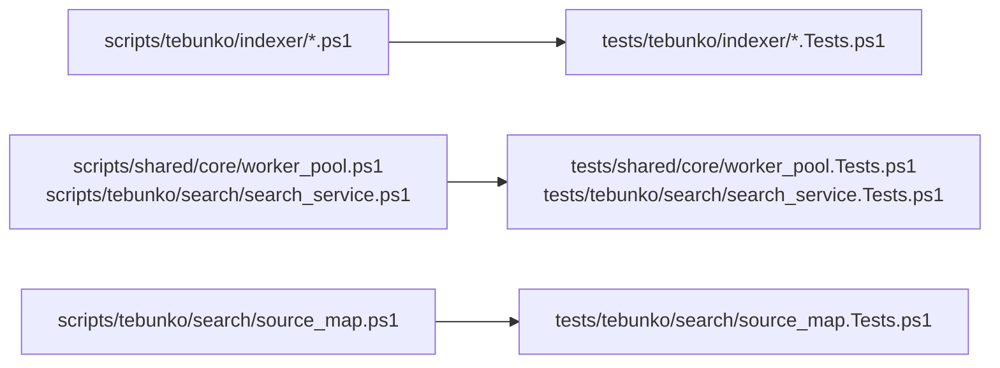

# 単体テスト（インデックス作成）

扱うこと: インデックス作成（`tests/tebunko/indexer/`）・スレッドとプール・元のファイルの特定の単体テストが何を確かめるか。扱わないこと: インデックス名・インデックスの管理・本文インデックスのテスト（[単体テスト（インデックスと検索）](unit-index.md)）、Office のテスト（[単体テスト（Office）](unit-office.md)）。先に読むページ: [単体テスト（インデックスと検索）](unit-index.md)。

**インデックス作成（`tests/tebunko/indexer/`）**

| 対象 | 主な確認内容 |
|---|---|
| `readStatusFile` / `writeStatusFile` / `addStatusRow` | クロール対象フォルダと各列の往復（`[` `]`・先頭の空白を含むパス）、1 行目・見出し行の書式、追記した行の優先（大文字・小文字を区別しない）、エラーのタブ・改行をスペースに、列数の合わない行の無視、書き直し時の置き換え、ファイル無しは空、まとめて書き出した行と `toStatusLine`（1 件ずつの追記）の整形が同じ（速さのため別々に書いているため）、ほかから共有せずに開かれているときの読み込み |
| `readStatusLines` / `renameStatusIndexName` / `removeStatusIndexName` | 名前の変更（クロール対象フォルダの行と各行の相対パス）、インデックスの記録の削除 |
| `readIngestingFiles` / `writeIngestingFiles` / `removeIngestingFile` | 取り込み中の複数のファイルの回数と相対パスの往復、取り込み中が無ければ記録を消す、壊れた行は読み飛ばす |
| `describeIngestError` | 取り込みの例外から失敗の原因を作る（パスが長すぎる場合を含む） |
| `getIndexingState` | 状態ごとの件数、失敗したファイルの行の並び、指定した時刻以降に取り込んだ件数 |
| `newIndexerChannel` / `writeIndexingProgress` / `readIndexingProgress` | 画面が決めた条件を入れスレッドをまたいで使える形にする、段階・件数・内容の往復（タブ・改行はスペース）、受け渡しの口が無ければ何もしない |
| `requestIndexingStop` / `answerIndexingPlan` | 中止を求めると確認を待っていても待つのをやめる、取り込む返事は中止にしない、取りやめの返事（`$null`）は中止にする |
| `testIndexerRunning` | インデックス作成の鍵をほかが持っていれば `$true`、調べた後は鍵を持たない |
| `writeIndexerLog` | ログを開いていればログに書く、コンソールに出すときは色を付ける、ログに書けなくても止めない |
| `getExtractVersion` / `getIngestDecision` | 形式ごとの抽出版、取り込むかどうかと理由（新規・更新あり・前回未完了・インデックスなし・前回失敗・前の抽出版） |
| `getIngestLane` / `getOfficeLane` | Excel はすべて Excel のレーン、旧形式の Word・PowerPoint は Office のレーン、新形式は読み取りのレーン。読み取りのレーンから回し直すときは、PowerPoint のファイルは PowerPoint、それ以外は Word のレーン |
| `createTargetList` / `findOfficeFiles` | 新規・更新あり・前回未完了・インデックスなし・前の抽出版は取り込み対象、更新の無い取り込み済み・前回失敗は対象外、元のファイルが無くなったらインデックスと行を消す（本文インデックスから外すよう `Removed` で返す）、アクセスできないフォルダがあったときは行とインデックスを残す |
| `StatusLedger`（`indexer_state.Tests.ps1`） | コンストラクタで渡した `Workspace` の場所を読み書きする（既存の関数と同じ結果）、今回の失敗・元ファイルが無くなった行を集める |
| `PendingPublish`（`pending_publish.Tests.ps1`） | 取り込んだ・無くなったファイルの記録、取り込み中・まだ渡していないファイルが 1 つでもあるフォルダは取り出さない、無くなれば取り出せる、一度取り出したフォルダは消える |
| `IndexingReporter`（`indexing_reporter.Tests.ps1`） | 進み具合を受け渡しの口に書く、画面の返事を受け渡しの口で待つ（返事は別のスレッドから渡す。中止・前に残った返事・制限時間を含む） |
| `publishTsv` / `removeStaleTmpDirs` / `removeDroppedFolders` | 作業フォルダの TSV をインデックスへ移す（`[` `]`・260 文字超のパス）、終了したプロセスの作業フォルダだけを削除する、クロール対象から削除したフォルダのインデックスだけを削除する |
| `indexer.ps1`（起動口） | 設定とインデックスを `$TestDrive` に差し替え、`indexer.ps1 -Channel` で通しで動かす（受け渡しの口の `Workers` を 0 にし、取り込みは司令のスレッドで行う。Excel は使わず、`.docx`・`.pptx` を取り込む）。代表的な場面だけを確かめる（関数の単位で確かめられることは各モジュールのテストで確かめる）。続けられないエラーと終了コード、ほかのインデックス作成が実行中なら触らない、基本の流れ（取り込み・本文インデックス・システムインデックス）、2 回目は更新の無いファイルを取り込まない、フォルダが見つからないときは前回の結果を残す、強制終了したファイルを最後に回す・続けて強制終了したら失敗にする、画面の確認での取りやめと失敗分の取り込み直し、中止（終了コード 2。元のファイルごとのフォルダを残さず、対応済みにしない）、制限時間、取り込み中に元のファイル・フォルダが無くなった場合、前回残った TSV を次の作成の始めに本文インデックスへ入れる、既定のワークスペースが空でなければ何も書かない。利用者の PowerPoint が起動していれば `.ppt` を後回し（未取り込みのまま残す。実際に PowerPoint を起動して確かめる）にし、ほかのファイルは取り込む。閉じれば次回に取り込む |
| `indexer.ps1`（取り込みのスレッド） | 取り込みのスレッドで取り込んでも、取り込み一覧・本文インデックスがスレッドを使わないときと同じになる、取り込みのスレッドが始められなければ続けられないエラーで 1 を返す |
| `getIngestWorkerCount` | 読み取りのスレッドの数。指定があればその数、無ければ設定（`ingestThreads`）、設定が 0 ならコア数から決める、ファイルの数より多くしない |
| `getIngestLaneCapacity` | Office のレーンは取り込み中と次の 1 件、読み取りのレーンはスレッドの数の 2 倍まで渡す |
| `runIngestWorker` / `invokeIngestTask`（レーン） | 列の順に取り込み、結果を 1 件に 1 つ返して、列が閉じられたら終わる、読み取りのスレッドは Office を起動し直さない。「Office が要る」の例外なら、失敗にせず回し直し（`Reroute`）として返し、Office も終了しない。利用者の PowerPoint が使用中の例外なら、失敗にせず後回し（`Postponed`）として返し、Office も終了しない。後回しは取り込んだ件数に数えず、起動し直しを早めない。**暗号化の判定でOfficeにまだ触れていない失敗**（[暗号化されたファイルの判定](../indexing/office-apps.md#暗号化されたファイルの判定office_protectionps1office_protection_viewps1)の`throwProtectionFailure`）は失敗にするがOfficeは終了しない。ふつうの失敗は今までどおりOfficeを終了する |
| `IndexingSession`（`indexing_session`） | インデクサを別のスレッド（MTA・優先度を下げる）で動かし終了コードを返す、中止を求めると受け渡しの口の `Stop` を立てて返事を待つのをやめさせる、終了コードを入れずに止まったら 1 と止まった理由、インデクサが入れたエラーの内容、`Close` は動いていれば中止を求めて待つ（何度呼んでもよい）、`KillOffice` は記録した PID のうちプロセス名が同じものだけを止める、`GetNotice`／`GetPostponed` は受け渡しの口の値を返す（無ければ空・0） |

**スレッドとプール（`tests/shared/core/worker_pool`・`tests/tebunko/search/search_service`）**

| 対象 | 主な確認内容 |
|---|---|
| `getWorkerCount` / `newWorkerState` | 画面のために 1 コアを残し 1〜上限に収める、指定した関数と値だけを各スレッドに読み込む |
| `WorkerPool` | 仕事の出力と引数の受け渡し、指定した優先度、PowerShell のインスタンスの使い回し、同時に複数の仕事、仕事の例外を投げても次の仕事を続けられる、止めた仕事は使い回さない、閉じた後は受け付けない（`Close` は何度呼んでもよい）、`Prelude` は各スレッドで 1 回だけ実行する |
| `BackgroundQueue` | 終わった仕事の出力を onDone に渡す、失敗は errorText で渡す、終わっていない仕事の数、閉じると終わっていない仕事を止める |
| `newSearchRequest` / `invokeSearchRequest` | ヒットを列に入れて件数と終わったことを伝える、照合のプールを渡しても同じ結果、始める前に取り消されていたら検索しない、検索できなかった理由を `Error` に入れる（例外は投げない） |
| `SearchService` | 要求を順に実行し同じスレッドを使い続ける、次の要求を渡すと前の要求を取り消す、閉じるとスレッドを止める、司令のスレッドが止まっていたら理由を返し次の要求で作り直す |
| `trimTsvTextCache` | 上限の 9 割以下なら追い出さずに世代だけ進める、超えていたら今の世代で使わなかったものを古い世代から追い出す、今の世代で使ったものは残す、入れたとき・使ったときの世代を残す |

**元のファイルの特定（`tests/tebunko/search/source_map`）**

| 対象 | 主な確認内容 |
|---|---|
| `getIndexNameMap` / `resolveSourcePath` | インデックス名から元のフォルダを引いた元のファイルのパス、ドライブ直下、元のフォルダが分からない結果は `$null`、**設定（`targetFolders` / `indexSources`）を元のフォルダの記録・取り込み一覧より優先**、既定のインデックスは取り込み一覧を元のフォルダの記録より優先 |
| `writeSourceFolderFile` / `readSourceFolderFile` / `getSourceLocation` | 各インデックスのフォルダへの書き出しと読み込み（説明の行は無視）、別の場所にコピーしたインデックス、インデックス名のフォルダを検索対象にした場合（そのフォルダの記録）、分からない場合は Known = `$false`・Folder は空でインデックス名を返す、キャッシュ |
| `joinSourcePath` | ドライブ直下・相対フォルダが空の場合・共有フォルダ・空の名前 |
| `findMovedSource` | 元のフォルダ・ファイルのあるフォルダ・途中のフォルダを選んだ場合も同じ `Root` を返す、相対フォルダが無い場合、見つからない場合 |
