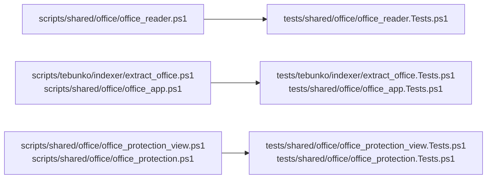

# 単体テスト（Office）

扱うこと: Office ファイルの読み取り（ZIP を直接読む）・COM を使う処理の単体テストが何を確かめるか。扱わないこと: インデックス作成の流れそのもののテスト（[単体テスト（インデックス作成）](unit-indexer.md)）。先に読むページ: [単体テスト（インデックスと検索）](unit-index.md)。

**Office ファイルの読み取り（`tests/shared/office/office_reader`）**

Word・PowerPoint・Excel は使わず、最小限の `.docx` `.pptx` `.xlsx`（ZIP）をテスト内で作成する。

| 対象 | 主な確認内容 |
|---|---|
| `isZipFile` / `isCompoundFile` | ZIP / 複合ドキュメント形式（旧形式・パスワード付き）/ 空ファイル・テキスト |
| `resolveZipPath` | リレーションシップの相対パス・`/` 始まりのパス |
| `readDocxUnits` | 段落・表の行（タブ区切り、セル内の複数段落、末尾の空セル、入れ子の表）、変更履歴の削除・フィールドコードを読まない、保存時のページ区切り・手動の改ページ（直後の保存時のページ区切りの有無）・セクション区切り・段落前で改ページ、ヘッダー/フッターの重複除去、脚注、テキストボックスは本文から分けてそのページの図形にする、SmartArt・グラフの文字は図形にする、コメントと返信は付けた所のページに入れる |
| `readPptxUnits` | 表示順（`sldIdLst`）、非表示スライド、グループ内の図形・表、スライド番号・日付のプレースホルダーを読まない、ノートとスライドの対応、SmartArt・グラフの文字はスライドの図形にする、旧形式・新形式のコメントと返信 |
| `readXlsxObjectUnits` / `getCellPosition` | 表示シートの図形・コメントだけをシートごとの場所にする、図形は左上のセル番地の順、グループ化した図形は 1 つ、互換用の代替表示は読まない、スレッド形式のコメント（返信を含む）、ふりがなは読まない、Excel のブックでない ZIP は何も返さない、グラフ・SmartArt の文字を読む（数値は読まない）、テキストボックスの段落 → グラフ・SmartArt の順に 1 つの図形にする、参照先・リレーションシップ（図形の部品自身のものを含む）が無い・部品が壊れたグラフは空にしてほかの図形・コメントは出す（読めなかった部品を `$failures` に返す）、表示のグラフシートは `A1` で読み非表示のグラフシートは読まない |
| `getHeaderFooterLines` / `readXlsxSheetHeaderFooter` / `readXlsxHeaderFooterLines`（`readXlsxObjectUnits` 経由） | ヘッダー・フッターの書式コード（`&L` `&C` `&R`・`&&`・ページ番号などの差し込み・フォント・大きさ・色・書式の除去。知らない `&x` は残す）、改行で行に分ける・タブは空白・前後を削る・空行を出さない、`"` を含む行は囲む、先頭ページ・偶数ページは設定（`differentFirst` `differentOddEven`）があるときだけ読む、順（ヘッダー → フッター・先頭 → 奇数 → 偶数・左 → 中央 → 右）、同じ文字の行は 1 つ、グラフシート、接頭辞付きの XML、壊れた XML はそのシートだけ読まず `$failures` に足す、DTD は拒否、`sheetData` が大きくても読める |
| `readObjectText` / `readChartText` | 参照先が無ければ空、グラフはタイトル・軸ラベル・系列名を読み（セル参照・直値のどちらでも読む）、項目名（多段の `multiLvlStrCache` を含む）・数値は読まない、項目の点数が多くても速く終わる |
| `readDocxUnits` / `readPptxUnits`（壊れた ZIP） | 本文・プレゼンテーション情報が無ければ、分かるメッセージで例外にする |
| `writeUnits` | 場所ごとの TSV 出力、空の場所は出力しない、`[` `]` を含むパス |

**暗号化されたファイルの判定（`tests/shared/office/office_protection_view`・`office_protection`）**

判断層（`office_protection_view.ps1`）はファイル・COM に触らないため、先頭バイト列とCFBのエントリ名の組だけで種類（`Zip`・`Password`・`Rights`・`Legacy`・`Text`・`Unknown`）を確かめる。状態層（`office_protection.ps1`）は、テストの中で組み立てた最小限のCFB（`tests/helpers/cfb.ps1` の `newCompoundFile`）と、既存のテストデータ（パスワード付き・旧形式・HTML/RTFの `Text`）で確かめる。

| 対象 | 主な確認内容 |
|---|---|
| `getOfficeProtectionKind` | ZIP・空/null・CFBのエントリ名の組み合わせ（新旧形式の権限保護・データスペースはあるが名前を取りこぼした安全側の判定・パスワード・権限保護と分からないCFB）・UTF-16(BOM)/RTF/UTF-8のテキスト・NULを含むバイナリ |
| `getProtectionFailureText` / `testOfficeOutput` / `testWorkbookFormat` / `getWordOpenFormat` | 種類ごとの文言の有無、Zip/UnicodeTextの出力の確かめ、ブックの形式（テキスト・HTML・CSV）の判定、拡張子ごとの`WdOpenFormat`の値 |
| `readFileHead` / `readCompoundEntryNames` / `getOfficeFileProtection` | ファイルの先頭の読み取り（無い・短いファイルでも例外にしない）、CFBのディレクトリのエントリ名の読み取り（複数セクターの鎖をたどる、FATの鎖が輪になる・範囲外のセクター・ディレクトリが途中で切れても例外を出さず速く戻る）、既存のテストデータ（パスワード付き・旧形式・HTML/RTFの `Text`）の判定が変わらない |

**COM を使う処理（`tests/tebunko/indexer/extract_office`・`tests/shared/office/office_app`）**

Excel・Word・PowerPoint の COM を呼ぶ処理は、Office を使わずに流れを検証する。COM の入口は `getApp`（アプリの取得）と `New-Object -ComObject` だけなので、ここを Pester の `Mock` で差し替え、本物と同じ呼び方ができる偽のオブジェクト（呼ばれたメソッドと引数を記録し、保存では本物と同じ形式のファイルを書く）を返す。実機での動作は [結合テスト（手動）](index.md#結合テスト手動) の手動の結合テストで確かめる。

| テスト | 主な確認内容 |
|---|---|
| `tests/tebunko/indexer/extract_office.Tests.ps1` | 表示しているシートだけを書き出す、作業フォルダのコピーを読み取り専用・ダミーのパスワードで開いて保存せずに閉じる、使用範囲の左上を A1 からの位置に戻す、使用範囲が膨らんだシートは一時シートにコピーして書き出して消す（構成が保護されていれば元のシートのまま）、新形式のブックの図形・コメントを別の場所の TSV にする（読めなくてもセルの値は取り込む）、グラフ・SmartArt の部品が壊れていてもそのグラフだけを空にしてインデックス作成ログに記録し、ほかの図形・セルの値は取り込む、新形式の Word は Word を使わずに読む、旧形式の Word・PowerPoint を新形式に保存してから読む、壊れた `.pptx` を PowerPoint に渡さない、読み取りのスレッドでは中身が旧形式の `.docx` を Office を使わずに「Office が要る」の例外にし（`getApp` を呼ばない）、壊れた `.pptx` は回し直さずに失敗にする、失敗しても文書を閉じて作業ファイルを消す。**暗号化されたファイル**: パスワード付き（新形式）・IRMはWord・PowerPointを起動せずに失敗にする（Excelのパスワード付きは今までどおり`Open`を呼ぶ）、読み取りのスレッドではパスワード付き・IRMは回さずその場で失敗にし「形式の分からないバイナリ」だけ回し直す、「形式の分からないバイナリ」は拡張子を変えず（Wordは`Format`も固定して）予備で開く・予備が無効なアプリは開かずに失敗にする・予備が失敗したら元の例外をログに書いて言い換える、変換結果・Excelのテキスト保存の出力がZIP/UnicodeTextでなければ「一時ファイルを暗号化した」に失敗にする、ExcelのFileFormatの確かめは「形式の分からないバイナリ」のときだけで`Text`の種類（HTMLの`.xls`等）には当てない |
| `tests/shared/office/office_app.Tests.ps1` | 起動時の設定（非表示・警告なし・イベントなし・リンクを更新しない・マクロ無効。PowerPoint は `Visible` を変えない）、起動済みのアプリを使い回す、自分で起動したアプリだけを制限時間の強制終了の対象にする、Quit して終わらなければ強制終了する（Excel は 1 秒、Word・PowerPoint は 5 秒待つ）、利用者の Excel・Word・利用者が文書を開いたアプリは終了させない、ほかのセッションのプロセスを自分のものと取り違えない、制限時間の監視、起動した Office の優先度は変えない。**PowerPoint**: 自分のセッションに既に起動していれば `New-Object` を呼ばずに例外にする、起動後に新しいプロセスが増えなければ設定を変える前に解放して例外にする、ほかのセッションにだけ起動していれば接続せず新しく起動する |
