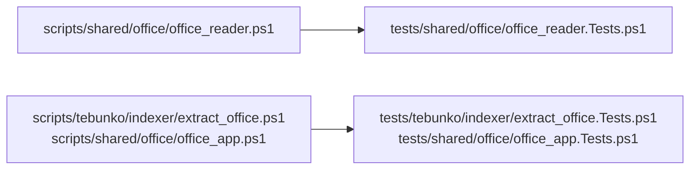

# 単体テスト（Office）

扱うこと: Office ファイルの読み取り（ZIP を直接読む）・COM を使う処理の単体テストが何を確かめるか。扱わないこと: インデックス作成の流れそのもののテスト（[単体テスト（インデックス作成）](unit-indexer.md)）。先に読むページ: [単体テスト（インデックスと検索）](unit-index.md)。

**Office ファイルの読み取り（`tests/shared/office/office_reader`）**

Word・PowerPoint・Excel は使わず、最小限の `.docx` `.pptx` `.xlsx`（ZIP）をテスト内で作成する。

| 対象 | 主な確認内容 |
|---|---|
| `isZipFile` / `isCompoundFile` | ZIP / 複合ドキュメント形式（旧形式・パスワード付き）/ 空ファイル・テキスト |
| `resolveZipPath` | リレーションシップの相対パス・`/` 始まりのパス |
| `readDocxUnits` | 段落・表の行（タブ区切り、セル内の複数段落、末尾の空セル、入れ子の表）、変更履歴の削除・フィールドコードを読まない、保存時のページ区切り・手動の改ページ（直後の保存時のページ区切りの有無）・セクション区切り・段落前で改ページ、ヘッダー/フッターの重複除去、脚注、テキストボックスは本文から分けてそのページの図形にする、SmartArt・グラフの文字は図形にする、コメントと返信は付けた所のページに入れる |
| `readPptxUnits` | 表示順（`sldIdLst`）、非表示スライド、グループ内の図形・表、スライド番号・日付のプレースホルダーを読まない、ノートとスライドの対応、SmartArt・グラフの文字はスライドの図形にする、旧形式・新形式のコメントと返信 |
| `readXlsxObjectUnits` / `getCellPosition` | 表示シートの図形・コメントだけをシートごとの場所にする、図形は左上のセル番地の順、グループ化した図形は 1 つ、互換用の代替表示は読まない、スレッド形式のコメント（返信を含む）、ふりがなは読まない、Excel のブックでない ZIP は何も返さない |
| `readObjectText` / `readChartText` | 参照先が無ければ空、グラフはタイトル・系列名・項目名（多段を含む）を読み、数値は読まない |
| `readDocxUnits` / `readPptxUnits`（壊れた ZIP） | 本文・プレゼンテーション情報が無ければ、分かるメッセージで例外にする |
| `writeUnits` | 場所ごとの TSV 出力、空の場所は出力しない、`[` `]` を含むパス |

**COM を使う処理（`tests/tebunko/indexer/extract_office`・`tests/shared/office/office_app`）**

Excel・Word・PowerPoint の COM を呼ぶ処理は、Office を使わずに流れを検証する。COM の入口は `getApp`（アプリの取得）と `New-Object -ComObject` だけなので、ここを Pester の `Mock` で差し替え、本物と同じ呼び方ができる偽のオブジェクト（呼ばれたメソッドと引数を記録し、保存では本物と同じ形式のファイルを書く）を返す。実機での動作は [結合テスト（手動）](index.md#結合テスト手動) の手動の結合テストで確かめる。

| テスト | 主な確認内容 |
|---|---|
| `tests/tebunko/indexer/extract_office.Tests.ps1` | 表示しているシートだけを書き出す、作業フォルダのコピーを読み取り専用・ダミーのパスワードで開いて保存せずに閉じる、使用範囲の左上を A1 からの位置に戻す、使用範囲が膨らんだシートは一時シートにコピーして書き出して消す（構成が保護されていれば元のシートのまま）、新形式のブックの図形・コメントを別の場所の TSV にする（読めなくてもセルの値は取り込む）、新形式の Word は Word を使わずに読む、旧形式の Word・PowerPoint を新形式に保存してから読む、壊れた `.pptx` を PowerPoint に渡さない、読み取りのスレッドでは中身が旧形式の `.docx` を Office を使わずに「Office が要る」の例外にし（`getApp` を呼ばない）、壊れた `.pptx` は回し直さずに失敗にする、失敗しても文書を閉じて作業ファイルを消す |
| `tests/shared/office/office_app.Tests.ps1` | 起動時の設定（非表示・警告なし・イベントなし・リンクを更新しない・マクロ無効。PowerPoint は `Visible` を変えない）、起動済みのアプリを使い回す、自分で起動したアプリだけを制限時間の強制終了の対象にする、Quit して終わらなければ強制終了する（Excel は 1 秒、Word・PowerPoint は 5 秒待つ）、利用者のアプリ・利用者が文書を開いたアプリは終了させない、制限時間の監視、起動した Office の優先度は変えない |
