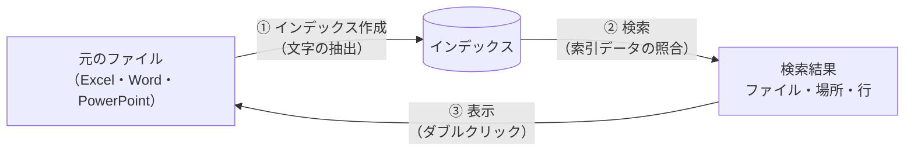

# インデックスの仕組み

tebunko の検索は、**インデックス**と呼ぶ索引データを使って行います。本ページでは、インデックスの役割、作成と更新の考え方、取り扱い上の注意を説明します。

## 概要

インデックスは、Excel・Word・PowerPoint のファイルから文字を抽出し、検索用に保存した索引データです。tebunko は検索時に元のファイルを開かず、インデックスのみを照合します。

書籍の巻末索引が本文を読まずに該当ページを示すのと同様に、インデックスを参照することで、ファイルを 1 件ずつ開く処理を省きます。

| 項目 | インデックスを使わない場合 | インデックスを使う場合（tebunko） |
|---|---|---|
| 検索の方法 | 検索のたびに各ファイルを開いて内容を読む | 事前に抽出した索引データを照合する |
| 所要時間 | ファイル数に比例して増加する | 100 万行規模で 1〜2 秒 |
| 結果の粒度 | — | ファイル・シート（ページ・スライド）・行 |

索引データは事前に作成しておく必要があります。作成は［1 インデックス管理］の［インデックス作成を開始］で行います。

## 処理の流れ

1. **インデックス作成**：登録したフォルダ内のファイルから文字を抽出し、インデックスに保存します。初回は全ファイルが対象となるため時間を要します（目安：300 ファイルで約 3 分）。
2. **検索**：インデックスを照合し、該当箇所を一覧表示します。
3. **表示**：検索結果から、インデックスではなく**元のファイル**を開きます。

## 更新のタイミング

インデックスは作成時点のファイル内容を保持します。ファイルの追加・変更後は、インデックス作成を再実行するまで検索結果に反映されません。

2 回目以降のインデックス作成は、追加・変更されたファイルのみを対象とする**差分取り込み**です。変更が無い場合は数秒で完了します。検索前や定期的（例：週 1 回）に再実行する運用を推奨します。

## インデックスの単位

tebunko では、**登録したフォルダ 1 件につきインデックス 1 件**を作成します。［1 インデックス管理］の一覧の各行が、それぞれのインデックスです。インデックス名はフォルダ名から自動的に設定され、検索結果にも表示されます。

| 登録したフォルダ | インデックス名（例） |
|---|---|
| `C:\共有\営業部` | 営業部 |
| `\\server\総務\規程集` | 規程集 |

## 保存場所

インデックスは、ワークスペース（既定：`%USERPROFILE%\Documents\tebunko_ws`）の `index` フォルダに保存します。元のファイルとは別の場所です。インデックスを削除しても元のファイルには影響せず、再度インデックス作成を実行すれば復元できます。

## 取り扱い上の注意

- **元のファイルは変更しません。** インデックス作成では、元のファイルのコピーを読み取り専用で開き、文字を抽出します。
- **インデックスには文書の本文がそのまま含まれます。** 元のフォルダのアクセス権はインデックスに引き継がれません。ワークスペースには、検索対象のフォルダと同等以上のアクセス制限を設定してください（[設定](settings.md#ワークスペース)）。

## Windows Search との関係

Windows にも、ファイル検索用の索引（Windows Search）があります。tebunko のインデックスはこれとは独立しており、Windows Search が無効な環境でも利用できます。なお、インデックスの規模が大きい場合は、検索範囲の絞り込みに Windows Search を併用します（[高速検索](fast-search.md)）。

## 関連項目

- [クイックスタート](quickstart.md)：インデックスの作成から検索までの手順
- [インデックスの作成](indexing.md)：［1 インデックス管理］の操作
