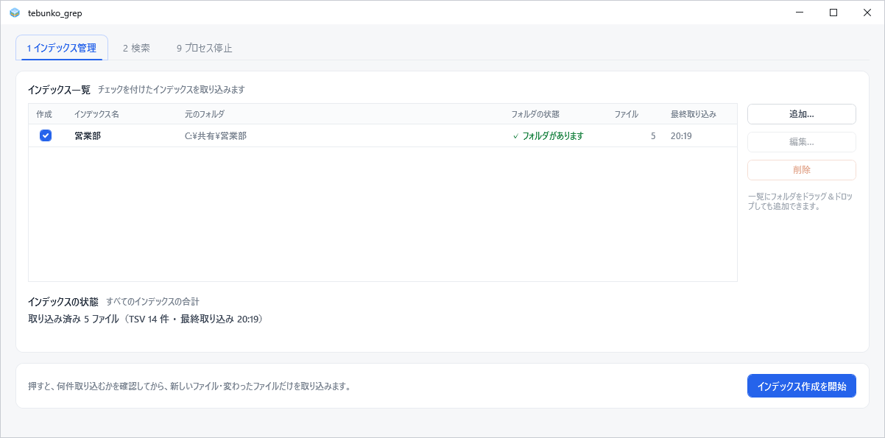

# インデックスの作成

［1 インデックス管理］タブでは、検索対象のフォルダを登録し、フォルダ内の Office ファイルから文字を抽出して**インデックス**（検索用の索引データ）を作成します。インデックスの役割については [インデックスの仕組み](about-index.md) を参照してください。

## フォルダの登録

1. ［追加…］を選択します。
2. 「元のフォルダ（Office ファイルのある場所）」にフォルダを指定します。［参照…］による選択のほか、パスの入力・貼り付け、フォルダのドラッグ＆ドロップで指定できます。
3. 「インデックス名」はフォルダ名から自動的に設定されます。この名前は検索対象の一覧と検索結果に表示されます。`\ / : * ? " < > |` は使用できません。
4. ［OK］を選択します。

エクスプローラーから一覧へフォルダを直接ドラッグ＆ドロップして登録することもできます。ネットワークドライブおよび `\\server\share` 形式の共有フォルダにも対応しています。

!!! note "登録できないフォルダ"
    登録済みのフォルダと同一のフォルダ、およびその上位・下位のフォルダは登録できません。1 つのファイルが複数のインデックスに重複して含まれることを防ぐためです。

## 一覧の項目

| 列 | 内容 |
|---|---|
| 作成 | チェックの付いたインデックスのみが取り込みの対象となります |
| インデックス名 | 検索結果に表示される名前 |
| 元のフォルダ | Office ファイルの格納場所 |
| フォルダの状態 | フォルダにアクセスできるかどうか |
| ファイル | 取り込み済みのファイル数とその内訳 |
| 最終取り込み | 最後に取り込みを行った日時 |

## インデックス作成の実行

1. 取り込むインデックスの［作成］にチェックを付けます。
2. ［インデックス作成を開始］を選択します。
3. 「インデックス作成の確認」に、インデックスごとの取り込み対象の件数と内訳が表示されます。［OK］で取り込みを開始します。取り込み対象が無い場合は［閉じる］のみが表示されます。

取り込みの対象は、**新規のファイルと、前回の取り込み以降に変更されたファイル**です（更新日時とサイズで判定します）。元のフォルダから削除されたファイルは、インデックスからも削除します。

進捗は「インデックス作成中… N / M 件（失敗 K 件）」と残り時間で表示します。所要時間の目安は、Office ファイル 300 件（大半が Excel）で約 3 分です。サイズの大きいファイルが多い場合は、さらに時間を要します。

### インデックス作成中の制約

- **検索は実行できます。** 取り込みを終えたフォルダから順に検索結果に反映されます。
- **画面を閉じると中断されます。** インデックス作成は tebunko のプロセス内で実行されるためです。終了時には確認が表示されるため、［インデックス作成を止めて閉じる］または［閉じない］を選択します。中断した処理は、次回の実行時に続きから再開します。
- ワークスペースは変更できません（[設定](settings.md)）。

## 中止と再開

［中止］を選択し、確認で［中止する］を選ぶと、処理中のファイルの取り込みを終えた時点で停止します。次回はボタンが［続きから再開（残り N 件）］となり、未処理のファイルから取り込みます。

処理の経過は、完了後に［ログを開く］で確認できます。

## 取り込みに失敗したファイル

パスワード付きのファイルなど、取り込めなかったファイルがある場合は、タブの見出しに ⚠ を表示し、「⚠ 取り込みに失敗したファイル N 件」の一覧（ファイル・失敗の原因・日時）を表示します。行をダブルクリックすると、ファイルの格納場所を開きます。

取り込みに失敗したファイルは、更新されない限り以降の取り込みの対象外となります。再度取り込む場合は、「インデックス作成の確認」で「前回取り込みに失敗し、その後更新されていないファイル N 件も再取り込みする」にチェックを付けます。

失敗の原因ごとの対処は [トラブルシューティング](troubleshooting.md#取り込みに失敗したファイルがある場合) を参照してください。

## 名前と場所の変更（［編集…］）

一覧でインデックスを選択して［編集…］を選ぶと、インデックス名と元のフォルダを変更できます。元のフォルダを移動した場合は、ここで移動先を指定します。インデックスを再作成する必要はありません。

## 削除（［削除］）

一覧でインデックスを選択し、［削除］（または Delete キー）を選んで確認で［削除する］を選ぶと、一覧から外し、そのインデックス（tebunko が作成したデータ）を削除します。**元のフォルダとファイルは削除されません。**

## 関連する設計書

画面の仕様は [［1 インデックス管理］タブ](../design/gui/index-tab.md)、取り込みの処理は [処理の流れと取り込み一覧](../design/indexer/flow.md) を参照してください。
