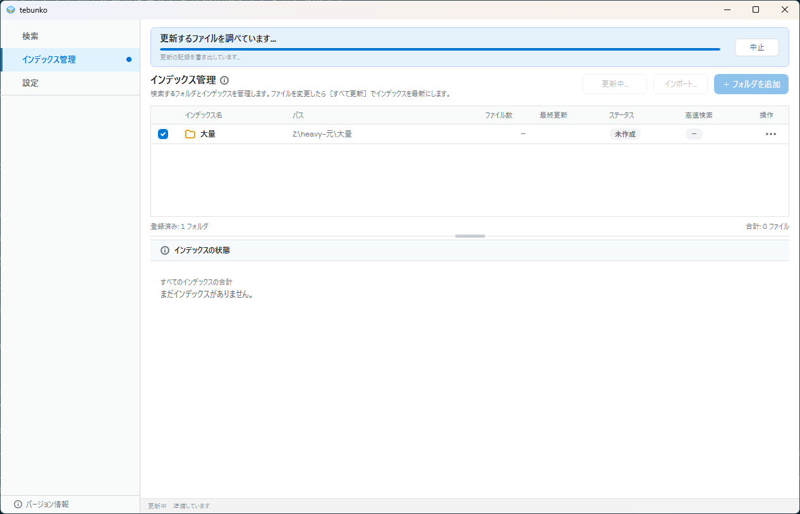
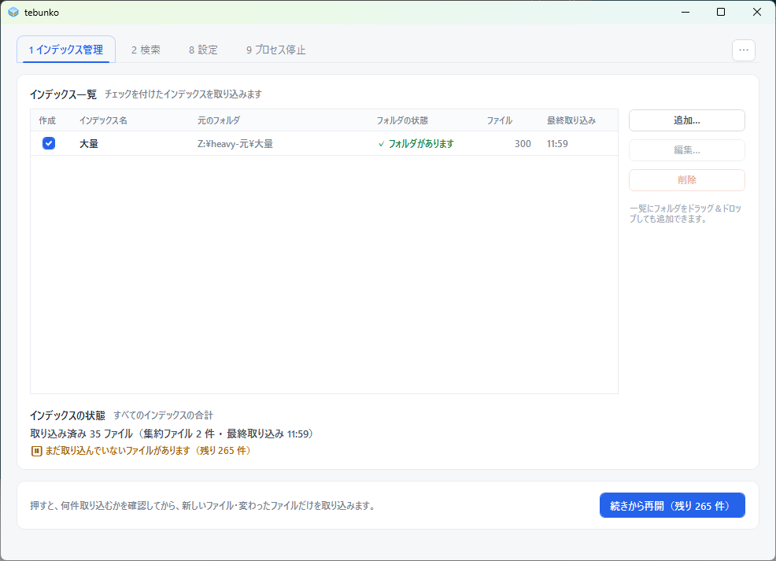
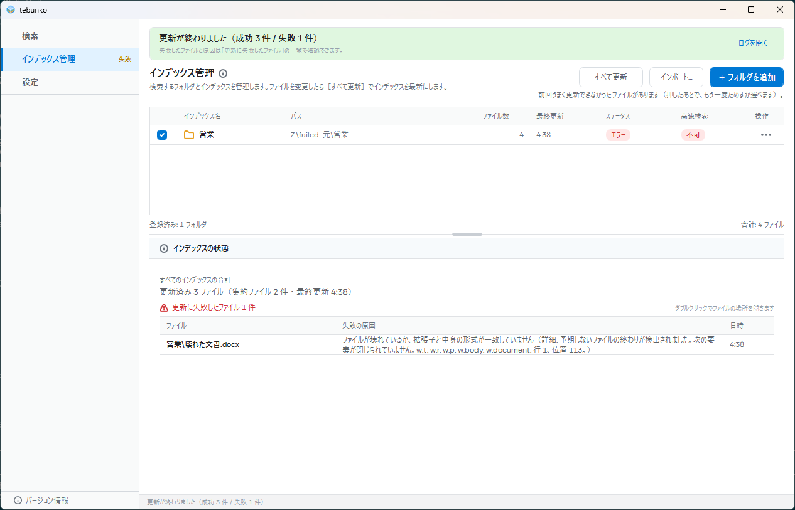

# インデックスの作成

［1 インデックス管理］タブでは、検索対象のフォルダを登録し、フォルダ内のファイル（Office ファイル・テキストファイル）から文字を抽出して**インデックス**（検索用の索引データ）を作成します。インデックスの役割については [インデックスの仕組み](about-index.md) を参照してください。

## フォルダの登録

1. ［追加…］を選択します。
2. 「元のフォルダ（Office ファイルのある場所）」にフォルダを指定します。［参照…］による選択のほか、パスの入力・貼り付け、フォルダのドラッグ＆ドロップで指定できます。
3. 「インデックス名」はフォルダ名から自動的に設定されます。この名前は検索対象の一覧と検索結果に表示されます。`\ / : * ? " < > |` は使用できません。
4. ［OK］を選択します。

エクスプローラーから一覧へフォルダを直接ドラッグ＆ドロップして登録することもできます。ネットワークドライブおよび `\\server\share` 形式の共有フォルダにも対応しています。

!!! note "登録できないフォルダ"
    登録済みのフォルダと同一のフォルダ、およびその上位・下位のフォルダは登録できません。1 つのファイルが複数のインデックスに重複して含まれることを防ぐためです。

## 一覧の項目

| 列 | 内容 |
|---|---|
| 作成 | チェックの付いたインデックスのみが更新の対象となります |
| インデックス名 | 検索結果に表示される名前 |
| 元のフォルダ | 検索したいファイルの格納場所 |
| フォルダの状態 | フォルダにアクセスできるかどうか |
| ファイル | 更新済みのファイル数とその内訳 |
| 最終更新 | 最後に更新を行った日時 |
| ステータス | 本文の更新の状態（未作成・更新中・要更新・エラー・最新）をバッジで表示します。見出しにカーソルを合わせると説明が、バッジにカーソルを合わせると理由が出ます |
| 高速検索 | [高速検索](fast-search.md)（Windows Search）が、そのインデックスにどこまで反映されたかをバッジで表示します。使えない理由はバッジのツールヒントで確認できます |

## インデックス作成の実行

1. 更新するインデックスの［作成］にチェックを付けます。
2. ［すべて更新］を選択します。
3. 「インデックス作成の確認」に、インデックスごとの更新の対象の件数と内訳が表示されます。［OK］で更新を開始します。更新の対象が無い場合は［閉じる］のみが表示されます。

更新の対象は、**新規のファイルと、前回の更新以降に変更されたファイル**です（更新日時とサイズで判定します）。元のフォルダから削除されたファイルは、インデックスからも削除します。

進捗は「インデックス作成中… N / M 件（失敗 K 件）」と残り時間で表示します。所要時間の目安は、Office ファイル 300 件（大半が Excel）で約 3 分です。サイズの大きいファイルが多い場合は、さらに時間を要します。

### インデックス作成中の制約

- **検索は実行できます。** 更新を終えたフォルダから順に検索結果に反映されます。
- **画面を閉じると中断されます。** インデックス作成は tebunko のプロセス内で実行されるためです。終了時には確認が表示されるため、［中止して閉じる］または［閉じない］を選択します。中断した処理は、次回の実行時に続きから再開します。
- ワークスペースは変更できません（[設定](settings.md)）。

## 中止と再開

［中止］を選択し、確認で［中止する］を選ぶと、処理中のファイルの更新を終えた時点で停止します。次回はボタンが［続きから再開（残り N 件）］となり、未処理のファイルから更新します。

処理の経過は、完了後に［ログを開く］で確認できます。

## 更新に失敗したファイル

パスワード付きのファイルなど、更新できなかったファイルがある場合は、タブの見出しに ⚠ を表示し、「⚠ 更新に失敗したファイル N 件」の一覧（ファイル・失敗の原因・日時）を表示します。行をダブルクリックすると、ファイルの格納場所を開きます。

更新に失敗したファイルは、更新されない限り以降の更新の対象外となります。再度更新する場合は、「インデックス作成の確認」で「前回更新に失敗し、その後更新されていないファイル N 件も再更新する」にチェックを付けます。

失敗の原因ごとの対処は [トラブルシューティング](troubleshooting.md#更新に失敗したファイルがある場合) を参照してください。

## 名前と場所の変更（［編集…］）

一覧でインデックスの行の右端の［⋯］を押し、［編集…］を選ぶと、インデックス名と元のフォルダを変更できます。元のフォルダを移動した場合は、ここで移動先を指定します。インデックスを再作成する必要はありません。

名前を変えると、［2 検索］の対象のツリーでチェックを外していたフォルダは、チェックありに戻ります。

## 削除（［削除］）

一覧でインデックスを選択し、行の［⋯］から［削除］（または Delete キー）を選んで確認で［削除する］を選ぶと、一覧から外し、そのインデックス（tebunko が作成したデータ）を削除します。**元のフォルダとファイルは削除されません。** 同じ名前でインデックスを作り直したときも、［2 検索］の対象のツリーでチェックを外していたフォルダは、チェックありに戻ります。

## エクスポート・インポート

インデックスを別の PC・ワークスペースへ移すときは、行の［⋯］から［エクスポート…］を選んで zip に書き出し、移す先で［インポート…］を選びます。手順と注意点は [インデックスをほかの PC で使う](about-index.md#インデックスをほかの-pc-で使う) を参照してください。

## 関連する設計書

画面の仕様は [インデックス一覧の管理](../design/gui/index-tab.md)・[インデックス作成の実行](../design/gui/indexing-run.md)、取り込みの処理は [インデックス作成のメインフロー](../design/indexing/flow.md) を参照してください。
