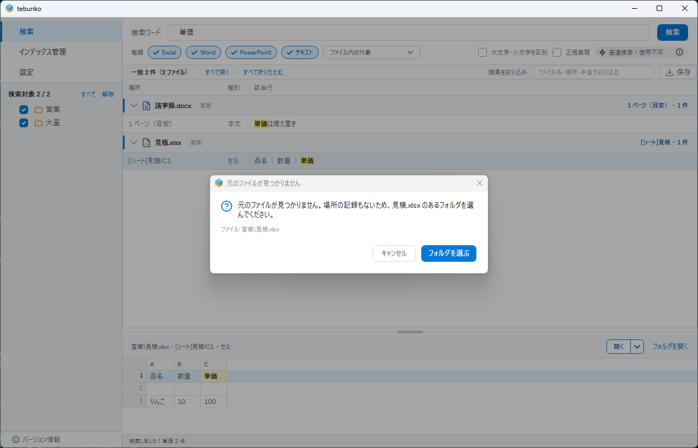

# 元のファイルを開く

検索結果から、元のファイルの該当箇所を開く方法を説明します。

## 操作方法

次のいずれかの操作で開きます。

- 検索結果の行をダブルクリックする
- 検索結果の行を選択して Enter キーを押す
- プレビューの［開く］を選択する
- 右クリックメニューから開き方を選択する

Excel の場合は、該当するシートのセルを選択した状態で開きます。

## 開き方の指定

プレビューの［開く ▾］のメニューで開き方（［開く］［新規で開く］［読み取り専用で開く］）を選ぶと、その開き方で開き、ダブルクリックまたは Enter キーで開く際の方法にもなります。指定は保存され、次回起動時にも引き継がれます。

| 開き方 | 内容 |
|---|---|
| ［開く］ | 元のファイルをそのまま開きます。編集して上書き保存できます |
| ［読み取り専用で開く］ | 元のファイルを読み取り専用で開きます。誤って上書き保存されることはありません（編集内容を保存する場合は、名前を付けて保存します） |
| ［新規で開く］ | 元のファイルを基にした新規（無題）のブック・文書として開きます。元のファイルを占有しないため、他の利用者が編集中でも開くことができ、他の利用者の編集も妨げません。保存する場合は、名前を付けて保存します |

共有フォルダのファイルを閲覧する用途では、［読み取り専用で開く］または［新規で開く］の使用を推奨します。

テキストファイル（[対応するテキストの拡張子](limitations.md#対応するテキストの拡張子)）は、開き方の指定にかかわらず、既定のアプリでそのまま開きます（読み取り専用・新規のような開き方はできません）。ただし `.bat` `.cmd` `.ps1` `.vbs` `.js` `.reg` `.sh` は、開くと実行・登録になってしまうため、既定のアプリではなく固定のパスのメモ帳で開きます（ステータスに「メモ帳で開きました」と表示）。該当の行へは移動しません。

## 右クリックメニュー

検索結果の行を右クリックすると、次のメニューを表示します。

| メニュー | 内容 |
|---|---|
| ［開く］ | 通常の方法で開く |
| ［読み取り専用で開く］ | 読み取り専用で開く |
| ［新規で開く］ | 新規のブック・文書として開く |
| ［フォルダを開く］ | 元のファイルの格納フォルダをエクスプローラーで開く |
| ［選んだ行をコピー］ | 選択した行をコピーする |
| ［ファイルのパスをコピー］ | 元のファイルのパスをコピーする |

先頭に太字で出る項目が、設定の「ファイルの開き方」で選んだ開き方です（ダブルクリックと同じ）。

ファイルごとの見出しの行を右クリックすると、［読み取り専用で開く］［フォルダを開く］［ファイルのパスをコピー］と、そのファイルの結果を閉じる・開く項目を表示します。

プレビューを右クリックすると、先頭の［元のファイルのこの場所を開く］のほか、［選んだセルをコピー］［この行をコピー］を使用できます。

## 元のファイルが見つからない場合

元のフォルダの移動や名前の変更により元のファイルが見つからない場合は、「<ファイル名> が見つかりません」と表示します。［フォルダを選ぶ］で移動先のフォルダ（元のフォルダ、またはその配下の任意のフォルダ）を指定すると、tebunko がファイルを検索し、見つかった場合はそのまま開きます。

ファイルが見つかった場合は、そのインデックスの元のフォルダを移動先に更新します。以降は、同じインデックスの他のファイルも同様に開けます。インデックスを再作成する必要はありません。

!!! tip "フォルダを移動する予定がある場合"
    事前に［インデックス管理］の［編集…］で元のフォルダを移動先に変更しておくと、このダイアログは表示されません（[名前と場所の変更](indexing.md#名前と場所の変更編集)）。

## 関連する設計書

[元のファイルを開く](../design/gui/open-file.md) を参照してください。
