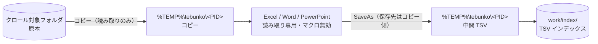

# ファイルの読み書きの範囲

## 書き込み・削除する場所

書き込みは次の場所に限られる。`tests/meta/safety.Tests.ps1` の「書き込み先が限られていること」が、これらの定義と、ドライブ直下・システムフォルダを指す書き込み先が無いことを確かめる。

| 場所 | 内容 | 定義 |
|---|---|---|
| `work/` 配下（既定は `%USERPROFILE%\Documents\tebunko_ws`。利用者が画面で選んだフォルダ（ワークスペース）にも置ける） | TSV インデックス（`work/index/`）、取り込み一覧・インデックス作成ログ・制御用ファイル、検索結果 | `tebunko/core/paths.ps1`（`$workspace`）、`tebunko/core/workspace.ps1`（`Workspace`） |
| `%TEMP%\tebunko\<PID>` 配下 | 取り込みの作業領域（原本のコピー・中間 TSV）。インデックス作成の完了時・開始時に空にする | `tebunko/core/paths.ps1:8` |
| `setting.config`（ツールを置いたフォルダの直下） | 画面が保存する設定（クロール対象フォルダ・検索対象インデックス・`work` の置き場所など） | `shared/core/data_dir.ps1:40`、`tebunko/core/settings.ps1:5` |
| `%LOCALAPPDATA%\tebunko\<鍵>` 配下 | ツールを置いたフォルダに書き込めないとき（Program Files・読み取り専用の共有フォルダ）だけ、`setting.config` をここに置く（ワークスペースの既定は `%USERPROFILE%\Documents\tebunko_ws`）。鍵はツールのフォルダのパスから作る 16 文字（[データの置き場所](../design/architecture/layout.md#データの置き場所settingconfigwork)） | `shared/core/data_dir.ps1:31` |
| 利用者が指定した出力先 | ［結果をファイルに出力］の保存先（既定は `work\検索結果.txt`） | 画面のダイアログで利用者が指定 |

削除（`Remove-Item`・`[System.IO.File]::Delete` など）の対象はすべてワークスペース配下または `%TEMP%\tebunko\<PID>` 配下、すなわち**本ツールが自分で作ったファイル**である。クロール対象フォルダ内のファイルを削除する処理は無い。

［8 設定］でワークスペースを変えるときは、前のワークスペースの中の本ツールが作ったファイル・フォルダ（`Workspace.Entries`：`index`・`system_index`・取り込み一覧・状態・ログ・取り込み出力）だけを新しいワークスペースへ移す（`moveWorkspace`）。別のドライブへは写してから元を削除する。選んだフォルダにすでにインデックスなどがあり、利用者が［消して、最初からやり直す］を選んだときは、そのフォルダの本ツールのファイル・フォルダ（同じ `Workspace.Entries`）だけを削除する（`removeWorkspaceEntries`）。利用者がワークスペースに置いたほかのファイルは移さず、削除しない。

確認コマンド（[検査項目と結果](checks.md#検査項目と結果) の `scan` を使う）:

```powershell
# 削除・書き込みの呼び出し箇所をすべて列挙し、対象のパスが work / tmpDir 由来であることを目で確かめる
scan 'Remove-Item','WriteAllText','WriteAllLines','StreamWriter','\.SaveAs','::Move','Move-Item'
```

## 取り込み対象のファイルは書き換えない

本ツールは、クロール対象フォルダのファイルを**直接開かない**。作業フォルダへコピーし、そのコピーだけを開く（`tebunko/indexer/extract_office.ps1:103`・`261` の `copyFileShared`）。コピー元は読み取り専用で開く（`shared/core/fs.ps1:121`。`FileAccess::Read` で開き、ほかのアプリの読み書き・削除を妨げない）。

この設計は、インデックス作成中も利用者が原本を上書き保存・移動できるように（ファイルロックを避けるために）入れたものだが、結果として原本への書き込み経路そのものが存在しない。



Office の `SaveAs` は 3 か所あるが、保存先は常に作業フォルダ内のパス（`$tmpPath` / `$destPath`）である（`extract_office.ps1:156`・`210`・`234`）。原本のパスを `SaveAs` に渡す経路は無い。

`tests/meta/safety.Tests.ps1` の「取り込み対象のファイルを書き換えないこと」が、原本のパスを書き込み・削除の API に渡さないこと、原本を読むのは `copyFileShared` の読み取りだけであること、`SaveAs` の保存先が作業フォルダだけであること、Word・PowerPoint を読み取り専用で開くことを確かめる（Excel を読み取り専用で開くことは「Office ファイルを安全に開くこと」が確かめる）。

## 読み取りのみであることの実証

静的な確認に加えて、実際に動かして確認できる。第三者が再現できる手順は次の 2 つ。

**手順 A: ハッシュの比較**

```powershell
$target = "C:\確認用\対象フォルダ"
$before = Get-ChildItem $target -Recurse -File | Get-FileHash
# ここで tebunko.bat を起動し、$target を対象にインデックスを作成する
$after  = Get-ChildItem $target -Recurse -File | Get-FileHash
Compare-Object $before $after -Property Path,Hash   # 何も出力されなければ、原本は 1 バイトも変わっていない
```

**手順 B: 書き込み権限を外して実行**

対象フォルダに読み取りの権限だけを与えたアカウントで、インデックス作成を最後まで実行する。書き込みを試みていれば失敗するため、完走することが「読み取りのみ」の裏付けになる。
