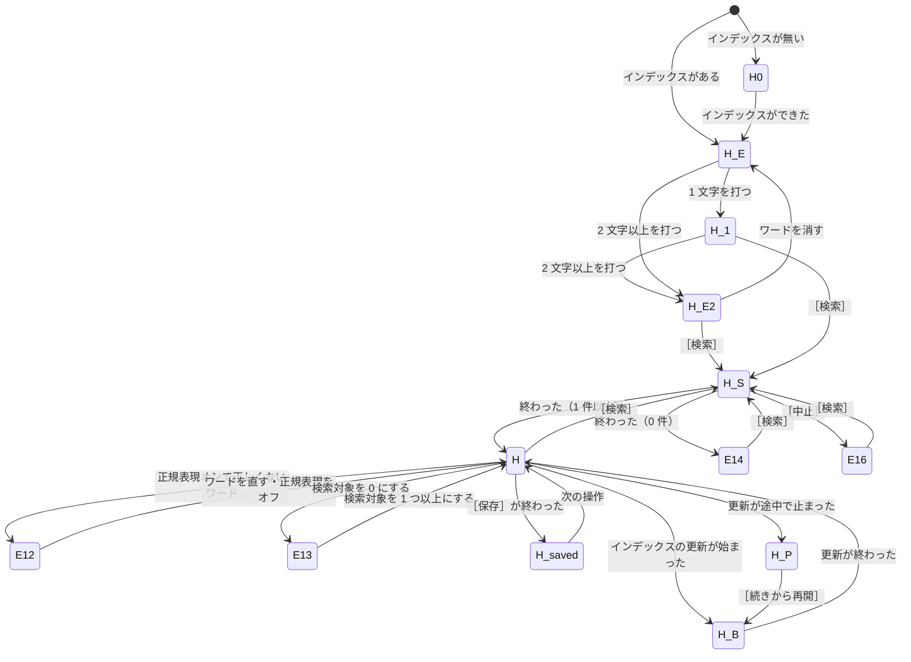

# 検索の画面（組み立てと状態）

## 1. 役割

この文書は検索の画面全体の組み立てを決める。主な領域（ナビの右）に次の部品を差し込み、状態（画面の記号）ごとに、どれを出すかを切り替える。

- バナー
- 検索バー
- 結果の一覧
- 空の状態
- 0 件の表示
- 境目
- プレビュー

部品の中身は別の文書にある。

| 部品 | 文書 |
|---|---|
| 検索バー | `search_bar.md` |
| 件数の行と結果の一覧 | `result_list.md` |
| プレビュー | `preview.md` |
| バナー | `overlays.md` |
| 検索対象のツリー | `target_tree.md` |
| ステータスバー | `shell/status_bar.md` |

Figma の画面（ページ 106・148）は次のとおり。

| 記号 | ノード | `../png/` |
|---|---|---|
| H | 108:230 | `108_230.png` |
| H-B | 108:1116 | `108_1116.png` |
| H-P | 108:1419 | `108_1419.png` |
| H-W | 125:1839 | `125_1839.png` |
| H-R | 135:1498 | `135_1498.png` |
| E13 | 175:4085 | `175_4085.png` |
| H-T1 | 175:3869 | `175_3869.png` |
| H-範囲 | 213:6592 | `213_6592.png` |
| H-範囲2 | 213:6958 | `213_6958.png` |
| H0 | 148:67 | `148_67.png` |
| H-E2 | 157:359 | `157_359.png` |
| H-E | 157:654 | `157_654.png` |
| H-S | 157:944 | `157_944.png` |
| E16 | 157:1238 | `157_1238.png` |
| E14 | 157:1538 | `157_1538.png` |
| H-1 | 157:1835 | `157_1835.png` |
| E12 | 157:2424 | `157_2424.png` |
| H-saved | 158:527 | `158_527.png` |
| H-row3 | 158:823 | `158_823.png` |
| H-row4 | 158:1118 | `158_1118.png` |

`../png/` に画像が無い状態もある。これは部品の variant（バリアント）にだけある。

- H-F（結果の一覧の絞り込み中）: `xaml/search/result_list` の H-F（352:17353）
- H-PP・H-TX: 同じく 426:50・426:183

## 2. 置き場所

- XAML: `scripts/tebunko/xaml/search/search.xaml`。
  - 根は `Grid`（x:Name `SearchRoot`）。
  - 窓（`shell/shell.md`）の **ContentHost** に差す。
  - ナビで「検索」を選んだときに差す。
- 読み込み: `XamlReader.Load` で読み、`ContentHost.Content` に入れる。
- `SearchRoot` の中に口（`ContentControl`）を置き、各部品の XAML をそれぞれ読み込んで差す。

  | 口 | 差す XAML |
  |---|---|
  | `TopBannerHost`・`MidBannerHost` | `xaml/search/banner.xaml`（overlays.md） |
  | `SearchBarHost` | `search_bar.xaml` |
  | `ResultListHost` | `result_list.xaml` |
  | `PreviewHost` | `preview.xaml` |

- 画面層は `ui/search/search.ps1`、判断層は `ui/search/search_view.ps1`。
- ステータスバーは窓の **StatusBarHost**（高さ 24。この Grid の外）に置く。文言だけをこの画面から渡す（下の「状態ごとの見え方」の「ステータスバー」の列）。
- ContentHost の大きさ（窓が 1280×820 のとき）:
  - 主な領域は 1060×788（タイトルバー 32 とナビ 220 を除く）。
  - そこからステータスバー 24 を除いた 1060×764 が、この Grid。

## 3. 部品の木

```xml
<Grid x:Name="SearchRoot" Background="{StaticResource Bg.Surface}">
  <Grid.RowDefinitions>
    <RowDefinition x:Name="TopBannerRow"  Height="Auto"/>               <!-- 0: H-B・H-P・H-saved のバナー（40） -->
    <RowDefinition x:Name="SearchBarRow"  Height="Auto"/>               <!-- 1: 検索バー（86。E12 は 112。幅 804 では 114） -->
    <RowDefinition x:Name="MidBannerRow"  Height="Auto"/>               <!-- 2: E16 のバナー（40） -->
    <RowDefinition x:Name="MainRow"       Height="*" MinHeight="120"/>  <!-- 3: 結果の一覧／空の状態／0 件の表示／空白 -->
    <RowDefinition x:Name="SplitterRow"   Height="5"/>                  <!-- 4: 境目。出さない状態では 0 -->
    <RowDefinition x:Name="PreviewRow"    Height="180" MinHeight="0"/>  <!-- 5: プレビュー。出さない状態では 0 -->
  </Grid.RowDefinitions>

  <ContentControl x:Name="TopBannerHost" Grid.Row="0" Height="40" Visibility="Collapsed"/>
  <ContentControl x:Name="SearchBarHost" Grid.Row="1"/>
  <ContentControl x:Name="MidBannerHost" Grid.Row="2" Height="40" Visibility="Collapsed"/>

  <!-- 3 行目は 4 つのうち 1 つだけを Visible にする -->
  <ContentControl x:Name="ResultListHost" Grid.Row="3"/>
  <Grid x:Name="EmptyState" Grid.Row="3" Visibility="Collapsed" Background="{StaticResource Bg.Surface}">
    <StackPanel x:Name="EmptyContent" MaxWidth="480"
                HorizontalAlignment="Center" VerticalAlignment="Center">
      <ContentControl x:Name="EmptyIllust" Width="64" Height="64" HorizontalAlignment="Center"
                      Content="{StaticResource Illust.FirstRun}"/>                       <!-- folder-search 64・線 2・Illust/Line -->
      <TextBlock x:Name="EmptyTitle" Margin="0,16,0,0" HorizontalAlignment="Center" TextAlignment="Center"
                 FontSize="16" FontWeight="SemiBold" Foreground="{StaticResource Ink.Value}"
                 Text="{search.empty.title}"/>
      <TextBlock x:Name="EmptyBody" Margin="0,16,0,0" HorizontalAlignment="Center" TextAlignment="Center"
                 TextWrapping="Wrap" LineHeight="23.4" LineStackingStrategy="BlockLineHeight"
                 Style="{StaticResource Body}" Foreground="{StaticResource Ink.Muted}"
                 Text="{search.empty.body}"/>
      <Button x:Name="EmptyOpenIndexButton" Margin="0,16,0,0" HorizontalAlignment="Center"
              Style="{StaticResource Primary}" Padding="16,7" Content="{search.empty.action}"/>
    </StackPanel>
  </Grid>
  <Grid x:Name="NoResultState" Grid.Row="3" Visibility="Collapsed" Background="{StaticResource Bg.Surface}">
    <StackPanel HorizontalAlignment="Center" VerticalAlignment="Center">
      <TextBlock x:Name="NoResultTitle" HorizontalAlignment="Center"
                 FontSize="16" FontWeight="SemiBold" Foreground="{StaticResource Ink.Strong}"
                 Text="{search.noresult.title}"/>
      <TextBlock x:Name="NoResultBody" Margin="0,8,0,0" HorizontalAlignment="Center"
                 Style="{StaticResource Body}" Foreground="{StaticResource Ink.Body}"
                 Text="{search.noresult.body}"/>
      <TextBlock x:Name="NoResultRegexNote" Margin="0,8,0,0" HorizontalAlignment="Center"
                 FontSize="12" Foreground="{StaticResource Ink.Body}"
                 Text="{search.noresult.regex}"/>
    </StackPanel>
  </Grid>
  <!-- H-E・H-E2・H-1 は 3 行目に何も出さない（Bg.Surface の空白）。上の 3 つをすべて Collapsed にする -->

  <GridSplitter x:Name="PreviewSplitter" Grid.Row="4" Height="5" HorizontalAlignment="Stretch"
                ResizeDirection="Rows" ResizeBehavior="PreviousAndNext"
                Background="{StaticResource Bg.Surface}" Style="{StaticResource SplitterGrip}"/>
  <!-- つまみ: 32×2・中央・Border.Grip。SplitterGrip の中で Rectangle を描く -->

  <ContentControl x:Name="PreviewHost" Grid.Row="5"/>
</Grid>
```

- **プレビューを出さない状態では、行の高さを 0 にする。** `SplitterRow.Height = 0`・`PreviewRow.Height = 0` とし、`PreviewSplitter`・`PreviewHost` を Collapsed にする。
  - Collapsed にするだけでは、固定の高さの行（5・180）が残ってしまう。
  - **PoC はここで空白が残った（diff_round3 の 4）。**
- プレビューを出す状態に戻ったときは、境目のドラッグで決めた高さに戻す。初めて出すときは 180 にする。

## 4. 寸法と色

窓が 1280×820 のときの値。

| 要素 | 大きさ | 余白 | 地の色 | 枠 | 文字の Style | 文字の色 | 角丸 | アイコン |
|---|---|---|---|---|---|---|---|---|
| SearchRoot | 1060×764 | 0 | Bg.Surface（#FFFFFF） | – | – | – | 0 | – |
| TopBannerHost／MidBannerHost | 横 Fill × 40 | overlays.md | overlays.md | overlays.md | overlays.md | overlays.md | 0 | info 16（overlays.md） |
| SearchBarHost | 横 Fill × Hug（86） | search_bar.md | Bg.Surface | 下 1 Border.Soft（#E0E2E5） | – | – | 0 | – |
| ResultListHost | 横 Fill × Fill（H で 493、H-B で 453、E16 で 638） | 0 | Bg.Surface | – | – | – | 0 | – |
| EmptyState | 横 Fill × Fill（678） | 0 | Bg.Surface | – | – | – | 0 | – |
| EmptyContent | 最大幅 480・Hug（377×210 前後） | 子の間 16 | – | – | – | – | – | – |
| EmptyIllust | 64×64 | – | – | – | – | Illust/Line（線 2。キーは `figma_theme_tokens.md`） | – | folder-search を 64 に拡大（`parts/illust_first_run` 346:9181） |
| EmptyTitle | Hug | 上 16 | – | – | 16 SemiBold（Style のキーは無い → 決めること） | Ink.Value（#212126） | – | – |
| EmptyBody | Hug・2 行・中央揃え | 上 16 | – | – | Body（13 Regular）・行の高さ 1.8（23.4） | Ink.Muted（#6B737D） | – | – |
| EmptyOpenIndexButton | Hug（175×31） | 上 16・中 16/7 | Accent（#0078D4） | – | 13 SemiBold（Heading） | Ink.OnAccent（#FFFFFF） | 6 | – |
| NoResultState | 横 Fill × Fill（678） | 子の間 8 | Bg.Surface | – | – | – | – | – |
| NoResultTitle | Hug | – | – | – | 16 SemiBold | Ink.Strong（#202124） | – | – |
| NoResultBody | Hug | 上 8 | – | – | Body（13 Regular） | Ink.Body（#5F6368） | – | – |
| NoResultRegexNote | Hug | 上 8 | – | – | 12 Regular（Style のキーは無い → 決めること） | Ink.Body（#5F6368） | – | – |
| PreviewSplitter | 横 Fill × 5 | – | Bg.Surface | – | – | – | – | つまみ 32×2・Border.Grip（#A9AFB6）・中央 |
| PreviewHost | 横 Fill × 180 | preview.md | preview.md | 上 1 Border.Soft（preview.md） | – | – | – | – |

- 空の状態の中の間の値は、Figma（148:128）では一律 16（gap 16）。
  - diff_round4 の 4 は、画像から「約 24・16・20」と読んだ。**正は Figma の 16。**
  - ただし説明の行の高さは 1.8（13 × 1.8 = 23.4）なので、見た目の間は広く見える。

## 5. 状態ごとの見え方

### 状態に入る条件

条件は `getSearchScreenState` の入力で決める。上から順に、最初に当てはまったものを状態にする。

| 順 | 記号 | 条件（入力の値） |
|---|---|---|
| 1 | H0 | `HasIndex = $false`（検索できるインデックスが 1 つも無い） |
| 2 | H-S | `Searching = $true` |
| 3 | E12 | `UseRegex = $true` で、検索ワードが正規表現として正しくない（`isValidRegex` が偽） |
| 4 | E13 | `TargetCount = 0`（検索対象のフォルダが 0） |
| 5 | E16 | 直前の検索を中止した（`LastResult.Stopped = $true`） |
| 6 | E14 | 直前の検索が終わって 0 件（`LastResult.Hits = 0`） |
| 7 | H-saved | 直前の操作が［保存］の成功（`Saved = $true`）。結果のある状態に重ねる |
| 8 | H-B | 結果があり、`IndexState = 'updating'`（インデックスを更新している） |
| 9 | H-P | 結果があり、`IndexState = 'interrupted'`（前回の更新が途中） |
| 10 | H | 結果がある（`LastResult.Hits -gt 0`）。H-R・H-W・H-F・H-row3・H-row4・H-T1・H-範囲は中身が違うだけの H |
| 11 | H-1 | 結果が無く、検索ワードが 1 文字 |
| 12 | H-E2 | 結果が無く、検索ワードがある |
| 13 | H-E | 結果が無く、検索ワードが空 |

- E12 と E13 は、前の結果を残したまま、検索バーだけを変える。
  - 前の結果があれば、結果の一覧とプレビューは H と同じに出す（Figma の E12・E13）。
  - 前の結果が無いときの見え方は Figma に無い → 決めること。
- H-B・H-P のバナーは、結果が無い状態（H-E など）でも出すのかが Figma に無い → 決めること。

### 状態の表

| 状態 | 上のバナー | 検索バーの下のバナー | 件数の行 | 絞り込み | 列の見出し | 3 行目 | 境目・プレビュー | 高速検索のバッジ | 件数の文言 | ステータスバー | 選んでいる行 |
|---|---|---|---|---|---|---|---|---|---|---|---|
| H0 | 出さない | 出さない | 出さない | 出さない | 出さない | 空の状態 | 出さない | 出さない | – | `{status.noindex}` | – |
| H-E | 出さない | 出さない | 出さない | 出さない | 出さない | 空白 | 出さない | 出す（使用可） | – | 空 | – |
| H-E2 | 出さない | 出さない | 出さない | 出さない | 出さない | 空白 | 出さない | 出す（使用可） | – | 空 | – |
| H-1 | 出さない | 出さない | 出さない | 出さない | 出さない | 空白 | 出さない | 出す（使用不可。理由は吹き出し） | – | 空 | – |
| H-S | 出さない | 出さない | 出す | 出す | 出す | 結果の一覧（見つかった分） | 出さない | 出す | `{result.progress}` | 空 | 1 つ目のファイルの 1 行目 |
| H | 出さない | 出さない | 出す | 出す | 出す | 結果の一覧 | 出す | 出す | `{result.summary}`＋`{result.mode.fast}` | `{status.searched}` | 1 つ目のファイルの 1 行目 |
| H-R | 出さない | 出さない | 出す | 出す | 出す | 結果の一覧 | 出す | 出す（使用不可。理由は吹き出し） | `{result.summary}`＋`{result.mode.normal}` | `{status.searched}`（16 件） | 1 行目 |
| H-W | 出さない | 出さない | 出す | 出す | 出す | 結果の一覧 | 出す | 出す | H と同じ | `{status.searched}` | 1 行目（1 ページ（目安）） |
| H-F | 出さない | 出さない | 出す | 出す（文字あり） | 出す | 結果の一覧（合うものだけ） | 出す | 出す | `{result.filtered}`＋`{result.mode.fast}` | Figma に画面が無い → 決めること | 合う行の 1 行目 |
| H-row3／H-row4 | 出さない | 出さない | 出す | 出す | 出す | 結果の一覧 | 出す | 出す | H と同じ | `{status.searched}` | 3 行目／4 行目 |
| H-B | 出す（情報・`{banner.updating}`） | 出さない | 出す | 出す | 出す | 結果の一覧 | 出す | **出さない** | `{result.summary}` だけ（モードを付けない） | `{status.searched}` | 1 行目 |
| H-P | 出す（注意・`{banner.interrupted}`） | 出さない | 出す | 出す | 出す | 結果の一覧 | 出す | **出さない** | `{result.summary}` だけ | `{status.searched}` | 1 行目 |
| H-saved | 出す（成功・`{banner.saved}`） | 出さない | 出す | 出す | 出す | 結果の一覧 | 出す | 出す | H と同じ | **空** | 1 行目 |
| E12 | 出さない | 出さない | 出す（前の結果） | 出す | 出す | 結果の一覧（前の結果） | 出す | 出す（使用不可。理由は吹き出し） | `{result.summary}`＋`{result.mode.normal}` | `{status.searched}` | 1 行目 |
| E13 | 出さない | 出さない | 出す（前の結果） | 出す | 出す | 結果の一覧（前の結果） | 出す | 出す | H と同じ | `{status.searched}` | 1 行目 |
| E14 | 出さない | 出さない | **出さない** | **出さない** | **出さない** | 0 件の表示 | 出さない | 出す（その時の判定） | – | `{status.searched}`（0 件） | – |
| E16 | 出さない | **出す（情報・`{banner.stopped}`）** | **出さない** | **出さない** | 出す | 結果の一覧（見つかった分） | **出さない** | 出す | – | **空** | 1 行目 |

- 「1 行目」は、1 つ目の開いたファイルの、1 つ目の該当行のこと。選んだ行の地は Select.Soft（#E1F2FF）。
- H-T1・H-範囲・H-範囲2 は H と同じ見え方になる。違うのはツリーのチェックとファイル内の対象のメニューだけ（target_tree.md・search_bar.md）。
- E14 の 3 行目の `{search.noresult.regex}` は、正規表現をオンにして検索したときだけ出す。
  - Figma には正規表現がオンの例しか無い → オフのときに出さないかは決めること。

### PoC が間違えたところ（特に守ること）

- **結果が無い状態（H0・H-E・H-E2・H-1・E14）には、列の見出しを出さない。**
  - 件数の行・絞り込み・境目・プレビューも出さない（diff_round3 の 4）。
- **H-E は主な領域に何も出さない。** 「検索ワードを入力してください」などの案内を出さない。高速検索のバッジ「使用可」は出す（diff_round3 の 4・diff_round4 の 6）。
- **E16 のバナーは検索バーの下（MidBannerHost）に出す。** ほかのバナー（H-B・H-P・H-saved）は検索バーの上（TopBannerHost）に出す（diff_round3 の 5）。
  - E16 は件数の行を出さず、バナーの下に列の見出しを続ける。
  - E16 ではプレビューを出さない。
- **H-B・H-P は高速検索のバッジを出さず、件数の文言にモードを付けない**（2026-10-04 からは、どの状態でも秒数・モードを付けない）（diff_round3 の 4・diff_round4 の 6）。
- **ステータスバーの文言**（diff_round3 の 4・diff_round4 の 6）:
  - H-S・E16・H-saved は空にする。
  - E14 は「検索しました：(株)山田商店 0 件」にする。
  - H-R は 16 件にする。
- **H0・E14 の中身は、3 行目の上下左右の中央に置く。** 3 行目はプレビューを出さないので、検索バーの下からステータスバーの上までになる。PoC は上へ 170〜240 ずれた（diff_round4 の 4）。
- **バナーの高さは 40 に収める**（中のボタンが切れない。diff_round4 の 6）。
- **中身の無い ScrollBar・Separator を置かない。** 空の状態の右上などに細い縦線が出た（diff_round4 の 7）。

### 状態の移り変わり



- 記号の「-」は、Mermaid の都合で「_」にしてある。
- H-saved から H に戻るきっかけ（バナーが消える時機）は Figma に無い → 決めること。

## 6. 文言

| 文言の ID | 全文 | 使う状態 |
|---|---|---|
| `search.empty.title` | インデックスが作成されていません | H0 |
| `search.empty.body` | 検索を行うには、まずインデックス管理からフォルダを登録し、<br>インデックスを作成してください。 | H0（「、」の後で改行。2 行） |
| `search.empty.action` | インデックス管理を開く | H0 |
| `search.noresult.title` | 見つかりませんでした | E14 |
| `search.noresult.body` | 検索対象のフォルダ・［ファイル内の対象］・［正規表現］を見直してください。 | E14 |
| `search.noresult.regex` | 正規表現で検索しています | E14（正規表現がオンのとき） |
| `banner.updating` | インデックスを更新しています（{インデックス名} {済み件数} / {全件数} 件） | H-B。例「インデックスを更新しています（営業部 1,200 / 2,075 件）」。件数は 3 桁区切り |
| `banner.updating.action` | 進み具合を見る | H-B |
| `banner.interrupted` | 前回の更新が途中です（残り {件数} 件） | H-P。例「前回の更新が途中です（残り 875 件）」 |
| `banner.interrupted.action` | 続きから再開 | H-P |
| `banner.saved` | 検索結果を保存しました | H-saved |
| `banner.saved.action` | フォルダを開く | H-saved |
| `banner.stopped` | 検索を中止しました（見つかった {件数} 件を表示しています） | E16。例「検索を中止しました（見つかった 5 件を表示しています）」。ボタンは無い |
| `status.noindex` | インデックスが未作成です | H0 |
| `status.searched` | 検索しました：{検索ワード} {件数} 件 | H・H-B・H-P・H-R・H-W・E12・E13・E14。例「検索しました：(株)山田商事 15 件」「検索しました：(株)山田商店 0 件」 |

- 件数の行の文言（`result.*`）は `result_list.md`、検索バーの文言は `search_bar.md` にある。
- 「：」は全角、「(株)」は半角のかっこ。数と「件」の間に半角の空白を入れる。

## 7. 操作と振る舞い

| きっかけ | 何が起きるか | 呼ぶ関数 | 次の状態 |
|---|---|---|---|
| ［インデックス管理を開く］をクリック | ナビの「インデックス管理」を選んだのと同じにする | `selectNav 'Index'`（shell.md） | インデックス管理の画面 |
| バナーの［進み具合を見る］ | インデックス管理を開き、更新中のインデックスを選ぶ | overlays.md | インデックス管理の画面 |
| バナーの［続きから再開］ | 前回の続きから更新を始める | overlays.md | H-B |
| バナーの［フォルダを開く］ | 保存したファイルのフォルダをエクスプローラーで開く | overlays.md | H-saved のまま |
| 境目をドラッグ | プレビューの高さを変える（上の一覧は最小 120、プレビューは最小 120。`figma_wpf_map.md`） | – | 変わらない |
| 検索が終わる・中止する・保存する・ワードを変える・チェックを変える | 状態を決め直し、表のとおりに出す・出さないを切り替える | `getSearchScreenState` → `getSearchScreenView` | 上の表 |

- Tab の順: 検索バー → 件数の行 → 結果の一覧 → プレビュー。バナーがあるときは、バナーのボタンを検索バーの前にする。
- 空の状態のボタンは、Primary のホバー・押した・フォーカスの見た目を使う（theme の Primary。Figma に別の定めは無い）。

## 8. リサイズ

- 窓の最小は 1024×640、既定は 1280×820。
- 伸びるのは 3 行目（MainRow `*`）だけで、最小の高さは 120。
- プレビューは固定の高さ（既定 180・最小 120）で、境目でだけ変わる。
- 窓が低いときに、一覧が 120 を割る前にプレビューを縮めるかどうかは、Figma に無い → 決めること。
- 検索バーの高さは Hug。
  - 主な領域の幅が 804（窓 1024）では、2 行目が折り返して 86 → 114 になる（search_bar.md）。
  - 3 行目はその分だけ縮む。
- 空の状態・0 件の表示は、3 行目の上下左右の中央を保つ。説明は MaxWidth 480 の中で折り返す。
- 各大きさでの見え方:
  - 1024×640（主な領域 804×584）:
    - 検索バー 114・境目 5・プレビュー 180
    - 結果の一覧は 584 − 24 − 114 − 5 − 180 = 261
    - 縦のスクロールバーが出るのは正しい（diff_round4 の「許」）。
  - 1600×1000（主な領域 1380×968）: 検索バー 86、結果の一覧は 968 − 24 − 86 − 5 − 180 = 673。

## 9. 判断層

`ui/search/search_view.ps1`。WPF の型に触らない。

### getSearchScreenState

入力（hashtable）:

| キー | 型 | 意味 |
|---|---|---|
| HasIndex | bool | 検索できるインデックスがある |
| Searching | bool | 検索している |
| UseRegex | bool | 正規表現がオン |
| Word | string | 検索ワード |
| TargetCount | int | 検索対象のフォルダの数 |
| IndexState | string | `'ready'`・`'updating'`・`'interrupted'` |
| Saved | bool | 直前の［保存］が成功した |
| LastResult | hashtable または $null | 直前の検索の結果。キーは Hits（int）・Stopped（bool） |

出力: 状態の記号（string）。値は `'H0'`・`'H-S'`・`'E12'`・`'E13'`・`'E16'`・`'E14'`・`'H-saved'`・`'H-B'`・`'H-P'`・`'H'`・`'H-1'`・`'H-E2'`・`'H-E'` のどれか。

```powershell
It "<Name> は <Expected>" -TestCases @(
  @{ Name="インデックスが無い";   In=@{HasIndex=$false;Searching=$false;UseRegex=$false;Word="";TargetCount=3;IndexState='ready';Saved=$false;LastResult=$null};                  Expected='H0' }
  @{ Name="検索中";               In=@{HasIndex=$true;Searching=$true;UseRegex=$false;Word="(株)山田商事";TargetCount=3;IndexState='ready';Saved=$false;LastResult=$null};       Expected='H-S' }
  @{ Name="正しくない正規表現";   In=@{HasIndex=$true;Searching=$false;UseRegex=$true;Word="(株)山田(商事";TargetCount=3;IndexState='ready';Saved=$false;LastResult=@{Hits=15;Stopped=$false}}; Expected='E12' }
  @{ Name="対象 0";               In=@{HasIndex=$true;Searching=$false;UseRegex=$false;Word="(株)山田商事";TargetCount=0;IndexState='ready';Saved=$false;LastResult=@{Hits=15;Stopped=$false}}; Expected='E13' }
  @{ Name="中止した";             In=@{HasIndex=$true;Searching=$false;UseRegex=$false;Word="(株)山田商事";TargetCount=3;IndexState='ready';Saved=$false;LastResult=@{Hits=5;Stopped=$true}};    Expected='E16' }
  @{ Name="0 件";                 In=@{HasIndex=$true;Searching=$false;UseRegex=$true;Word="(株)山田商店";TargetCount=3;IndexState='ready';Saved=$false;LastResult=@{Hits=0;Stopped=$false}};   Expected='E14' }
  @{ Name="保存した";             In=@{HasIndex=$true;Searching=$false;UseRegex=$false;Word="(株)山田商事";TargetCount=3;IndexState='ready';Saved=$true;LastResult=@{Hits=15;Stopped=$false}};  Expected='H-saved' }
  @{ Name="更新中";               In=@{HasIndex=$true;Searching=$false;UseRegex=$false;Word="(株)山田商事";TargetCount=3;IndexState='updating';Saved=$false;LastResult=@{Hits=15;Stopped=$false}}; Expected='H-B' }
  @{ Name="更新が途中";           In=@{HasIndex=$true;Searching=$false;UseRegex=$false;Word="(株)山田商事";TargetCount=3;IndexState='interrupted';Saved=$false;LastResult=@{Hits=15;Stopped=$false}}; Expected='H-P' }
  @{ Name="結果あり";             In=@{HasIndex=$true;Searching=$false;UseRegex=$false;Word="(株)山田商事";TargetCount=3;IndexState='ready';Saved=$false;LastResult=@{Hits=15;Stopped=$false}}; Expected='H' }
  @{ Name="1 文字・結果なし";     In=@{HasIndex=$true;Searching=$false;UseRegex=$false;Word="山";TargetCount=3;IndexState='ready';Saved=$false;LastResult=$null};               Expected='H-1' }
  @{ Name="ワードあり・結果なし"; In=@{HasIndex=$true;Searching=$false;UseRegex=$false;Word="(株)山田商事";TargetCount=3;IndexState='ready';Saved=$false;LastResult=$null};       Expected='H-E2' }
  @{ Name="ワードなし";           In=@{HasIndex=$true;Searching=$false;UseRegex=$false;Word="";TargetCount=3;IndexState='ready';Saved=$false;LastResult=$null};                 Expected='H-E' }
) { param($In, $Expected) getSearchScreenState $In | Should -Be $Expected }
```

### getSearchScreenView

入力: `$state`（string。上の記号）。

出力（hashtable。すべて bool。ただし `MainContent` と `Banner*` は string）:

| キー | 値 |
|---|---|
| TopBanner | `''`・`'updating'`・`'interrupted'`・`'saved'` |
| MidBanner | `''`・`'stopped'` |
| ShowSummaryRow | 件数の行 |
| ShowFilter | 絞り込み |
| ShowColumnHeader | 列の見出し |
| MainContent | `'results'`・`'empty'`・`'noresult'`・`'blank'` |
| ShowPreview | 境目とプレビュー |
| ShowFastSearch | 高速検索のバッジ |
| ShowSearchMode | 使わない（2026-10-04。件数の文言に秒数・方式を付けないことにした） |
| ClearStatus | ステータスバーを空にする |

```powershell
It "<State> の見え方" -TestCases @(
  @{ State='H0';      TopBanner='';           MidBanner='';        Row=$false; Filter=$false; Header=$false; Main='empty';    Preview=$false; Fast=$false; Mode=$false }
  @{ State='H-E';     TopBanner='';           MidBanner='';        Row=$false; Filter=$false; Header=$false; Main='blank';    Preview=$false; Fast=$true;  Mode=$false }
  @{ State='H-E2';    TopBanner='';           MidBanner='';        Row=$false; Filter=$false; Header=$false; Main='blank';    Preview=$false; Fast=$true;  Mode=$false }
  @{ State='H-1';     TopBanner='';           MidBanner='';        Row=$false; Filter=$false; Header=$false; Main='blank';    Preview=$false; Fast=$true;  Mode=$false }
  @{ State='H-S';     TopBanner='';           MidBanner='';        Row=$true;  Filter=$true;  Header=$true;  Main='results';  Preview=$false; Fast=$true;  Mode=$false }
  @{ State='H';       TopBanner='';           MidBanner='';        Row=$true;  Filter=$true;  Header=$true;  Main='results';  Preview=$true;  Fast=$true;  Mode=$true }
  @{ State='H-B';     TopBanner='updating';   MidBanner='';        Row=$true;  Filter=$true;  Header=$true;  Main='results';  Preview=$true;  Fast=$false; Mode=$false }
  @{ State='H-P';     TopBanner='interrupted';MidBanner='';        Row=$true;  Filter=$true;  Header=$true;  Main='results';  Preview=$true;  Fast=$false; Mode=$false }
  @{ State='H-saved'; TopBanner='saved';      MidBanner='';        Row=$true;  Filter=$true;  Header=$true;  Main='results';  Preview=$true;  Fast=$true;  Mode=$true }
  @{ State='E12';     TopBanner='';           MidBanner='';        Row=$true;  Filter=$true;  Header=$true;  Main='results';  Preview=$true;  Fast=$true;  Mode=$true }
  @{ State='E13';     TopBanner='';           MidBanner='';        Row=$true;  Filter=$true;  Header=$true;  Main='results';  Preview=$true;  Fast=$true;  Mode=$true }
  @{ State='E14';     TopBanner='';           MidBanner='';        Row=$false; Filter=$false; Header=$false; Main='noresult'; Preview=$false; Fast=$true;  Mode=$false }
  @{ State='E16';     TopBanner='';           MidBanner='stopped'; Row=$false; Filter=$false; Header=$true;  Main='results';  Preview=$false; Fast=$true;  Mode=$false }
) {
  param($State, $TopBanner, $MidBanner, $Row, $Filter, $Header, $Main, $Preview, $Fast, $Mode)
  $v = getSearchScreenView $State
  $v.TopBanner | Should -Be $TopBanner;  $v.MidBanner | Should -Be $MidBanner
  $v.ShowSummaryRow | Should -Be $Row;   $v.ShowFilter | Should -Be $Filter
  $v.ShowColumnHeader | Should -Be $Header; $v.MainContent | Should -Be $Main
  $v.ShowPreview | Should -Be $Preview;  $v.ShowFastSearch | Should -Be $Fast
  $v.ShowSearchMode | Should -Be $Mode
}
```

- 高速検索のバッジの中身（どの文言か）は `getFastSearchView`（search_bar.md）で決める。ここでは出すかどうかだけを決める。

### getSearchStatusText

入力: `$state`（string）・`$word`（string）・`$hits`（int）。

出力: ステータスバーの文言（string。空もある）。

```powershell
It "<State> のステータスバー" -TestCases @(
  @{ State='H0';      Word='';            Hits=0;  Expected='インデックスが未作成です' }
  @{ State='H';       Word='(株)山田商事'; Hits=15; Expected='検索しました：(株)山田商事 15 件' }
  @{ State='H-B';     Word='(株)山田商事'; Hits=15; Expected='検索しました：(株)山田商事 15 件' }
  @{ State='E12';     Word='(株)山田商事'; Hits=15; Expected='検索しました：(株)山田商事 15 件' }
  @{ State='E14';     Word='(株)山田商店'; Hits=0;  Expected='検索しました：(株)山田商店 0 件' }
  @{ State='H-S';     Word='(株)山田商事'; Hits=5;  Expected='' }
  @{ State='E16';     Word='(株)山田商事'; Hits=5;  Expected='' }
  @{ State='H-saved'; Word='(株)山田商事'; Hits=15; Expected='' }
  @{ State='H-E';     Word='';            Hits=0;  Expected='' }
) { param($State,$Word,$Hits,$Expected) getSearchStatusText $State $Word $Hits | Should -Be $Expected }
```

- E12・E13 の `$word` は、前の結果を出したときのワードを使う。打ちかけのワードは使わない。Figma の E12 は「(株)山田商事」になっている。
- 件数が 1,000 以上のときに 3 桁区切りにするかは、Figma に例が無い。今のコードの `N0`（3 桁区切り）を続ける案 → 決めること。

## 10. 画面層

`ui/search/search.ps1`。

1. 画面を作るとき、`search.xaml` を読み、各口に部品の XAML を差す。部品ごとの画面層の初期化（`initSearchBar`・`initResultList`・`initPreview`）を呼ぶ。
2. `updateSearchScreen` を 1 つだけ置く。状態が変わりうるきっかけで、必ずここを通す（検索の開始・終了・中止、ワード・正規表現・検索対象の変化、保存の成功、インデックスの状態の変化）。
   - `$state = getSearchScreenState $in`
   - `$view = getSearchScreenView $state`
   - 次を写す。
     - `TopBannerHost`・`MidBannerHost` の Visibility と中身（overlays.md の `setBanner`）
     - `ResultListHost`・`EmptyState`・`NoResultState` の Visibility（`MainContent` のとおり。`'blank'` は 3 つとも Collapsed）
     - `SplitterRow.Height`・`PreviewRow.Height`（出さないときは 0、出すときは前の高さ）
     - 件数の行・絞り込み・列の見出しの出す／出さない（`setResultListView`、result_list.md）
     - バッジの出す／出さない（`setFastSearchView`、search_bar.md）
     - ステータスバーの文言（`setStatusText (getSearchStatusText ...)`）
3. 検索は別のスレッド（今の Runspace の作り）で動かす。結果が届くたびに `Dispatcher.BeginInvoke` で UI スレッドに戻し、`updateSearchScreen` と結果の追加を行う。UI スレッドで索引を読まない。
4. `EmptyOpenIndexButton.Add_Click` → `selectNav 'Index'`。

## 11. 受け入れ

窓 1280×820 で、`../png/` の画像と重ねて見比べる（主な領域 x 220〜1280・y 32〜820）。1024×640 と 1600×1000 は、`figma_wpf_map.md` の「リサイズの見本」と比べる。

- H（`108_230.png`）:
  - 検索バーの下の線が y 118（主な領域の y 86）。
  - 結果の一覧が y 118〜611、境目が 611〜616（つまみが中央に 32×2）、プレビューが 616〜796、ステータスバーが 796〜820。
- H-B・H-P・H-saved（`108_1116.png`・`108_1419.png`・`158_527.png`）:
  - バナーが y 32〜72 にある。
  - 検索バーが 40 下がり、結果の一覧が 40 縮む（453）。
- E16（`157_1238.png`）:
  - バナーが検索バーの直下（y 118〜158）にある。
  - その下に列の見出しが続き、件数の行が無い。
  - 境目とプレビューが無く、ステータスバーは空。
- H0（`148_67.png`）:
  - イラスト・見出し・説明 2 行・ボタンの塊の中心が、y 118〜796 の中央（y 457 前後）にある。
  - 説明は「、」で 2 行に折れている。
  - 列の見出し・絞り込み・プレビューが無い。
  - ステータスバーは「インデックスが未作成です」。
- E14（`157_1538.png`）:
  - 3 行の文が y 118〜796 の中央にある。
  - 件数の行・列の見出し・プレビューが無い。
  - ステータスバーは「検索しました：(株)山田商店 0 件」。
- H-E・H-E2・H-1（`157_654.png`・`157_359.png`・`157_1835.png`）:
  - 検索バーの下は白いだけ（線・スクロールバー・案内文が無い）。
- H-S（`157_944.png`）:
  - 件数の行があり、［すべて開く］［保存］が無く、絞り込みはある。
  - プレビューが無い。ステータスバーは空。
- どの状態でも、空の領域に細い縦線（中身の無い ScrollBar・Separator）が出ていない。

## 決めること

1. E12・E13 で、前の結果が無いときの見え方（H-E2 と同じにするか）。
2. H-B・H-P のバナーを、結果が無い状態（H-E・H-E2・H-1・E14・H0 以外）でも出すか。
3. H-saved のバナーを消す時機（次の検索・時間・閉じるボタンなど）。
4. H-F（絞り込み中）のステータスバーの文言。
5. E14 の「正規表現で検索しています」を、正規表現がオフのときに出さないか（出す文が別にあるか）。
6. 窓が低いとき、一覧の最小 120 を割る前にプレビューを縮めるか。
7. 件数が 1,000 以上のときの 3 桁区切り（ステータスバー・件数の行）。今のコードの `N0` を続ける案。
8. 空の状態の見出し（16 SemiBold）と 0 件の表示の補足（12 Regular）に当たる文字の Style のキーが無い。足すか、どれかにまとめるか。
9. バナーの文字の色は変数にした（決定。`Banner.Info.Ink` #0B3D66 など 4 つ。overlays.md と共通）。
